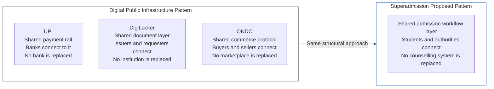
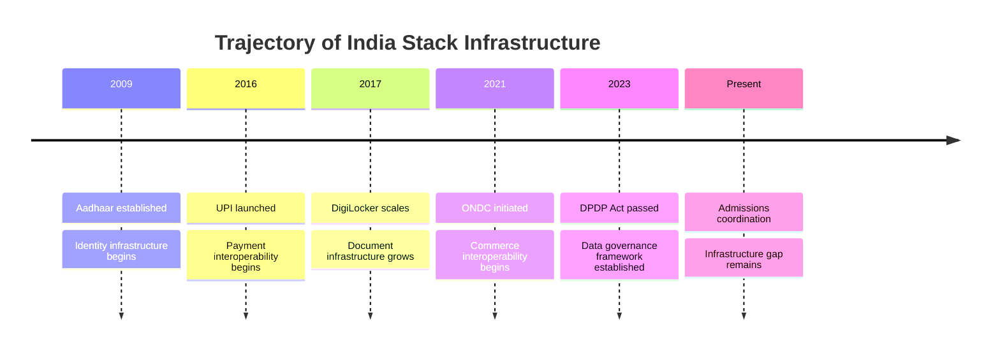

India has built consequential digital public infrastructure over the past decade. These systems — Aadhaar, UPI, DigiLocker, ONDC — have changed how identity, payments, documents, and commerce work at scale. The pattern they follow is relevant to what Superadmission proposes.

This page examines that pattern, what Superadmission can learn from it, and where the admissions context is different in ways that matter.

---

## The Digital Public Infrastructure Pattern

The systems collectively described as India Stack share a structural characteristic: they provide a shared protocol or infrastructure layer that multiple parties can connect to, rather than a centralised system that replaces existing actors.

The key characteristic: each of these systems creates value by enabling coordination between existing actors, not by replacing them.

UPI did not replace banks. It created a shared payment rail that banks connect to. The result: interoperability between all banks, and a payment experience for users that works regardless of which bank they use.

ONDC did not replace Flipkart or Zomato. It created a shared commerce protocol. Any seller can list through any buyer-side app. The ecosystem became more interoperable.

Superadmission proposes the same structural approach for admissions: a shared coordination layer that counselling systems connect to, enabling a student experience that works across systems without replacing any of them.

---

## What NEP 2020 Establishes

The National Education Policy 2020 identifies several directions relevant to the admissions context.

<AccordionGroup>

  <Accordion title="Multiple entry and exit points">
    NEP 2020 advocates for flexible progression through higher education — students entering and exiting at different points, accumulating credits across institutions. This implies a student record that must persist and be portable across institutions. The identity and document layer Superadmission proposes is aligned with this direction — a persistent, portable student record is a prerequisite for NEP's vision of flexible progression.
  </Accordion>

  <Accordion title="Technology in education administration">
    NEP 2020 explicitly calls for using technology to simplify educational administration and reduce burden on students and institutions. The admission coordination problem is one of the more significant administrative burdens in higher education. The policy direction supports the kind of infrastructure layer Superadmission proposes.
  </Accordion>

  <Accordion title="Academic Bank of Credits">
    The Academic Bank of Credits (ABC) — a DigiLocker-based system for storing student credit records — is an infrastructure initiative under NEP 2020. It establishes that the Indian education system is moving toward digital, portable academic records. The document and identity layers in the Superadmission architecture are designed to be compatible with this direction.
  </Accordion>

</AccordionGroup>

---

## What Can Be Learned from ONDC

ONDC (Open Network for Digital Commerce) is the most structurally relevant precedent for what Superadmission proposes. Both deal with the same class of problem: fragmented, independently-operated systems that do not interoperate, and a user (buyer or student) who bears the coordination cost.

| Dimension | ONDC | Superadmission |
|-----------|------|----------------|
| Problem | Commerce fragmented across platforms | Admissions fragmented across counselling systems |
| Solution type | Shared open protocol | Shared coordination layer |
| Existing actors | Marketplaces, sellers, logistics | Counselling authorities, institutions |
| Approach to existing actors | Connect to protocol, not replaced | Connect to layer, not replaced |
| User benefit | Buy from any seller through any app | Apply to any counselling through one profile |
| Government role | DPIIT initiative, voluntary adoption | Currently independent, eventual alignment sought |

**What ONDC demonstrates that is relevant:**
- Interoperability between independent systems can be achieved without forcing any system to change its core operations
- Adoption is driven by value demonstration, not mandate
- A network effects dynamic applies — the system becomes more valuable as more participants join

**Where the admissions context is different:**
- ONDC participants are commercial entities with market incentives to adopt. Counselling authorities are government bodies with operational mandates and political contexts. The adoption dynamics are genuinely different.
- Commerce transactions are relatively uniform across participants. Admission workflows vary significantly between central and state counselling systems. Technical integration is more complex.
- ONDC operates in a competitive market. Admission counselling operates in a regulated, non-competitive context. The value proposition must be framed around operational efficiency and student benefit, not competitive advantage.

---

## Where the Project Fits

Superadmission is not a government initiative. It is an independent project that has studied the public digital infrastructure direction and designed its architecture to be compatible with it. The goal is eventual alignment — not a mandate, not a government takeover of the project, but a formal recognition that the infrastructure layer is useful and an appropriate approval or integration pathway.

This is a longer path than building a product and selling it. It is the appropriate path for what is being proposed.

The trajectory is clear. Each domain where coordination was difficult has eventually produced an infrastructure layer. Admissions is a domain where that infrastructure does not yet exist.

<Info>
  Superadmission is not claiming to be the inevitable or only answer to that gap. It is a serious, documented proposal for what that infrastructure could look like. Whether it becomes the architecture that fills the gap depends on factors — authority engagement, regulatory alignment, institutional adoption — that are outside the project's control. The documentation exists to make that evaluation possible.
</Info>

---

## Summary of Alignment Points

| Initiative | Relevance to Superadmission |
|-----------|---------------------------|
| Aadhaar | Identity layer design alignment. Optional Aadhaar-based verification if approved. |
| DigiLocker | Document layer alignment. Fetch verified documents with student consent where available. |
| UPI | Payment layer alignment. Unified fee payment across counselling systems. |
| ONDC | Structural model reference. Shared protocol layer approach. |
| Academic Bank of Credits | Compatible student record design. Persistent, portable academic identity. |
| NEP 2020 | Policy direction alignment. Technology-enabled administration, portable records. |
| DPDP Act | Compliance framework. Data governance, consent, student data rights. |

