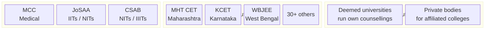
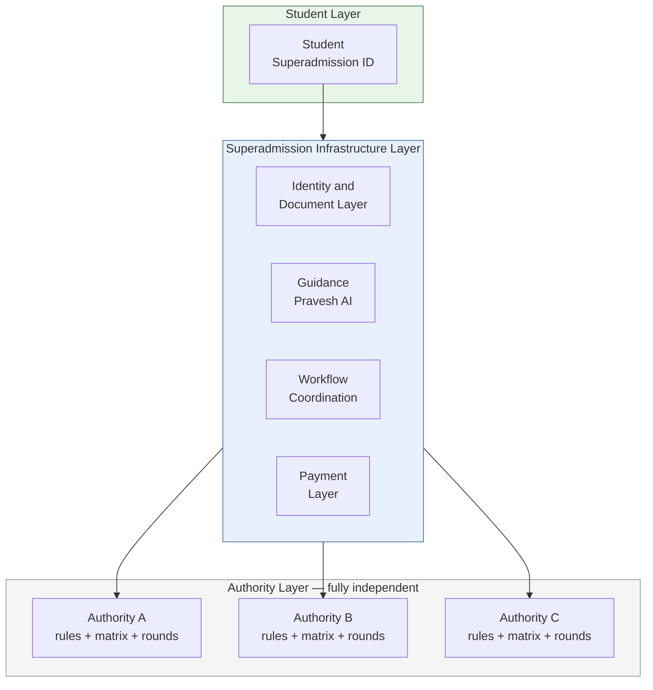

Counselling authorities are the governing bodies of the admissions process. They set the rules, manage the rounds, and take accountability for allocation outcomes. Superadmission is designed to support that — not to replace it.

---

## Who the authorities are

Each authority operates independently. Jurisdiction is defined by stream, geography, or institution type — not by a unified national framework.

---

## What authorities control — fully, always

<CardGroup cols={2}>
  <Card title="Eligibility rules" icon="filter">
    Domicile requirements, subject combinations, minimum marks, age criteria — fully authority-defined
  </Card>
  <Card title="Reservation mandates" icon="scale-balanced">
    SC, ST, OBC, EWS percentages, sub-categories, carry-forward rules — configured per authority
  </Card>
  <Card title="Round structure" icon="arrows-rotate">
    Number of rounds, opening and closing dates, acceptance windows, upgrade round design
  </Card>
  <Card title="Publication decisions" icon="gavel">
    Allocation results do not publish without explicit authority sign-off — no automated release
  </Card>
  <Card title="Seat matrix" icon="table-cells">
    Category-wise, programme-wise, institution-wise seat counts — defined and locked by the authority
  </Card>
  <Card title="Grievance resolution" icon="flag">
    Final authority on dispute resolution within their process — Superadmission surfaces the case, the authority decides
  </Card>
</CardGroup>

---

## How the proposed layer relates to authorities

The infrastructure layer sits between students and authorities. It handles identity, documents, payments, and workflow state. Authorities receive pre-verified intake data and run their process on top of it. Their governance remains separate.

---

## What the platform does not touch

| Authority function | Superadmission involvement |
|---|---|
| Setting eligibility criteria | None — authority configures |
| Defining reservation percentages | None — authority configures |
| Approving or rejecting individual applications | None — officer decision |
| Setting round schedules | None — authority configures |
| Publishing results | None without authority sign-off |
| Determining final allotment | Allocation engine runs on authority's rules — authority authorises output |

---

## What an authority would need to evaluate

Before any alignment conversation, a counselling authority would reasonably want to assess:

<AccordionGroup>
  <Accordion title="Data governance">
    Who holds student data. What is shared and with whom. How data is isolated between counsellings. Retention policy. DPDP Act alignment. Consent framework design.
  </Accordion>
  <Accordion title="Technical integration">
    What the authority needs to configure. What API or interface they use. Whether existing systems need to change. What the onboarding process looks like.
  </Accordion>
  <Accordion title="Allocation verification">
    How the allocation engine handles their specific reservation mandate structure. Whether edge cases in their rules are handled correctly. What the validation sequence looks like before publication.
  </Accordion>
  <Accordion title="Override and control">
    What controls the authority retains. What the authority can pause, extend, or reverse. What the platform cannot do without authority action.
  </Accordion>
  <Accordion title="Pilot scope">
    Whether a single-counselling pilot is possible without committing to full adoption. What a limited trial would involve. What exit looks like if the trial does not proceed.
  </Accordion>
</AccordionGroup>

<Tip>
**The platform is designed to be pilotable by a single authority without requiring national rollout.** One authority connecting does not commit any other authority. Each adoption is independent.
</Tip>

---

## Coordination design intent

Superadmission does not create coordination between authorities. Each authority's process remains independent — its data, its rounds, its decisions.

What the platform coordinates is narrower and specific:

- A student's document verification status is visible to every counselling they have applied to
- A student's deadline view is unified across their active applications
- On seat acceptance, the student's status updates across their active applications

None of this requires authorities to share data with each other. The coordination happens at the student's profile layer, not at the authority layer.

---

<Info>
How this relates to national policy, NEP 2020, and Digital Public Infrastructure — written for a policy or ministry reader — is in Policy and Government.
</Info>

