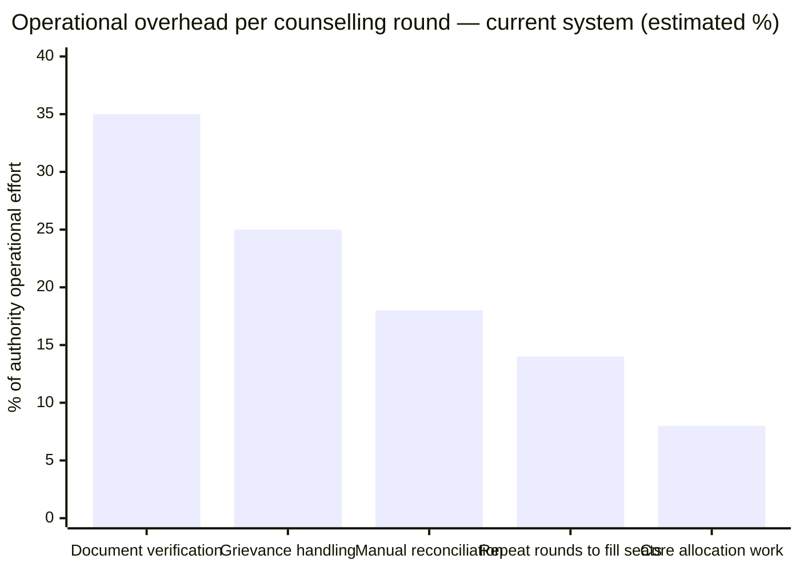
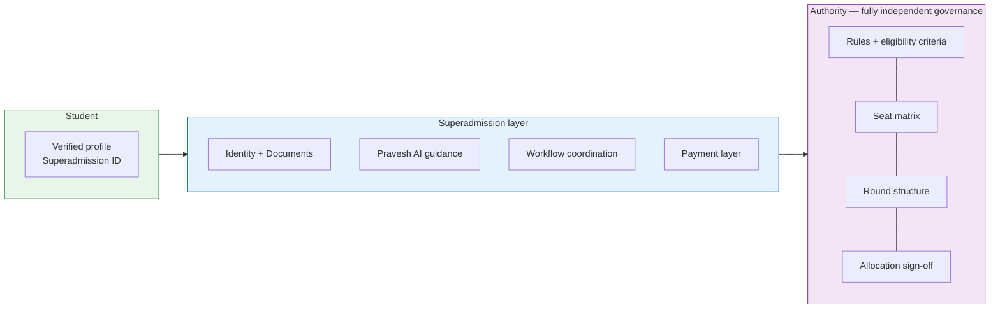
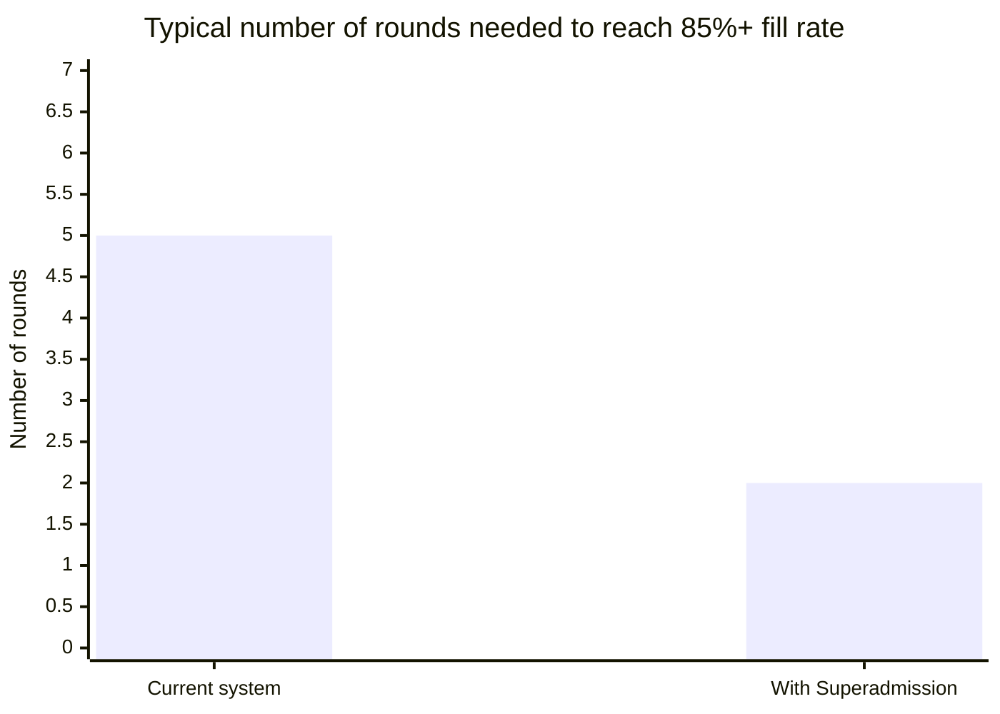

Counselling authorities manage large-scale admission processes with high volume, fixed timelines, and defined reservation rules. These processes involve multiple rounds, document verification, and continuous state tracking. Operational complexity increases with fragmented systems and manual coordination. Superadmission reduces this operational load by standardising workflows and state management, while leaving all rule definition, decision-making, and authority control unchanged.

---

## What authorities deal with today

_Estimated from operational research. Multiple rounds exist primarily to recover from coordination failures in earlier rounds._

---

## What Superadmission does for authorities

<CardGroup cols={2}>
  <Card title="Pre-verified student intake" icon="shield-check">
    Students arrive with documents already verified at source via DigiLocker. The authority's verification queue shrinks to manually uploaded documents only — scored and pre-annotated by Pravesh AI.
  </Card>

  <Card title="Configured rule engine" icon="sliders">
    Authorities configure their specific eligibility rules, reservation mandates, category hierarchies, and round structures once. The allocation engine enforces them exactly — no manual application of rules during the run.
  </Card>

  <Card title="Allocation at scale, fast" icon="bolt">
    Deferred Acceptance algorithm processes 1 million\+ applications in under 1 hour. Simultaneous enforcement of all category rules and seat limits — no post-allocation correction rounds needed.
  </Card>

  <Card title="Auditable outcomes" icon="magnifying-glass-chart">
    Every allocation decision has a traceable chain — which preference was tried, which constraint blocked it, which seat matched. Grievances resolve faster when the basis for every decision is on record.
  </Card>

  <Card title="Real-time round monitoring" icon="chart-line">
    Live seat fill rates by institution, programme, and category. Verification queue depth. Preference lock rates. Alerts before problems compound — not after a round closes.
  </Card>

  <Card title="Grievance reduction by design" icon="flag">
    Document rejection grievances drop when documents are pre-verified. Allocation disputes resolve faster when outcomes are explainable. Fewer rounds needed when coordination failures are addressed structurally.
  </Card>
</CardGroup>

---

## How the infrastructure layer relates to authority operations

The infrastructure layer handles what is common across all counsellings — identity, documents, payments, and workflow state. The authority layer handles what is specific to each counselling — rules, matrix, rounds, and governance. They are separate. They connect cleanly.

---

## What authorities configure on the platform

| Configuration | Detail |
| --- | --- |
| Eligibility rules | Domicile, subject combination, minimum marks, age criteria |
| Reservation mandates | SC, ST, OBC, EWS, sub-category percentages, carry-forward logic |
| Seat matrix | Institution-wise, programme-wise, category-wise seat counts |
| Round structure | Number of rounds, dates, acceptance window per round |
| Category hierarchy | How categories interact after cutoff — authority-defined |
| Verification thresholds | Confidence score bands for queue routing |

---

## What authorities retain — fully, always

- Final sign-off before any allocation publishes
- Every eligibility decision on disputed cases
- Grievance resolution authority
- Round pause, extend, and close controls
- Seat matrix — configurable until round opens

---

## Rounds — before and after

_Estimated. Fewer rounds are needed when pre-verified intake reduces document delays, and when coordination failures that cause seat lapses are addressed at the infrastructure layer._