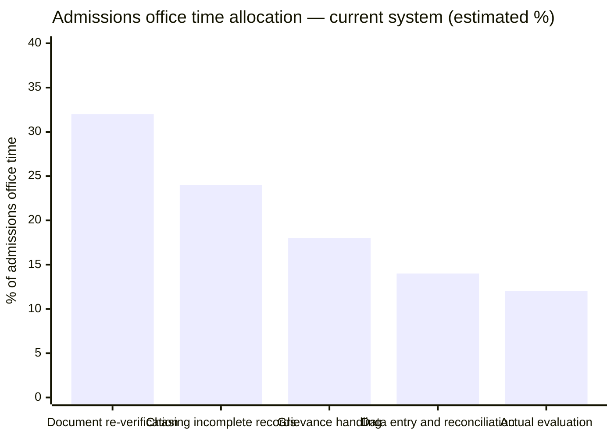
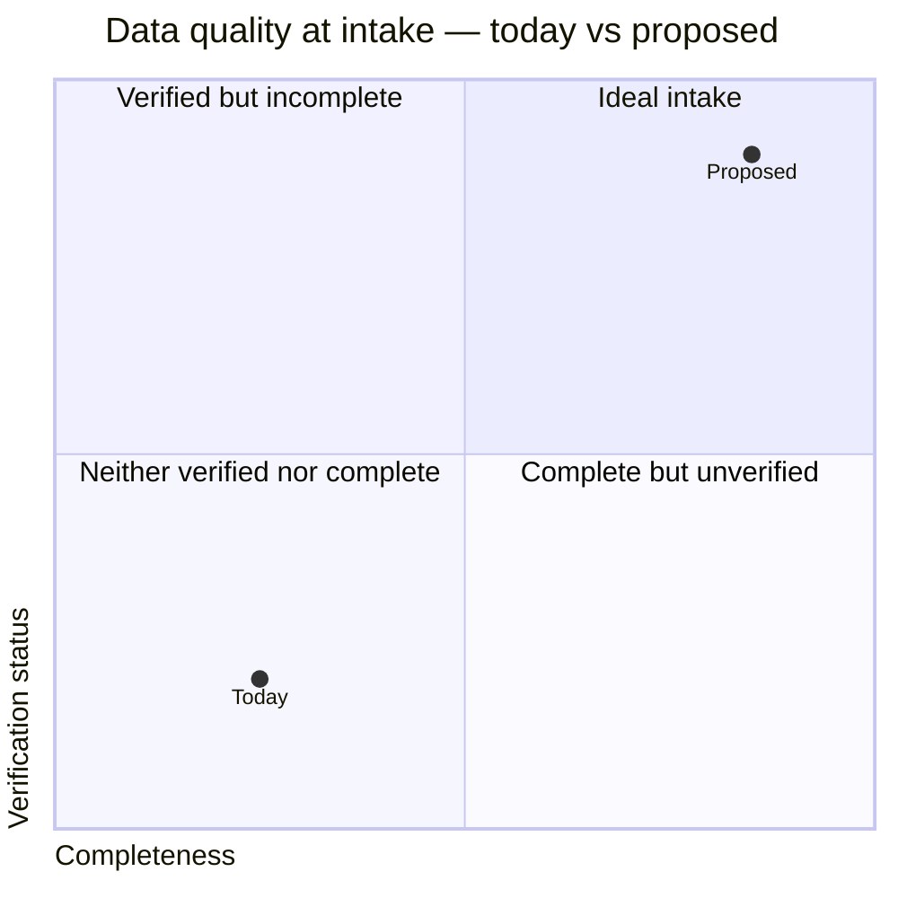
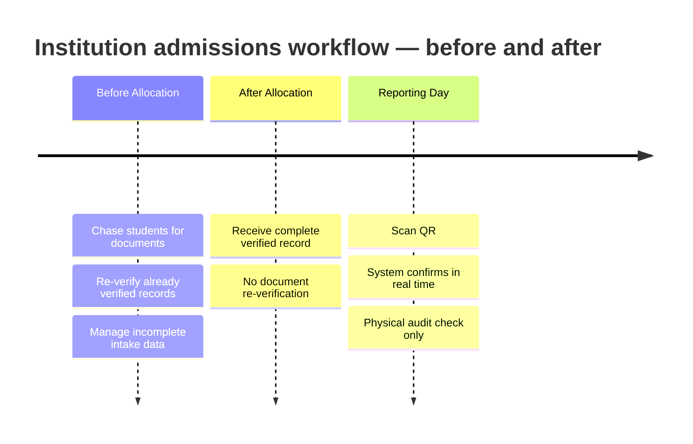

Institutions sit at the receiving end of the admissions process. They do not run counsellings. They receive students from them. The operational burden on an institution's admissions office is directly proportional to how incomplete, unverified, or inconsistent the incoming data is.

---

## The current intake burden

*Estimated from operational research across institutional admissions offices. Not a published study.*

The majority of admissions office time goes to tasks that exist because incoming data is incomplete or unverified — not to evaluation.

---

## Institutions in scope

<CardGroup cols={2}>
  <Card title="Centrally funded" icon="landmark">
    IITs, NITs, IIITs, central universities — participate in JoSAA, CSAB, and central counsellings
  </Card>
  <Card title="State government" icon="building-columns">
    State engineering, medical, and general degree colleges — participate in state-level counsellings
  </Card>
  <Card title="Deemed universities" icon="graduation-cap">
    Run independent counsellings. High administrative overhead from managing their own intake pipeline.
  </Card>
  <Card title="Private affiliated" icon="school">
    Affiliated to state universities. Seat allocation managed by the affiliating body's counselling.
  </Card>
</CardGroup>

---

## Seat vacancy distribution

*Source: AICTE data, approximate categorisation. Private and deemed institutions carry disproportionate vacancy burden — partly structural, partly coordination-driven.*

---

## What institutions receive today vs proposed

Today, institutions receive student data that is typically neither complete nor verified at source. The proposed model moves intake data significantly toward the ideal quadrant.

---

## Two touchpoints — nothing more

Institutions have two defined interactions with Superadmission.

<Steps>
  <Step title="Receive confirmed allotment">
    When a student's payment clears, the institution receives a complete, verified student record automatically. Programme, category, rank, documents — all present.
  </Step>
  <Step title="Verify at physical reporting">
    Student arrives with a digital admission letter and single-use QR code. Staff scan it. System confirms payment, allotment, and no duplicate in real time. Physical document check is audit-only.
  </Step>
</Steps>

---

## What institutions do not need to change

| Current practice | Status |
|---|---|
| Internal student information systems | Unchanged — no integration required |
| Fee structure and collection | Unchanged — institution handles post-confirmation |
| Academic processes and evaluation | Unchanged — entirely outside scope |
| Reporting to affiliating bodies | Unchanged |
| Physical document retention for records | Still required — QR scan supplements, does not replace |

---

## What changes operationally

---

## The no-rebuild principle

<Tip>
**Institutions do not build anything.** No API integration. No system replacement. No staff retraining beyond QR scanning. The entire institution-side workflow is two touchpoints — receiving a record and scanning a code.
</Tip>

---

<Info>
How counselling authorities configure the process that produces these allotments — seat matrix, rounds, allocation — is in Counselling Authorities.
</Info>

