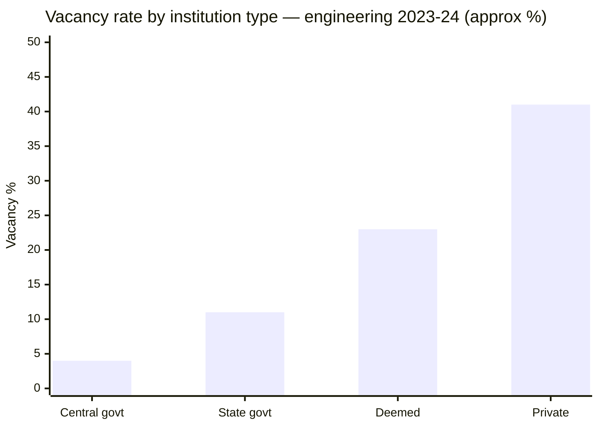
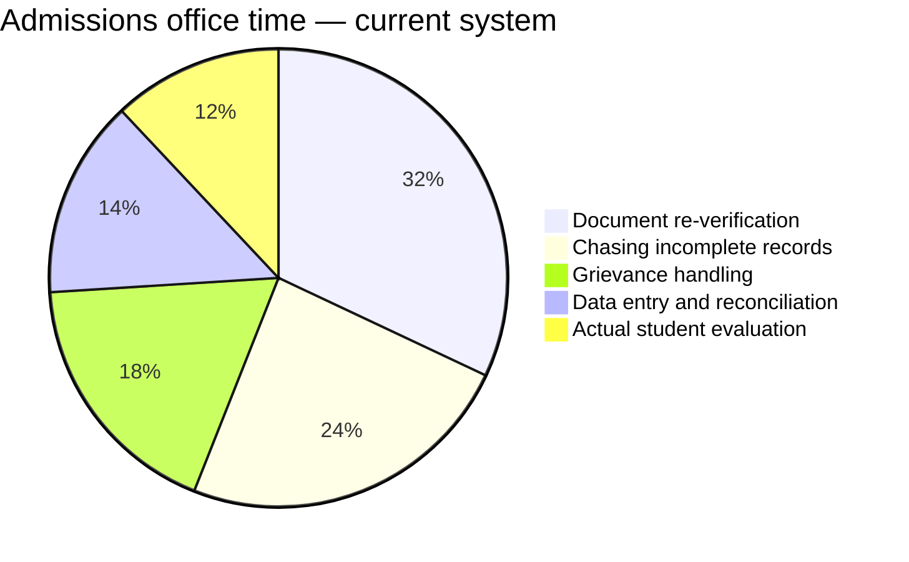

Institutions receive students through counselling processes and complete the final admission steps. Their workload depends on the quality and completeness of incoming student records. Inconsistent data, incomplete documents, and manual verification increase administrative effort.
Superadmission provides structured records, verified documents, and clear reporting states, allowing institutions to focus on admission confirmation rather than data correction.

---

## Institutions in scope

<CardGroup cols={2}>
  <Card title="Centrally funded" icon="landmark">
    IITs, NITs, IIITs, central universities. Participate in JoSAA, CSAB, and central counsellings. High fill rates, lower operational burden.
  </Card>

  <Card title="State government" icon="building-columns">
    State engineering, medical, and general degree colleges. Participate in state counsellings. Significant variation in intake data quality.
  </Card>

  <Card title="Deemed universities" icon="graduation-cap">
    Run independent counsellings. Carry the full administrative overhead of managing their own intake pipeline without shared infrastructure.
  </Card>

  <Card title="Private affiliated" icon="school">
    Affiliated to state universities. Seat allocation managed by the affiliating body. High vacancy rates — particularly in non-metro locations.
  </Card>
</CardGroup>

---

## Seat vacancy by institution type

_Source: AICTE data, approximate categorisation._

**What this tells us:**

- Central institutions fill almost completely — strong demand, well-run counsellings
- Private institutions carry the largest vacancy burden — partly structural oversupply, partly coordination failure
- Deemed and private vacancy is where Superadmission's coordination design has the largest potential impact

---

## Where admissions office time goes today

_Estimated from operational research. Not a published study._

**88% of admissions office time goes to tasks that exist because incoming data is incomplete or unverified.** Only 12% goes to actual evaluation. Superadmission's pre-verified intake is designed to invert this ratio significantly.

---

## Data quality at intake — today vs proposed

| Dimension | Today | Proposed |
| --- | --- | --- |
| Documents verified at source | Rarely | Always — fetched via DigiLocker |
| Record completeness on day one | Partial — often missing items | Complete — profile formed before admission |
| Duplicate admission risk | Present — manual check | Eliminated — QR is single-use, real-time check |
| Grievances from document issues | High | Structurally reduced — caught at profile formation |
| Time from allotment to confirmed intake | Days to weeks | Under 2 minutes |

---

## Two touchpoints. Nothing more.

<Steps>
  <Step title="Receive confirmed allotment">
    When a student's UPI payment clears, the institution receives a complete, pre-verified student record automatically. Programme, category, rank, document status — all present. No chasing required.
  </Step>
  <Step title="Scan QR at physical reporting">
    Student arrives with a digital admission letter and a single-use, time-limited QR code. Staff scan it. System confirms payment, allotment validity, and no duplicate admission — in real time.
  </Step>
</Steps>

![\[SCREENSHOT NEEDED: Institution reporting interface — QR scan result showing student name, programme, allotment confirmation, green verified status badge\]](/images/samplescreenshot.jpg)

---

## What institutions do not need to change

| Current practice | Status under Superadmission |
| --- | --- |
| Internal student information systems | Unchanged — no integration required |
| Fee structure and collection | Unchanged — institution handles post-confirmation |
| Academic processes and evaluation | Unchanged — entirely outside scope |
| Reporting to affiliating bodies | Unchanged |
| Physical document retention | Still required — QR scan is supplementary |

<Tip>
  **No rebuild. No integration. No retraining beyond QR scanning.** The entire institution-side workflow is two touchpoints — a record arrives, and a code gets scanned on reporting day.
</Tip>

---

<Info>
  How counselling authorities configure the process that produces these allotments is in Counselling Authorities.
</Info>