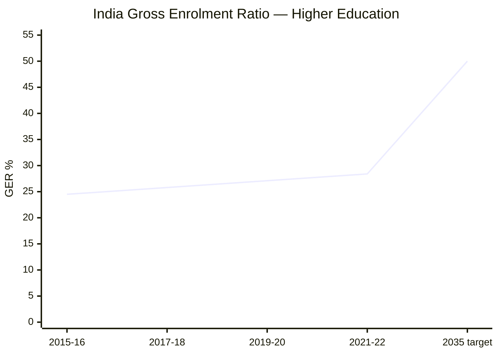
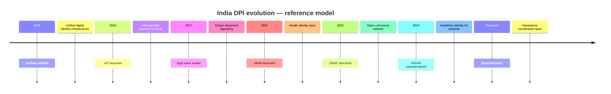

This page is written for a policy analyst, ministry official, or institutional reviewer. It is precise about what Superadmission proposes, what it aligns with, and what it does not claim.

No partnerships are active. No approvals have been obtained. This is a proposed infrastructure model.

---

## National policy context

Several active policy directions in India are structurally relevant to what Superadmission proposes. The model did not originate from these policies — but the design is informed by them and, where applicable, aligned with their intent.

---

### NEP 2020 and the GER target

*Source: AISHE reports, Ministry of Education. 2035 target per NEP 2020.*

The National Education Policy 2020 sets a Gross Enrolment Ratio target of 50% in higher education by 2035. The current rate is 28.4% (2021-22). Closing that gap requires adding approximately 7 crore students to higher education within a decade.

That scale of growth requires admissions infrastructure that can absorb it. The coordination layer does not exist yet.

**Relevance to Superadmission:** The proposed model is designed as infrastructure that could support the enrolment growth NEP 2020 targets — not as a direct implementation of NEP, but as a structurally compatible layer.

---

### Digital Public Infrastructure

India's DPI trajectory over the past decade provides the reference model for how Superadmission is designed:

Each DPI layer solved a coordination problem in one domain — identity, payments, documents, health, commerce. Higher education admissions has a structurally similar coordination problem. No equivalent layer exists yet.

**Relevance to Superadmission:** The proposed architecture is designed to sit on existing India Stack infrastructure (Aadhaar, DigiLocker, APAAR, UPI) — consistent with how DPI layers have been built in adjacent domains.

---

### India AI Mission

The India AI Mission (2024) identifies education as a priority sector for AI application. The mission emphasises AI for public benefit, with a focus on equity and access.

**Relevance to Superadmission:** Pravesh AI, the guidance and decision-support layer, is designed as an AI application in public-interest education infrastructure — consistent with the mission's stated priority areas. No formal relationship with the India AI Mission exists.

---

### DPDP Act alignment

The Digital Personal Data Protection Act, 2023, establishes the legal framework for personal data handling in India. Key provisions relevant to the proposed model:

| DPDP provision | Design response |
|---|---|
| Consent for data processing | Explicit DigiLocker consent at profile formation — purpose-limited |
| Data minimisation | Only data required for the specific counselling application is shared with that authority |
| Right to access | Students can view all data held about them |
| Right to erasure | Data deletion on request, subject to regulatory retention requirements |
| Data fiduciary obligations | Platform operates as data fiduciary — not data processor — for student data |

**Clarification:** This is design intent, not legal certification. Formal DPDP compliance assessment would be required before any production deployment.

---

## What formal alignment would involve

For Superadmission to operate at any scale involving government counselling processes, the following types of approvals or alignments would be required. These are noted as matters of process, not as claims about current status.

<AccordionGroup>
  <Accordion title="Ministry of Education">
    Engagement with MoE would be required for any integration with central counselling bodies (MCC, JoSAA, CSAB) or for recognition under NEP implementation frameworks.
  </Accordion>
  <Accordion title="State government approvals">
    Each state counselling authority operates under state government jurisdiction. State-level approval or partnership would be required for any state CET integration.
  </Accordion>
  <Accordion title="DPDP compliance verification">
    Formal assessment by a qualified data protection authority or legal counsel before handling student personal data at scale.
  </Accordion>
  <Accordion title="NIC or CERT-In security audit">
    Any platform handling government-adjacent data at scale would require security audit aligned with government standards.
  </Accordion>
  <Accordion title="UGC or AICTE coordination">
    For integration with APAAR (Academic Bank of Credits) or any UGC/AICTE-governed process, coordination with the respective regulatory body would be required.
  </Accordion>
</AccordionGroup>

---

## What Superadmission is not claiming

<Warning>
The following statements are explicitly not being made:

- Superadmission is not an approved government system
- Superadmission has no active partnership with any ministry, authority, or government body
- Superadmission is not an implementation of NEP 2020
- Superadmission is not part of the India AI Mission
- No counselling authority has committed to or agreed to use this platform
- No DPDP compliance certification has been obtained
- No security audit has been completed

This is a proposed infrastructure model, at design and early prototype stage, being documented for institutional review and discussion.
</Warning>

---

## The policy case — stated plainly

India's higher education admissions system coordinates crore-scale student volumes across 54+ independent processes annually. The coordination gap — duplicate registration, repeated document verification, fragmented deadline management, absent guidance — is well-documented in student outcomes and seat vacancy data.

Digital Public Infrastructure has addressed structurally similar coordination problems in payments, health, and documents. The admissions domain has not yet had an equivalent infrastructure layer built for it.

Superadmission proposes that layer. The design is India Stack-aligned, governance-preserving, and built for the scale of what NEP 2020 requires. Formal evaluation and approval processes are the appropriate next step for any institutional reader considering whether this warrants further discussion.

---

<Tip>
**For institutional or ministry readers who want to understand the technical architecture before a conversation:** the full system documentation is at docs.superadmission.com. The founders are reachable for direct discussion.
</Tip>

