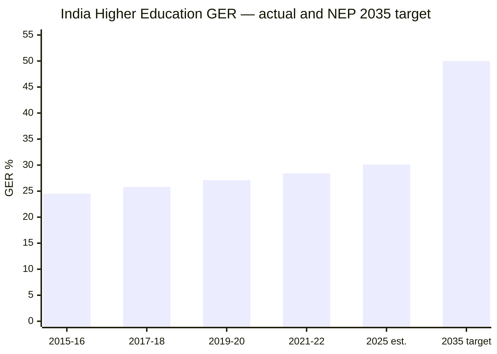
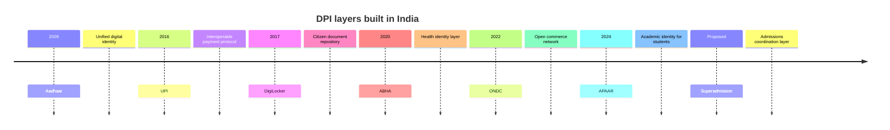
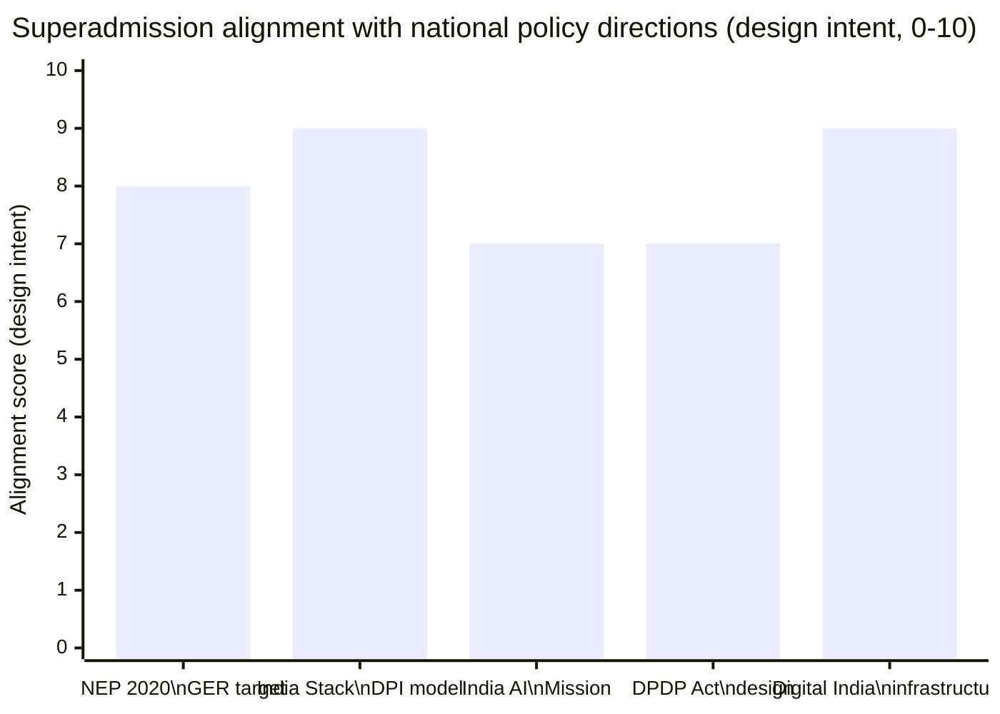

This page is for a policy analyst, ministry official, or institutional reviewer. It is precise about what Superadmission proposes, what it aligns with, and what it does not claim.

**No partnerships are active. No approvals have been obtained. This is a proposed infrastructure model.**

---

## NEP 2020 and the GER target

India's National Education Policy 2020 sets a Gross Enrolment Ratio of 50% in higher education by 2035. The current rate is 28.4% (2021-22 AISHE data).

*Source: AISHE reports, Ministry of Education. 2025 estimated. 2035 is the NEP 2020 stated target.*

**What closing the gap requires:**
- Adding approximately 7 crore students to higher education by 2035
- Seat capacity, faculty, and infrastructure expansion — policy domain
- Admissions coordination infrastructure that can absorb the volume — where Superadmission is relevant

**Relevance:** The proposed model is designed as infrastructure structurally compatible with this growth — not as a direct NEP implementation.

---

## India's Digital Public Infrastructure — the reference model

Each DPI layer solved a coordination problem in one domain. Higher education admissions has a structurally identical coordination problem. No equivalent layer has been built for it.

**Relevance:** The proposed architecture is designed to sit on existing India Stack — Aadhaar, DigiLocker, APAAR, UPI — consistent with how DPI layers have been built across adjacent domains.

---

## India AI Mission

The India AI Mission (2024) identifies education as a priority sector for AI-driven public benefit, with emphasis on equity and access.

**Pravesh AI — the guidance layer — is relevant here:**
- Provides decision support to students who currently rely on paid consultants
- Operates on structured, verified data — not on unverified inputs
- Designed to be explainable — every recommendation traces to a specific data point
- Built for India's linguistic diversity and varying digital literacy levels

**Clarification:** No formal relationship with the India AI Mission exists. The design is directionally aligned with its stated priorities.

---

## DPDP Act alignment

The Digital Personal Data Protection Act, 2023 is the governing framework for personal data handling in India.

| DPDP provision | Design response |
|---|---|
| Consent for data processing | Explicit DigiLocker consent at profile formation — purpose-limited per counselling |
| Data minimisation | Only data required for the specific application is shared with that authority |
| Right to access | Students can view all data held about them |
| Right to erasure | Deletion on request — subject to regulatory retention requirements |
| Data fiduciary obligations | Platform operates as data fiduciary, not data processor, for student data |

<Warning>
This is design intent — not legal certification. Formal DPDP compliance assessment by qualified legal counsel would be required before any production deployment.
</Warning>

---

## What formal alignment would involve

For Superadmission to operate at scale with government counselling processes:

<AccordionGroup>
  <Accordion title="Ministry of Education">
    Required for any integration with central counselling bodies (MCC, JoSAA, CSAB) or for recognition under NEP implementation frameworks.
  </Accordion>
  <Accordion title="State government approvals">
    Each state counselling operates under state jurisdiction. State-level approval required per state CET integration.
  </Accordion>
  <Accordion title="DPDP compliance verification">
    Formal assessment before handling student personal data at scale.
  </Accordion>
  <Accordion title="NIC or CERT-In security audit">
    Required for any platform handling government-adjacent data at national scale.
  </Accordion>
  <Accordion title="UGC or AICTE coordination">
    Required for APAAR integration or any UGC/AICTE-governed process connection.
  </Accordion>
</AccordionGroup>

---

## Policy alignment summary

*Self-assessed design-intent alignment. Not externally validated or certified.*

---

## What Superadmission is not claiming

<Warning>
The following statements are explicitly not being made:

- Superadmission is not an approved government system
- No active partnership with any ministry, authority, or government body exists
- Superadmission is not an implementation of NEP 2020
- Superadmission is not part of the India AI Mission
- No counselling authority has committed to or agreed to use this platform
- No DPDP compliance certification has been obtained
- No security audit has been completed

This is a proposed infrastructure model at design and early prototype stage, documented for institutional review and discussion.
</Warning>

---

<Tip>
For institutional or ministry readers who want to understand the technical architecture before a conversation — the full system documentation is at docs.superadmission.com. The founders are available for direct discussion.
</Tip>