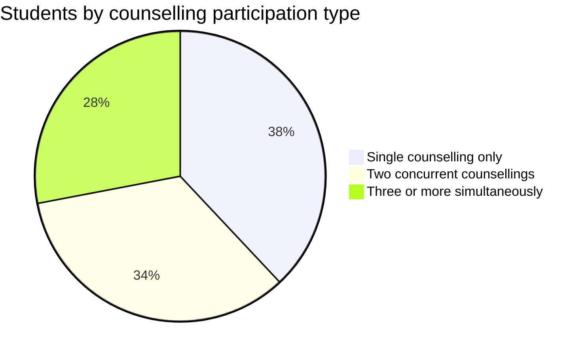
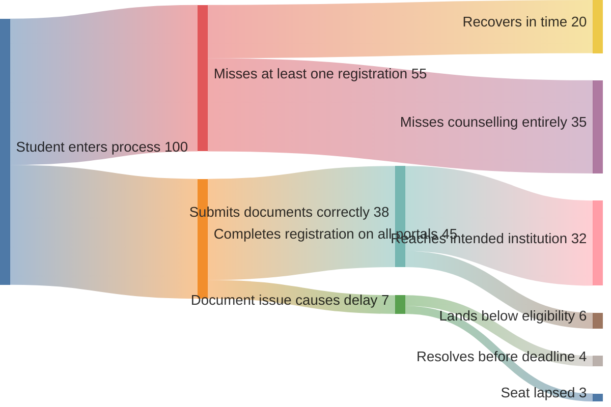

The students Superadmission is designed for are not a monolith. A student applying to JEE Advanced counselling at IITs has a very different experience from a student navigating three simultaneous state-level medical counsellings. The platform is designed to work for both — and for every case in between.

---

## Who is in this system

*Estimated distribution based on entrance exam overlap patterns. Students appearing in both national and state exams frequently participate in multiple counselling processes simultaneously.*

The complexity scales with the number of concurrent counsellings. The platform's value scales with it too.

---

## Student archetypes

<CardGroup cols={3}>
  <Card title="First-generation applicant" icon="seedling">
    No family precedent for this process. No informal network to draw on. Navigates entirely through official channels — or paid consultants if they can afford them.
  </Card>
  <Card title="Multi-counselling student" icon="layer-group">
    Qualified in NEET plus two state medical counsellings. Managing three separate portals, three document queues, three deadline schedules simultaneously.
  </Card>
  <Card title="Low-connectivity student" icon="signal">
    Intermittent internet access. Feature phone or low-end Android. Cannot reliably navigate complex portals during peak traffic periods.
  </Card>
</CardGroup>

---

## What students do today — per cycle

| Action | Average per student per cycle |
|---|---|
| Separate counselling registrations | 2.3 |
| Document submissions (same documents) | 4.1 |
| Portals actively tracked | 3 to 7 |
| Distinct payment transactions | 3 to 5 |
| Deadlines managed without unified view | 6 to 12 |

*Based on observed patterns from CollegeCult operational data across approximately 2,000 student journeys.*

---

## Where students get lost

*Illustrative flow based on observed drop-off patterns. Not a statistically validated study.*

---

## What changes on Superadmission

<Tabs>
  <Tab title="Registration">

**Today:** New account per counselling. Same fields, same documents, repeated.

**Proposed:** One Aadhaar login. One Superadmission ID. Profile carries to every participating counselling. Registration time: 5 to 10 minutes, once.

  </Tab>
  <Tab title="Documents">

**Today:** Average 4.1 submissions per cycle. Each enters a fresh verification queue. 5 to 15 days per queue.

**Proposed:** Fetched from source once. Verified once. Accepted at every participating counselling. Zero re-submissions after profile formation.

  </Tab>
  <Tab title="Deadlines">

**Today:** Student tracks manually across portals. No unified view. No proactive alerts. Conflicts discovered after they have already caused a problem.

**Proposed:** All active deadlines in one view. Proactive alerts at 72h, 24h, 6h. Conflict detection flags overlapping windows before they collide.

  </Tab>
  <Tab title="Guidance">

**Today:** Absent from the official process. Paid consultants fill the gap for students who can afford them.

**Proposed:** Pravesh AI built into every decision point — eligibility confirmation, probability estimates per preference, plain-language explanation of every offer and its implications.

  </Tab>
</Tabs>

---

## What students control

- Which counsellings to register for
- Their preference order — editable until deadline
- Whether to accept or decline an allotment
- Their data — what is shared, with which counselling, for what purpose

<Tip>
**Student sovereignty is an architectural principle, not a policy statement.** No counselling authority receives student data beyond what the student has applied to. No data is shared for any purpose outside the admission process.
</Tip>

---

## What stays the same

- Entrance exam scores determine rank — Superadmission does not touch this
- Reservation mandates, category rules, and eligibility criteria are set by authorities — unchanged
- The student's right to choose their institution and course — fully preserved
- Physical reporting at the institution — still required, simplified to a QR scan

---

<Info>
How institutions receive and process students after allocation is in Institutions.
</Info>
