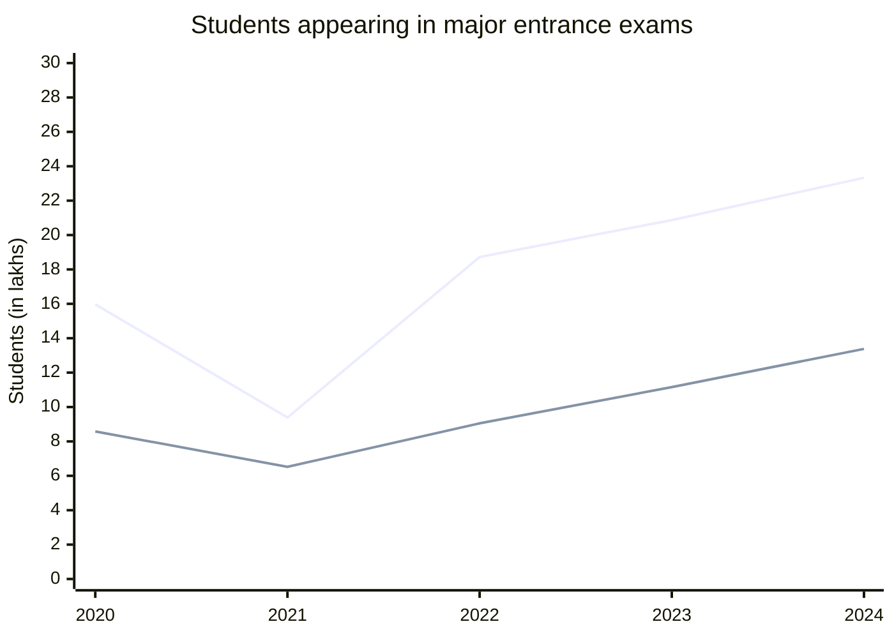
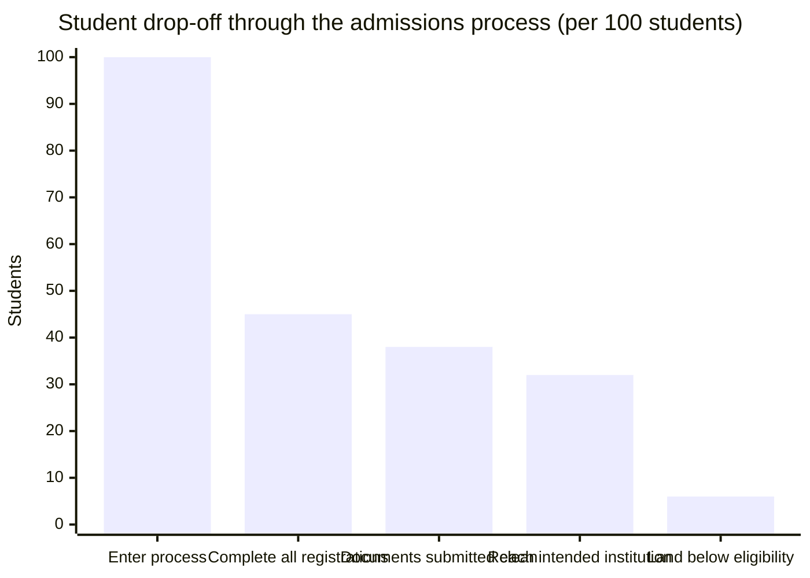

Students participate in multiple admission processes with separate timelines, requirements, and interfaces. This requires repeated data entry, document submission, and manual tracking of deadlines and status, where primary challenges are coordination and access to clear information. Superadmission provides a unified view of processes, structured guidance, and consistent tracking, reducing the need for manual coordination.

---

## Scale of student participation

_Blue: NEET UG. Green: JEE Main. Source: NTA. NEET 2021 was held during COVID-affected conditions._

Participation is growing. Both nationally and across state-level CETs, the student volume entering the admissions process increases year on year moving toward the NEP 2035 target of 50% Gross Enrolment Ratio.

---

## Who is in this system

Not every student has the same experience. Three types of students face distinctly different challenges.

<CardGroup cols={3}>
  <Card title="First-generation applicant" icon="seedling">
    No family member has been through this before. Navigates entirely on their own or through paid consultants if they can afford them. Every step is new.
  </Card>

  <Card title="Multi-counselling student" icon="layer-group">
    Qualified in NEET plus two state medical counsellings. Three separate portals. Three document queues. Three deadline schedules. No unified view.
  </Card>

  <Card title="Low-connectivity student" icon="signal">
    Intermittent internet. Low-end device. Cannot reliably access complex portals during the crash-prone peak traffic windows that follow result declarations.
  </Card>
</CardGroup>

---

## What students do today per cycle?

| Action | Average per student per cycle |
| --- | --- |
| Separate counselling registrations completed | 3 to 4 |
| Document submissions of the same documents | 3 to 4 |
| Portals actively tracked simultaneously | 3 to 7 |
| Distinct payment transactions | 3 to 5 |
| Deadlines managed without a unified view | 6 to 12 |

_Based on observed patterns from approximately 2,000 student journeys through_ <Tooltip tip="CollegeCult was the first step we took; this ran on a consultancy model" headline="About CollegeCult">CollegeCult</Tooltip> _operations._

---

## Where students get lost

_Illustrative is based on observed patterns. Not a statistically validated study._

More than half of students miss at least one counselling registration. Of those who complete everything correctly, a significant share still land below their eligible institution because of deadline collisions, incomplete information, or guidance gaps.

---

## What changes on Superadmission

<Tabs>
  <Tab title="Registration">
    **Today:** New account per counselling. Same fields, same documents, every time.

    **Proposed:** One Aadhaar login. One verified ID. Profile carries to every participating counselling. Registration time: 5 to 10 minutes, once.
  </Tab>
  <Tab title="Documents">
    **Today:** Average 4 submissions per cycle. Each enters a new verification queue. 5 to 15 days per queue.

    **Proposed:** Fetched from source once. Verified once. Accepted at every participating counselling. Zero re-submissions after profile formation.
  </Tab>
  <Tab title="Deadlines">
    **Today:** Student tracks manually across portals. No unified view. Conflicts discovered after they have already caused a problem.

    **Proposed:** All active deadlines in one view. Proactive alerts at 72h, 24h, 6h. Conflict detection flags overlapping windows before they collide.
  </Tab>
  <Tab title="Guidance">
    **Today:** Absent from the official process. Paid consultants fill the gap for students who can afford Rs 5,000 to Rs 2 lakh.

    **Proposed:** Pravesh AI built into every decision point — eligibility, probability estimates per preference, plain-language explanation of every offer.
  </Tab>
</Tabs>

<Frame caption="The student overview dashboard — all active counsellings, document status, current stage, and next deadline in a single view">
  
</Frame>

---

## What students control

- Selection of counselling processes to register for
- Preference order, editable until the defined deadline
- Acceptance or rejection of an allotment
- Data sharing permissions across processes

<Tip>
  Decision support is provided uniformly to all students, without dependency on external guidance or paid services.
</Tip>

---

## What stays the same

- Entrance exam scores determine rank
- Reservation mandates and category rules are defined by authorities
- Student choice of institution and programme remains unchanged
- Physical reporting at the institution remains required, with simplified verification methods

<Info>
  How institutions receive and process students after allocation is in Institutions.
</Info>