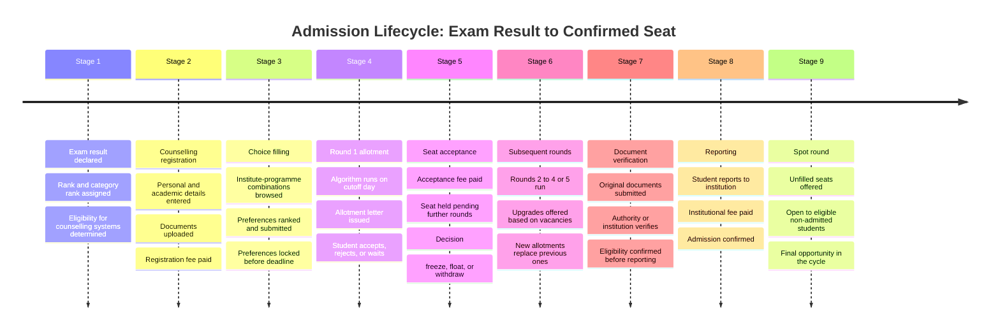
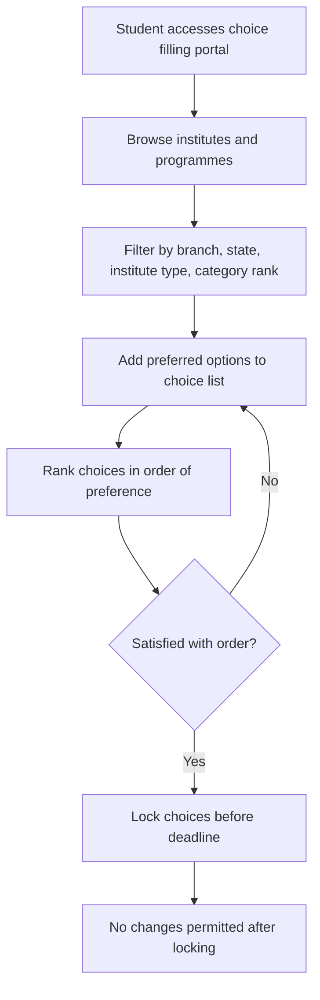
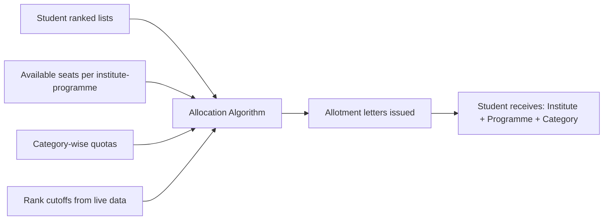
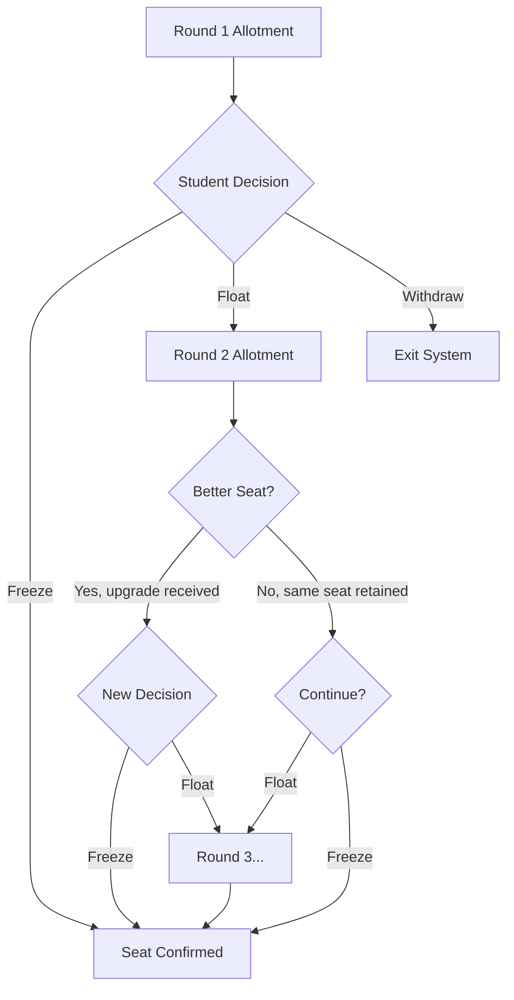

The admission process in India follows a defined sequence. Each stage is controlled by a different entity. The student must complete each step actively — nothing moves forward automatically.

This page traces that sequence for a student participating in a single counselling system. The complexity compounds when multiple counselling systems are involved simultaneously, which is the common case.

---

## Full Lifecycle Overview

---

## Stage 1: Exam Result

The entrance exam body declares results and publishes rank lists. A student receives:

- An overall merit rank
- A category-specific rank for each applicable category (OBC-NCL, SC, ST, EWS, PwD)
- A subject-specific rank in some exams (e.g. Physics, Chemistry, Mathematics percentiles in JEE Main)

These ranks determine which counselling systems the student can access and at which eligibility thresholds. A student may qualify for JoSAA, their state CET counselling, and one or more institutional counsellings based on different rank thresholds.

<Note>
  The exam body does not run counselling. It only produces ranks. The student must then identify which counselling systems their rank qualifies them for and register on each independently.
</Note>

---

## Stage 2: Counselling Registration

Each counselling system requires a separate registration. The student:

1. Creates an account on the counselling portal
2. Enters personal details — name, date of birth, category, contact information
3. Enters academic details — qualifying exam marks, board, year of passing
4. Uploads a set of documents — photograph, signature, mark sheets, category certificates, identity proof
5. Pays a non-refundable registration fee

<Warning>
  If the student is participating in three counselling systems, this entire process is repeated three times. Documents are uploaded separately to each portal. There is no shared document submission. Registration fees are paid separately on each portal.
</Warning>

**Typical documents required at registration:**

| Document | Format | Common Requirement |
|----------|--------|-------------------|
| Passport photograph | JPEG, under 50KB | All counselling systems |
| Signature | JPEG, under 30KB | All counselling systems |
| Class 10 mark sheet | PDF | Most systems |
| Class 12 mark sheet | PDF | All counselling systems |
| Rank / admit card | PDF | All counselling systems |
| Category certificate | PDF | If applicable |
| Domicile / residential certificate | PDF | State counselling systems |
| Income certificate | PDF | EWS and fee waiver cases |
| PwD certificate | PDF | If applicable |

---

## Stage 3: Choice Filling

The student browses available institute-programme combinations — called choices — and ranks them in order of preference.

<Info>
  The order of preferences matters. The algorithm does not know what the student actually wants — it only knows the ranked list. A student who places a less preferred option higher by mistake may receive that allotment and lose access to a more preferred one.
</Info>

**What students typically evaluate during choice filling:**

- Branch or programme preference
- Institute ranking or reputation
- City or state location
- Hostel availability
- Fee structure
- Cutoff trends from previous years

Choice filling windows are typically open for 3 to 5 days. After the lock deadline, no changes are permitted.

---

## Stage 4: Allotment

On the allotment day, the authority's algorithm runs. It processes every registered student's ranked choice list against available seats, category quotas, and rank thresholds.

The student receives an allotment letter specifying:
- The institute
- The programme
- The category under which the seat was allotted
- The deadline to respond

**Student options after receiving an allotment:**

<CardGroup cols={3}>
  <Card title="Accept" icon="check">
    Pay the seat acceptance fee. Participate in future rounds for possible upgrade. Seat is held.
  </Card>
  <Card title="Reject" icon="x">
    Do not accept the current allotment. Exit this counselling round. May still participate in next round depending on system rules.
  </Card>
  <Card title="No Action" icon="clock">
    Failing to respond by the deadline typically results in automatic forfeiture of the allotment. Rules vary by authority.
  </Card>
</CardGroup>

---

## Stage 5: Seat Acceptance and Round Decision

A student who accepts a seat must then decide how to participate in subsequent rounds.

<AccordionGroup>

  <Accordion title="Freeze">
    The student retains their current allotment and exits all further rounds. The accepted seat becomes their confirmed seat. No further allotments will be offered. This is the appropriate choice when the student is satisfied with the current allotment.
  </Accordion>

  <Accordion title="Float">
    The student retains their current allotment but continues to participate in subsequent rounds. If a more preferred allotment becomes available in a later round, the current seat is automatically replaced. If no better option appears, the current allotment is retained. Float is the appropriate choice when the student wants to keep the current seat while remaining open to an upgrade.
  </Accordion>

  <Accordion title="Withdraw">
    The student exits the counselling system entirely. No seat is retained. The acceptance fee may be forfeited depending on the authority's refund policy. Withdrawal is typically irreversible within that counselling cycle.
  </Accordion>

</AccordionGroup>

---

## Stage 6: Upgrade Rounds

Most counselling systems run 2 to 5 rounds. After each round, seats vacated by withdrawals and rejections are redistributed.

<Note>
  Each round has its own acceptance deadline. A student who misses a round's deadline may lose their current allotment depending on the authority's rules. Tracking deadlines across multiple rounds — and across multiple counselling systems simultaneously — is one of the primary sources of difficulty for students.
</Note>

---

## Stage 7: Document Verification

Before reporting, documents are verified. This happens at two levels:

**Authority-level verification:** Some counselling systems verify documents before or during the counselling process. The student uploads documents online. A verification team reviews them. If a document is rejected, the student is typically given one opportunity to resubmit.

**Institution-level verification:** After allotment is finalised, the institution verifies original documents when the student reports. Even if documents were verified by the counselling authority, the institution conducts its own independent verification. A mismatch or missing document at this stage can result in cancellation of admission.

---

## Stage 8: Reporting

Reporting is the final confirmation of admission. The student physically or digitally reports to the institution within the prescribed deadline.

<Steps>
  <Step title="Carry Original Documents">
    All documents uploaded during registration must be presented in original. Mark sheets, certificates, category documents, admit card, allotment letter, and identity proof.
  </Step>
  <Step title="Document Verification at Institution">
    The institution's admissions office verifies each document against the copies submitted during counselling. Any discrepancy may result in cancellation.
  </Step>
  <Step title="Pay Institutional Fee">
    The first-semester or first-year fee is paid at this stage. Fee amount, payment method, and accepted modes vary by institution.
  </Step>
  <Step title="Biometric Registration">
    Many institutions collect biometric data — fingerprint, photograph — at the time of reporting for identity records.
  </Step>
  <Step title="Admission Confirmed">
    After all steps are completed, the student receives an admission confirmation. They are enrolled.
  </Step>
</Steps>

<Warning>
  Missing the reporting deadline forfeits the allotted seat. The seat is then released back into the system — either for a spot round or cancelled entirely. The reporting deadline is set by the counselling authority, not the institution, and is non-negotiable in most cases.
</Warning>

---

## Stage 9: Spot Round

After all regular rounds close, some seats remain vacant — due to withdrawals, unreported allotments, or late cancellations. Authorities open a spot round to fill these seats.

**Spot round characteristics:**
- Open to students who were not allotted a seat in any regular round, or who withdrew
- Very short window — typically 1 to 2 days
- Same eligibility criteria as regular rounds
- Some authorities require physical presence at designated venues
- No upgrade rounds after spot round — the allotment is final

---

## The Multi-Counselling Reality

Everything described above assumes a student is in one counselling system. Most students are not.

A student with a JEE Main rank in the 50,000 to 1,00,000 range may simultaneously participate in JoSAA (for NITs and GFTIs), their home state engineering counselling, and one or two institutional counsellings. Each of these runs on its own timeline. Choice filling deadlines may overlap. Allotment days may fall within days of each other. Reporting deadlines may conflict.

The student manages this entirely manually — tracking deadlines, checking portals, uploading documents, and making acceptance decisions across systems with no shared interface and no coordination support.

<Info>
  This is the operational context Superadmission is designed to address. The proposed architecture is not about making any single counselling system better. It is about providing a shared layer — identity, documents, status, guidance — across all systems simultaneously.
</Info>

---

<CardGroup cols={2}>
  <Card title="Operational Challenges" icon="triangle-alert" href="/blueprint/operational-challenges">
    Where the multi-counselling reality breaks down in practice.
  </Card>
  <Card title="Proposed Structure" icon="layers" href="/blueprint/proposed-structure">
    How Superadmission proposes to address the coordination gap.
  </Card>
</CardGroup>