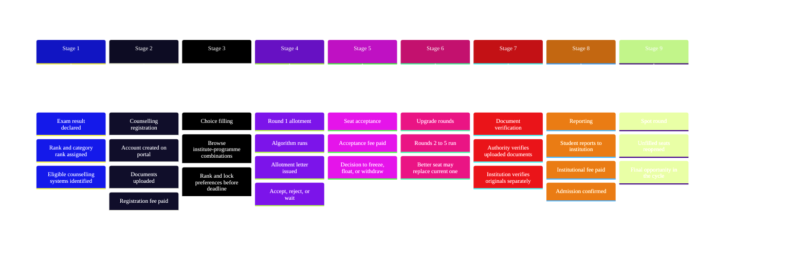
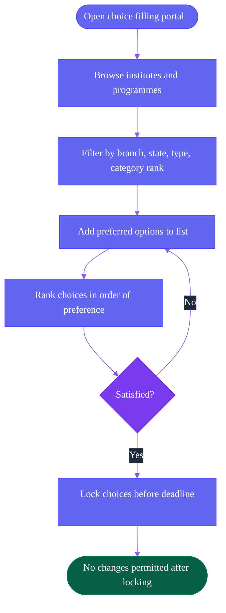
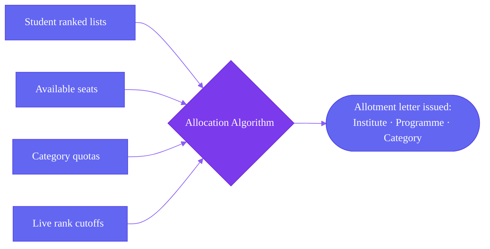
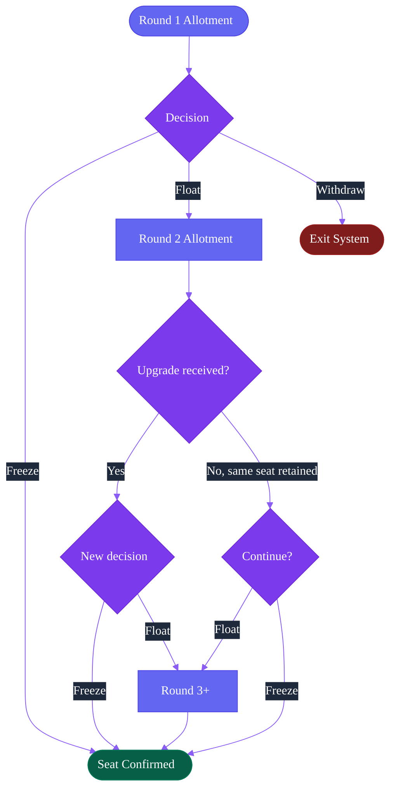

The admission process in India follows a defined sequence. Each stage is controlled by a different entity. The student must complete each step actively.

This page traces that sequence for a student participating in a single counselling system. The complexity compounds when multiple counselling systems are involved simultaneously.

---

## Full Lifecycle at a Glance

---

## Stage 1: Exam Result

The exam body publishes results and rank lists. The student receives:

- An overall merit rank
- Category-specific ranks for each applicable category (OBC-NCL, SC, ST, EWS, PwD)
- Subject-specific percentiles where applicable (e.g., PCM percentiles in JEE Main)

These ranks determine which counselling systems the student can access and at what eligibility thresholds.

<Note>
  The exam body does not run counselling. It produces ranks. The student must then identify which counselling systems their rank qualifies them for and register on each one independently.
</Note>

---

## Stage 2: Counselling Registration

Each counselling system requires a separate registration. The student creates an account, enters personal and academic details, uploads documents, and pays a non-refundable registration fee.

<Warning>
  If the student is participating in three counselling systems, this entire process repeats three times. Documents are uploaded separately to each portal. Registration fees are paid seperately.
</Warning>

---

## Stage 3: Choice Filling

The student browses available institute-programme combinations and ranks them in order of preference.

<Info>
  The algorithm only knows the ranked list. A student who ranks a less preferred option higher by mistake may receive that allotment and lose access to a better one. Choice filling windows are typically open for 3 to 5 days.
</Info>

**What students evaluate during choice filling:**

<CardGroup cols={2}>
  <Card title="Academic Factors" icon="graduation-cap">
    Branch preference, institute ranking, programme reputation, and cutoff trends from previous years.
  </Card>

  <Card title="Practical Factors" icon="map-pin">
    City and state location, hostel availability, fee structure, and distance from home.
  </Card>
</CardGroup>

---

## Stage 4: Allotment

On allotment day, the allocation algorithm processes every student's ranked choice list against available seats, category quotas, and rank thresholds.

---

## Stage 5: Round Decision

After **receiving the allotment letter, the student has three options:**

<CardGroup cols={3}>
  <Card title="Accept Seat" icon="check">
    Pay the seat acceptance fee. Hold the seat. Remain eligible for better allotments in subsequent rounds.
  </Card>

  <Card title="Reject Seat" icon="x">
    Decline the allotment. Exit this round. Won't be eligible to participate in the next round depending on the authority's rules.
  </Card>

  <Card title="No Action" icon="clock">
    Failing to respond by the deadline typically forfeits the allotment automatically. Rules vary by authority.
  </Card>
</CardGroup>

A student who accepts a seat chooses how to participate in subsequent rounds.

---

## Stage 6: Upgrade Rounds

Most counselling systems run 2 to 5 rounds. After each round, seats vacated by withdrawals and rejections are redistributed.

<Note>
  Each round has its own acceptance deadline. Missing a round's deadline may cause the student to lose their current allotment depending on the authority's rules. Tracking deadlines across multiple rounds and across multiple counselling systems simultaneously is one of the primary sources of error.
</Note>

---

## Stage 7: Document Verification

Verification happens at two independent levels, even for the same counselling and the same student.

<Steps>
  <Step title="Authority-Level Verification">
    The student uploads documents online. A verification team reviews them. If a document is rejected, the student typically gets one chance to resubmit. Some systems run this before the final allotment round.
  </Step>
  <Step title="Institution-Level Verification">
    After allotment is finalised, the institution verifies original documents when the student reports. Even if the counselling authority already verified the documents, the institution repeats the process with originals. A mismatch at this stage can result in cancellation of admission.
  </Step>
</Steps>

---

## Stage 8: Reporting

Reporting is the final confirmation of admission.

<Steps>
  <Step title="Carry Original Documents">
    Every document uploaded during registration must be presented in original.
  </Step>
  <Step title="Institution Verifies Documents">
    The admissions office checks each document against the copies from counselling body. Any discrepancy may result in cancellation.
  </Step>
  <Step title="Pay Institutional Fee">
    First-semester or first-year fee is paid at this stage. Amount, method, and accepted payment modes vary by institution.
  </Step>
  <Step title="Biometric Registration">
    Most institutions collect fingerprint and photograph for identity records.
  </Step>
  <Step title="Admission Confirmed">
    After all steps are completed, the student receives admission confirmation and is enrolled.
  </Step>
</Steps>

<Warning>
  Missing the reporting deadline forfeits the allotted seat. 
</Warning>

---

## The Multi-Counselling Reality

Everything above assumes one counselling system. Most students manage two or three simultaneously.

The student tracks all of this manually checking portals, uploading documents, making acceptance decisions with no shared interface and no coordination support.

<Info>
  This is the operational context Superadmission is designed to address. The proposed architecture is not about making any single counselling system better. It provides a shared layer identity, documents, status, guidance across all systems simultaneously.
</Info>

---

<CardGroup cols={2}>
  <Card title="Operational Challenges" icon="triangle-alert" href="/blueprint/operational-challenges">
    Where the multi-counselling reality breaks down in practice.
  </Card>

  <Card title="Proposed Structure" icon="layers" href="/blueprint/proposed-structure">
    How Superadmission proposes to address the coordination gap.
  </Card>
</CardGroup>