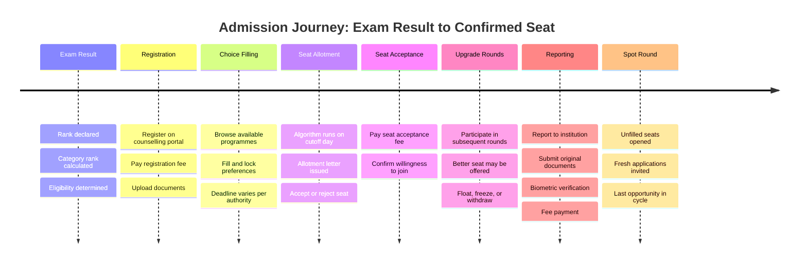
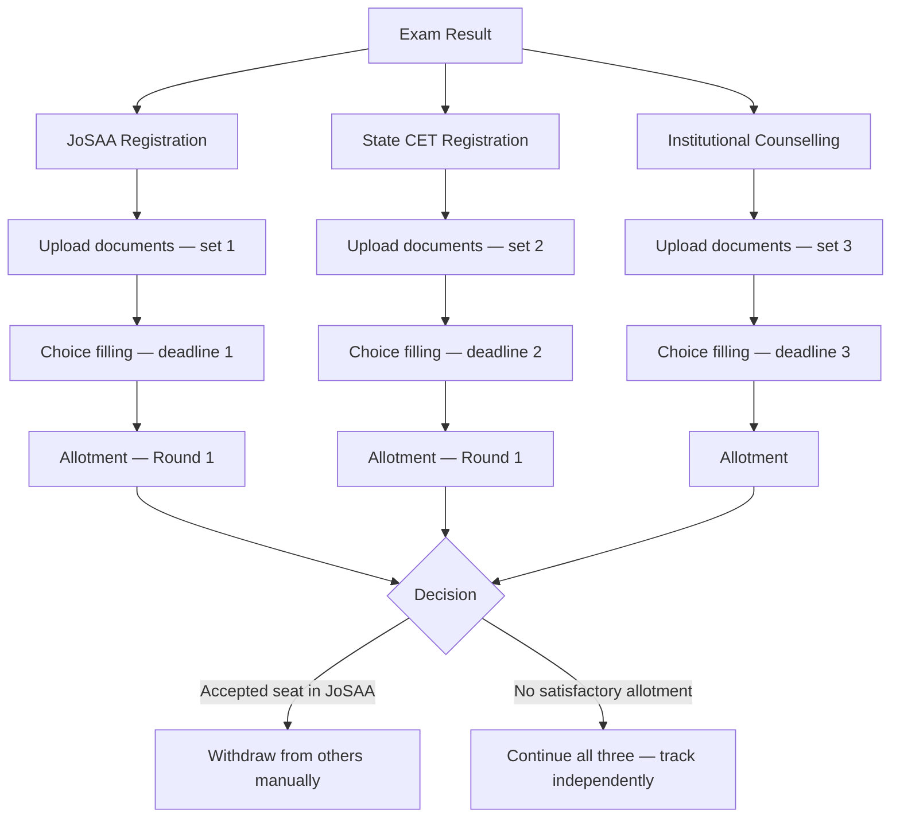

India does not have one admissions system. It has dozens of parallel systems operating simultaneously, each with its own portal, timeline, document requirements, and logic. A student applying after JEE or NEET does not move through a single process. They move through several, often at the same time.

This page maps that system. Not to criticise it — to understand it. Everything that follows in this documentation builds on what is described here.

---

## The Structure

Three types of entities run admissions in India.

<CardGroup cols={3}>
  <Card title="Exam Bodies" icon="file-pen">
    Conduct entrance exams. Declare results and ranks. Do not run counselling directly. NTA, state boards, and university-specific bodies.
  </Card>
  <Card title="Counselling Authorities" icon="building-2">
    Manage seat allocation. Run counselling rounds. Control choice filling, allotment, and upgrades. Examples: JoSAA, MCC, CSAB, state CETs.
  </Card>
  <Card title="Institutions" icon="school">
    Hold seats. Set eligibility criteria. Handle fee collection, document verification, and physical reporting after allotment.
  </Card>
</CardGroup>

The student sits outside all three, interacting with each independently.

---

## How Counselling Works

Counselling is the process by which a student's rank is converted into a seat at an institution. It is not automatic. It requires active participation across multiple steps.

<Note>
  Counselling and admission are not the same thing. Counselling is the seat allocation process. Admission is confirmed only after fee payment, document verification, and physical or online reporting at the institution.
</Note>

**The major counselling systems:**

| Authority | Scope | Stream | Approximate Scale |
|-----------|-------|--------|-------------------|
| JoSAA | Central | Engineering (JEE) | 45,000+ seats across IITs, NITs, IIITs, GFTIs |
| MCC | Central | Medical (NEET-UG / PG) | 1,00,000+ MBBS seats |
| CSAB | Central | Engineering (NRI / special rounds) | Supplementary to JoSAA |
| State CETs | State-level (30+ states) | Engineering, Medical, Management | Varies by state |
| Institutional | University-specific | Management, Law, Design, others | Independent timelines |

A student in the top 10,000 of JEE Advanced may simultaneously be eligible for JoSAA, their state engineering counselling, and one or more institutional counsellings. These run on overlapping timelines with no coordination between them.

---

## The Admission Lifecycle

The journey from exam result to confirmed seat involves the following stages. Each stage requires independent action from the student.

---

## Stage by Stage

<AccordionGroup>

  <Accordion title="Exam Result and Rank">
    The entrance exam body declares results and assigns ranks — overall and category-wise. A student may have different ranks under General, OBC-NCL, SC, ST, EWS, or PwD categories depending on eligibility. These ranks determine which counselling systems the student can access and at what eligibility threshold.
  </Accordion>

  <Accordion title="Counselling Registration">
    Each counselling system requires a separate registration. The student pays a registration fee (non-refundable in most cases), fills in personal and academic details, and uploads a set of documents. This happens independently on each portal. There is no shared registration or shared document submission across counselling systems.
  </Accordion>

  <Accordion title="Choice Filling">
    The student browses available institute-programme combinations (called choices) and ranks them in order of preference. The order matters — the allocation algorithm uses this ranked list. Most systems have a deadline of 3 to 5 days for choice filling. Changes can be made until the lock deadline. After locking, no changes are permitted.
  </Accordion>

  <Accordion title="Seat Allotment">
    On the allotment day, the authority's algorithm runs. It processes every student's ranked list against available seats, category quotas, and cutoff ranks. The student receives an allotment letter specifying the institute and programme. The student then has 24 to 48 hours to accept the seat, reject it, or freeze it while waiting for upgrades in the next round.
  </Accordion>

  <Accordion title="Upgrade Rounds">
    Most counselling systems run 2 to 4 rounds. In each round, the algorithm re-runs. Students who accepted a seat in a previous round may receive a better allotment if a preferred choice opens up. Options at each round: **Freeze** (keep current seat, exit further rounds), **Float** (keep current seat, continue in rounds for upgrade), or **Withdraw** (exit the system entirely).
  </Accordion>

  <Accordion title="Reporting">
    After accepting a seat, the student must report to the institution. This involves submitting original documents, biometric verification in many cases, and payment of the first semester fee. Failure to report by the deadline forfeits the seat. Reporting requirements, deadlines, and document checklists vary by institution.
  </Accordion>

  <Accordion title="Spot Round">
    After all regular rounds close, some seats remain unfilled. Authorities open a spot round — a short window where students can apply for these remaining seats. Spot rounds are typically a single-day or two-day process. Eligibility criteria are the same. Physical presence at a designated venue is sometimes required.
  </Accordion>

</AccordionGroup>

---

## Where the System Breaks

The process above is manageable when a student participates in one counselling. Most students do not.

A student who qualifies for JEE Main and has a state CET rank may participate in JoSAA, their state engineering counselling, and one institutional counselling simultaneously. This is the standard case, not the exception.

<Warning>
  There is no automatic coordination between counselling systems. If a student accepts a seat in one system, they must manually withdraw from others. Missing a withdrawal deadline can result in forfeiture of the seat acceptance fee or, in some cases, disqualification from future rounds.
</Warning>

**The operational breakdowns:**

| Problem | What it means in practice |
|---------|--------------------------|
| Duplicate registration | Student registers separately on each portal, entering the same personal and academic details each time |
| Repeated document upload | Same set of documents uploaded independently to each counselling portal |
| Disconnected deadlines | Choice fill, allotment, acceptance, and reporting deadlines across systems do not align and are not displayed in one place |
| No shared status | Seat status in one counselling system is not visible from another |
| Inconsistent interfaces | Each portal has a different UI, different terminology, and different navigation logic |
| Verification repetition | Documents verified by one authority are not accepted by another — the student repeats verification at each institution |

---

## What This Means Structurally

The fragmentation described above is not a user experience problem. It is a coordination and infrastructure problem.

Each counselling system was built independently to serve its own operational needs. None of them were designed to interoperate. The student is the integration layer — manually carrying information, documents, and decisions between systems that do not communicate with each other.

<Info>
  Superadmission is a proposed infrastructure layer designed to address this coordination gap. It does not replace counselling authorities or their allocation logic. It proposes a shared workflow layer — identity, documents, status, and guidance — that sits between students and existing systems. The architecture is described in the sections that follow.
</Info>

---

## Key Terms

<AccordionGroup>

  <Accordion title="Counselling">
    The process by which a student's entrance exam rank is used to allocate a seat at an institution. Managed by a counselling authority. Involves registration, choice filling, allotment, and acceptance.
  </Accordion>

  <Accordion title="Allotment">
    The outcome of a counselling round. The authority's algorithm assigns each eligible student to an institute-programme combination based on rank, category, and stated preferences.
  </Accordion>

  <Accordion title="Choice Filling">
    The step in which a student lists and ranks their preferred institute-programme combinations. The order of preferences is used directly by the allocation algorithm.
  </Accordion>

  <Accordion title="Freeze">
    A student's decision to retain their current allotment and not participate in further upgrade rounds. The seat is confirmed after freezing.
  </Accordion>

  <Accordion title="Float">
    A student's decision to retain their current allotment but remain eligible for a better seat in subsequent rounds. If a better allotment is received, the current seat is automatically replaced.
  </Accordion>

  <Accordion title="Upgrade">
    When a student receives a more preferred allotment in a later round than what they received in an earlier round. Possible only if the student chose Float or did not freeze.
  </Accordion>

  <Accordion title="Reporting">
    The final step where a student confirms their seat by physically or digitally reporting to the institution, submitting original documents, and paying the institutional fee.
  </Accordion>

  <Accordion title="Spot Round">
    A short, final round of counselling for seats that remain unfilled after all regular rounds are complete. Open to eligible students who did not receive a satisfactory allotment.
  </Accordion>

  <Accordion title="Cutoff">
    The minimum rank required to receive an allotment in a given institute-programme-category combination. Cutoffs are determined by the allotment algorithm and vary each year based on applicant volume and seat availability.
  </Accordion>

</AccordionGroup>

---

<CardGroup cols={2}>
  <Card title="Admission Lifecycle" icon="route" href="/blueprint/admission-lifecycle">
    Detailed visual walkthrough of each stage in the admission process.
  </Card>
  <Card title="Operational Challenges" icon="triangle-alert" href="/blueprint/operational-challenges">
    A closer look at where the current system creates friction and why.
  </Card>
  <Card title="Proposed Structure" icon="layers" href="/blueprint/proposed-structure">
    How Superadmission proposes to address the coordination gap.
  </Card>
  <Card title="Student Experience" icon="user" href="/blueprint/student-experience">
    How the proposed model changes the student journey.
  </Card>
</CardGroup>