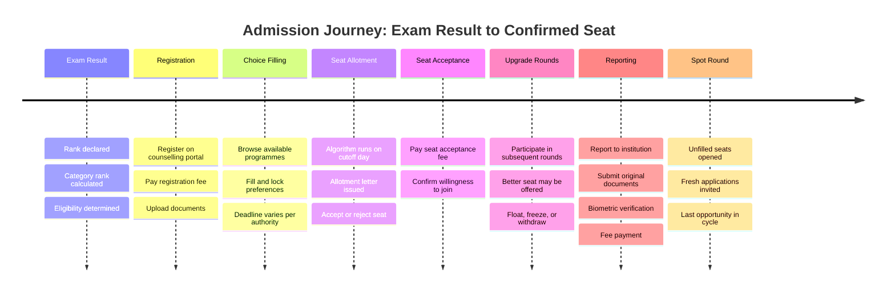
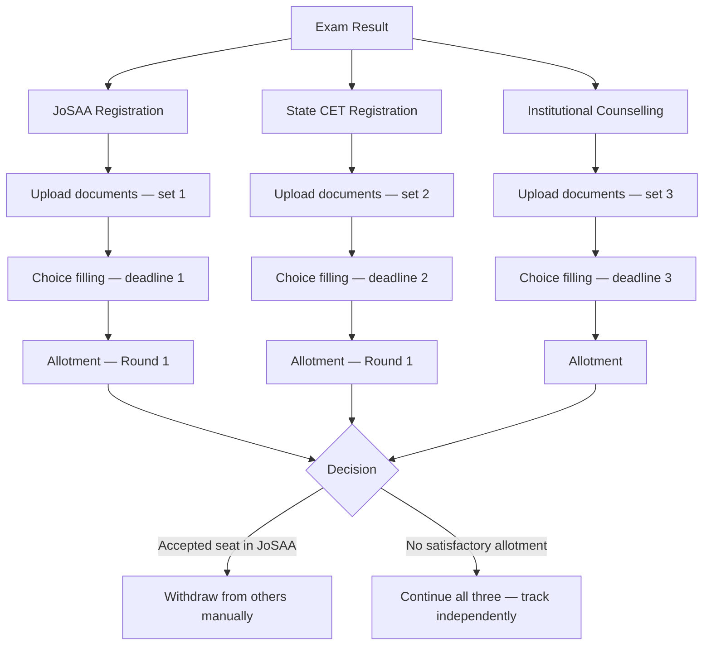

India does not have one admissions system. It has dozens of parallel systems operating simultaneously, each with its own portal, timeline, document requirements, and logic.

This page maps that system. 

---

## The Structure

Three types of entities run admissions in India.

<CardGroup cols={3}>
  <Card title="Exam Bodies" icon="file-pen">
    Conduct entrance exams. Declare results and ranks. Do not run counselling directly. \
    \
    \
  </Card>

  <Card title="Counselling Authorities" icon="building-2">
    Manage seat allocation. Run counselling rounds. Control choice filling, allotment, and upgrades. 
  </Card>

  <Card title="Institutions" icon="school">
    Hold seats. Set eligibility criteria. Handle physical reporting after allotment.\
    \
  </Card>
</CardGroup>

---

## How Counselling Works

Counselling is the process by which a student's rank is converted into a seat at an institution. It is not automatic. It requires active participation across multiple steps.

<Note>
  Counselling and admission are not the same thing. Counselling is the seat allocation process. Admission is confirmed only after fee payment, document verification, and physical or online reporting at the institution.
</Note>

---

## The Admission Lifecycle

The journey from exam result to confirmed seat involves the following stages. Each stage requires independent action from the student.

## Where the System Breaks

The process above is manageable when a student participates in one counselling. Most students do not.

A student who qualifies for JEE Main and has a state CET rank may participate in JoSAA, their state engineering counselling, and one institutional counselling simultaneously. This is the standard case, not the exception.

<Warning>
  There is no automatic coordination between counselling systems. If a student accepts a seat in one system, they must manually withdraw from others. Missing a withdrawal deadline can result in forfeiture of the seat acceptance fee.
</Warning>

**The operational breakdowns:**

| Problem | What it means in practice |
| --- | --- |
| Duplicate registration | Student registers separately on each portal, entering the same personal and academic details each time |
| Repeated document upload | Same set of documents uploaded independently to each counselling portal |
| Disconnected deadlines | Choice fill, allotment, acceptance, and reporting deadlines across systems do not align and are not displayed in one place |
| No shared status | Seat status in one counselling system is not visible from another |
| Verification repetition | Documents verified by one authority are not accepted by another — the student repeats verification at each institution |

<Info>
  Superadmission is a proposed infrastructure layer designed to address this coordination gap. It does not replace counselling authorities or their allocation logic. It proposes a shared workflow layer — identity, documents, status, and guidance — that sits between students and existing systems. The architecture is described in the sections that follow.
</Info>

---

<CardGroup cols={2}>
  <Card title="Admission Lifecycle" icon="route" href="/blueprint/admission-lifecycle">
    Detailed visual walkthrough of each stage in the admission process.
  </Card>

  <Card title="Operational Challenges" icon="triangle-alert" href="/blueprint/operational-challenges">
    A closer look at where the current system creates friction and why.
  </Card>

  <Card title="Proposed Structure" icon="layers" href="/blueprint/proposed-structure">
    How Superadmission proposes to address the coordination gap.
  </Card>

  <Card title="Student Experience" icon="user" href="/blueprint/student-experience">
    How the proposed model changes the student journey.
  </Card>
</CardGroup>