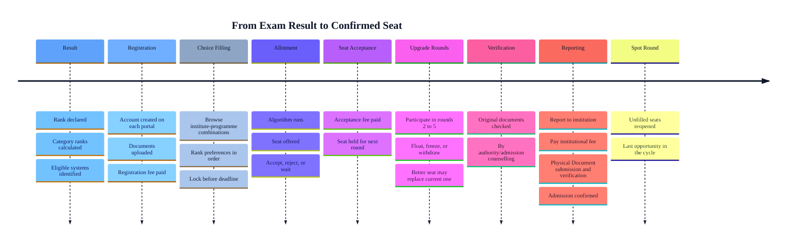

The higher education admissions ecosystem in India lacks a unified administrative infrastructure. Instead, candidates must navigate dozens of parallel, autonomous counselling bodies operating concurrently. Each authority

maintains independent digital portals, distinct operational timelines, specific documentation mandates, and unique regulatory frameworks.

## Administrative Architecture

The admissions workflow is governed by three distinct categories of institutional entities, each managing a specific phase of the applicant lifecycle:

<CardGroup cols={3}>
  <Card title="Exam Bodies" icon="file-pen">
    Responsible for conducting standardized entrance examinations, evaluating candidate performance, and publishing verified merit ranks and results.
  </Card>

  <Card title="Counselling Authorities" icon="archway">
    Responsible for converting examination ranks into programmatic seat allocations. They administer preference entry (choice filling), algorithmic allocation rounds, and institutional upgrade cycles.
  </Card>

  <Card title="Institutions" icon="school">
    The ultimate custodians of academic seats. They define specific eligibility criteria, handle physical candidate reporting, execute localized document verification, and collect institutional fees post-allotment.
  </Card>
</CardGroup>

**Operational Distinction:** _Counselling_ and _Admission_ are procedurally distinct. Counselling refers strictly to the seat allocation process administered by a centralized authority. Final admission is secured only after full fee payment, successful institutional document verification, and physical reporting at the respective campus.

---

## The Admission Journey

Progressing from an initial examination result to a confirmed institutional seat requires navigating nine sequential operational stages, each currently demanding manual, independent intervention from the applicant.

## Cross-System Pain Point

While the 9-step admission journey is linear in isolation, the operational reality for applicants is highly fragmented. A typical candidate (such as a JEE Main qualifier) concurrently navigates multiple independent counselling tracks, including JoSAA, state-specific engineering portals, and standalone institutional processes.

Because these systems lack interoperability, actions taken within one portal do not propagate to others. Accepting a seat in one system does not trigger an automatic withdrawal or notification elsewhere. Candidates must manually track and coordinate their status across platforms; failure to sync these actions before institutional deadlines frequently results in the forfeiture of seat acceptance fees.

---

## Core System Inefficiencies

The lack of integration across admissions infrastructure introduces three critical operational bottlenecks:

<CardGroup cols={1}>
  <Card title="Redundant Data and Document Storage" icon="upload">
    Applicants are required to repeatedly upload identical credentials—such as photographs, academic transcripts, and category certificates—to each independent portal. Digital validation by one authority is not recognized by parallel systems.
  </Card>

  <Card title="Asynchronous Timelines and Deadlines" icon="timeline">
    Choice-filling windows, allocation releases, and fee payment deadlines across portals are entirely unaligned. Without a centralized data feed or schedule, candidates must manually monitor distinct, high-stakes milestones.
  </Card>

  <Card title="Duplicated Verification Cycles" icon="repeat">
    Each administrative authority conducts independent verification of the same baseline documentation. This insular approach forces a single document to undergo redundant verification workflows four to five times within a single admission cycle.
  </Card>
</CardGroup>