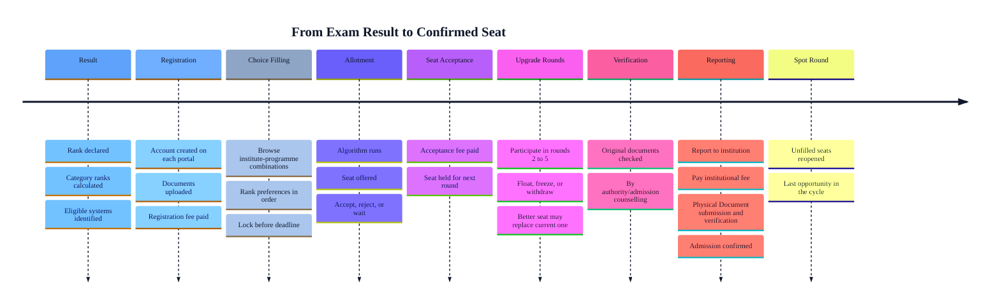

In India today there is no single admissions infrastructure. It has dozens of parallel counselling bodies running simultaneously, each with its own portal, timeline, document requirements, and rules.

## Who Runs Admissions

Three distinct types of entities control different parts of the process.

<CardGroup cols={3}>
  <Card title="Exam Bodies" icon="file-pen">
    They conduct entrance exams. Publish ranks and results.
  </Card>

  <Card title="Counselling Authorities" icon="archway">
    Convert ranks into seat allotments. Run choice filling, allocation rounds, and upgrade cycles.
  </Card>

  <Card title="Institutions" icon="school">
    Hold the actual seats. Set eligibility criteria. Handle physical reporting, document verification, and fee collection after allotment.
  </Card>
</CardGroup>

<Note>
  Counselling and admission are not the same thing. Counselling is the seat allocation process run by an authority. Admission is confirmed only after fee payment, document verification, and reporting at the institution itself.
</Note>

---

## The Admission Journey

Getting from an exam result to a confirmed seat involves nine distinct stages. Currently each one requires independent action from the student.

---

## Where the System Breaks

The above mentioned journey is manageable within a single counselling system. In practice, a typical JEE Main qualifier participates in multiple counselling systems simultaneously, including JoSAA, state engineering counselling, and institutional processes.

<Frame>
  
  
</Frame>

There is no automatic coordination between counselling systems. Accepting a seat in one system does not notify or withdraw you from others. Missing a withdrawal deadline can mean losing your seat acceptance fee.

---

## The Four Breakdowns

<CardGroup cols={1}>
  <Card title="Duplicate Registration" icon="copy">
    Every portal requires a fresh account with the same personal and academic details entered from scratch.
  </Card>

  <Card title="Repeated Document Upload" icon="upload">
    The same photograph, mark sheets, and certificates are uploaded independently to each counselling portal. One verification does not count for another.
  </Card>

  <Card title="Disconnected Deadlines" icon="timeline">
    Choice filling windows, allotment days, acceptance deadlines, and reporting cutoffs across portals do not align and are not visible in one place. The student tracks everything manually.
  </Card>

  <Card title="Verification Repetition" icon="repeat">
    Each authority verifies the same documents independently, resulting in each document being verified 4x/5x times than required. 
  </Card>
</CardGroup>