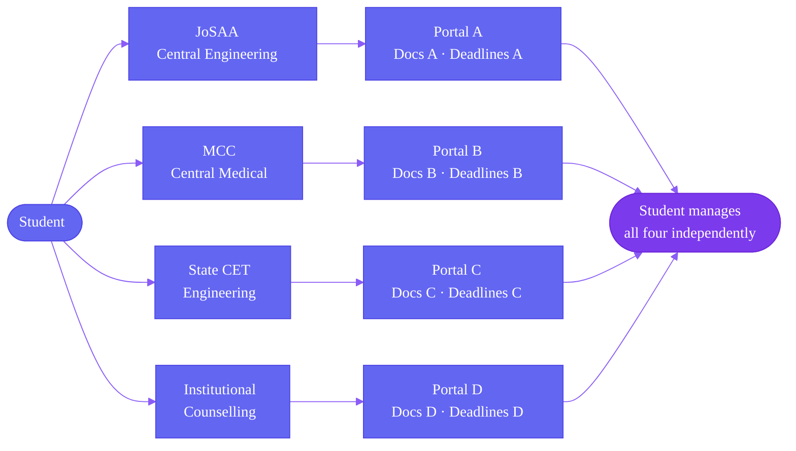

Counselling in India is a collection of independent systems. Central, state, and institutional authorities each run their own portals, set their own timelines, and manage their own document requirements. They operate in parallel. A student eligible for more than one system must engage with each independently.

Understanding this structure is the foundation for understanding what Superadmission is designed to solve.

---

## Central Counselling Authorities

Central authorities manage seat allocation for institutions funded or regulated at the national level.

<CardGroup cols={2}>
  <Card title="JoSAA" icon="building-2">
    **Joint Seat Allocation Authority**

    Covers IITs, NITs, IIITs, and Government-Funded Technical Institutes. Uses JEE Advanced ranks for IITs and JEE Main ranks for everything else. Runs 5 to 6 rounds annually. Largest centralised engineering counselling in the country.
  </Card>
  <Card title="MCC" icon="building-2">
    **Medical Counselling Committee**

    Manages MBBS, BDS, MD, MS, and MDS seats under the All India Quota (15% of state government seats) and all central institution seats. Uses NEET-UG and NEET-PG ranks. Runs multiple rounds including mop-up and stray vacancy rounds.
  </Card>
  <Card title="CSAB" icon="building-2">
    **Central Seat Allocation Board**

    Activates after JoSAA closes. Fills remaining NIT, IIIT, and GFTI seats through special rounds — primarily for NRI, PIO, and OCI category students and students from specific states and union territories.
  </Card>
  <Card title="CUET Counselling" icon="building-2">
    **Central Universities Common Entrance Test**

    Used by central universities for undergraduate admissions outside engineering and medicine. Counselling is managed by individual universities or through central coordination. Structure varies significantly across institutions.
  </Card>
</CardGroup>

---

## State Counselling Authorities

Every state with significant engineering or medical intake runs its own counselling — independent of JoSAA, MCC, and each other.

<Note>
  The table below is representative, not exhaustive. Over 30 states run independent counselling operations. Structures, timelines, and technical implementations vary significantly.
</Note>

| State | Authority | Exam Used | Streams |
|-------|-----------|-----------|---------|
| Maharashtra | MHT CET Cell | MHT CET | Engineering, Pharmacy |
| Tamil Nadu | TNEA | Class 12 marks (no entrance exam) | Engineering |
| Telangana | TSCHE / EAMCET | TS EAMCET | Engineering, Agriculture |
| Andhra Pradesh | APSCHE | AP EAMCET | Engineering, Agriculture |
| Karnataka | KEA | KCET | Engineering, Medical, Architecture |
| Uttar Pradesh | AKTU / UPTAC | JEE Main + state board | Engineering |
| Rajasthan | BCECEB / RTU | JEE Main + state board | Engineering |
| West Bengal | WBJEEB | WBJEE | Engineering |
| Delhi | JAC Delhi | JEE Main | Engineering |
| Gujarat | ACPC | GUJCET | Engineering, Pharmacy |

Each system has its own registration portal, document submission process, choice filling interface, and allotment schedule. None coordinate with JoSAA or with each other.

---

## Institutional Counselling

Beyond central and state systems, many institutions run independent counselling for seats not covered by any authority.

<AccordionGroup>
  <Accordion title="Deemed Universities">
    Institutions with deemed university status manage their own admissions. They use NEET or JEE scores as eligibility thresholds but run entirely separate portals and timelines. Examples: Manipal, VIT, SRM, BITS Pilani, Amrita.
  </Accordion>
  <Accordion title="Private Universities">
    Many conduct their own entrance tests and counselling. Some accept national or state exam scores but process admissions independently. Coordination with external systems is minimal.
  </Accordion>
  <Accordion title="Management and Law Institutions">
    CAT, CLAT, NMAT, and similar exams feed into their own counselling ecosystems. IIMs manage admissions individually through a common interface. NLUs use CLAT centralised counselling. Below that tier, institutions operate independently.
  </Accordion>
  <Accordion title="Design and Architecture">
    NATA scores feed into state and institutional counselling for architecture. NID and NIFT have entirely separate admission processes running on different timelines from engineering and medical counselling.
  </Accordion>
</AccordionGroup>

---

## How the Systems Relate to Each Other

The diagram below shows a student's reality in a single admission cycle. There is no coordination layer between any of these systems.

<Warning>
  A student holding a JEE Main rank and a state CET rank may be eligible for JoSAA, their state engineering counselling, and one or more institutional counsellings simultaneously. Each system has no visibility into the student's status in the others.
</Warning>

---

## What Each Authority Owns

This is why coordination is structurally difficult. Every authority controls its entire stack — and none of it is shared.

| Controlled by Each Authority | Not Shared Across Systems |
|------------------------------|--------------------------|
| Registration and eligibility rules | Student identity or profile |
| Document requirements and verification | Verified document status |
| Choice filling interface and deadline | Seat preferences or decisions |
| Allotment algorithm and logic | Allotment status in other systems |
| Round schedule and timing | Round progress elsewhere |
| Fee structure and payment portal | Payment confirmations |
| Reporting requirements and deadlines | Reporting status |
| Grievance handling process | Grievance or dispute history |

Every item in the right column is information the student carries manually between systems.

---

## The Coordination Gap

No mechanism currently exists for counselling systems to share student data, verify documents across systems, or coordinate round timelines. These systems were each built to serve their own operational mandate. Interoperability was not a design requirement.

<Info>
  Superadmission is designed to sit as a coordination layer above these existing systems — not to replace them. The proposed architecture enables shared identity, shared document verification, and unified workflow management without requiring any authority to change how it allocates seats.
</Info>

---

<CardGroup cols={2}>
  <Card title="Admission Lifecycle" icon="route" href="/blueprint/admission-lifecycle">
    How a student moves through these systems step by step.
  </Card>
  <Card title="Operational Challenges" icon="triangle-alert" href="/blueprint/operational-challenges">
    What happens when a student navigates multiple systems simultaneously.
  </Card>
</CardGroup>