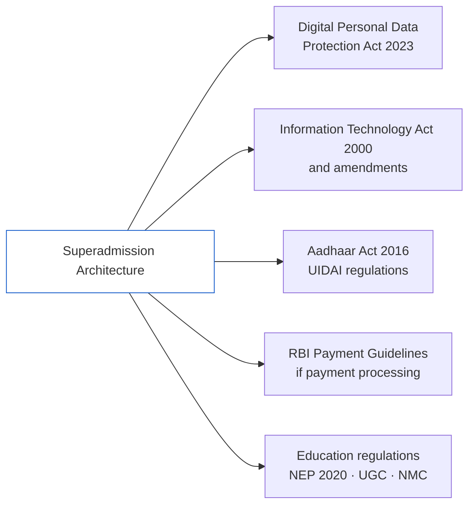
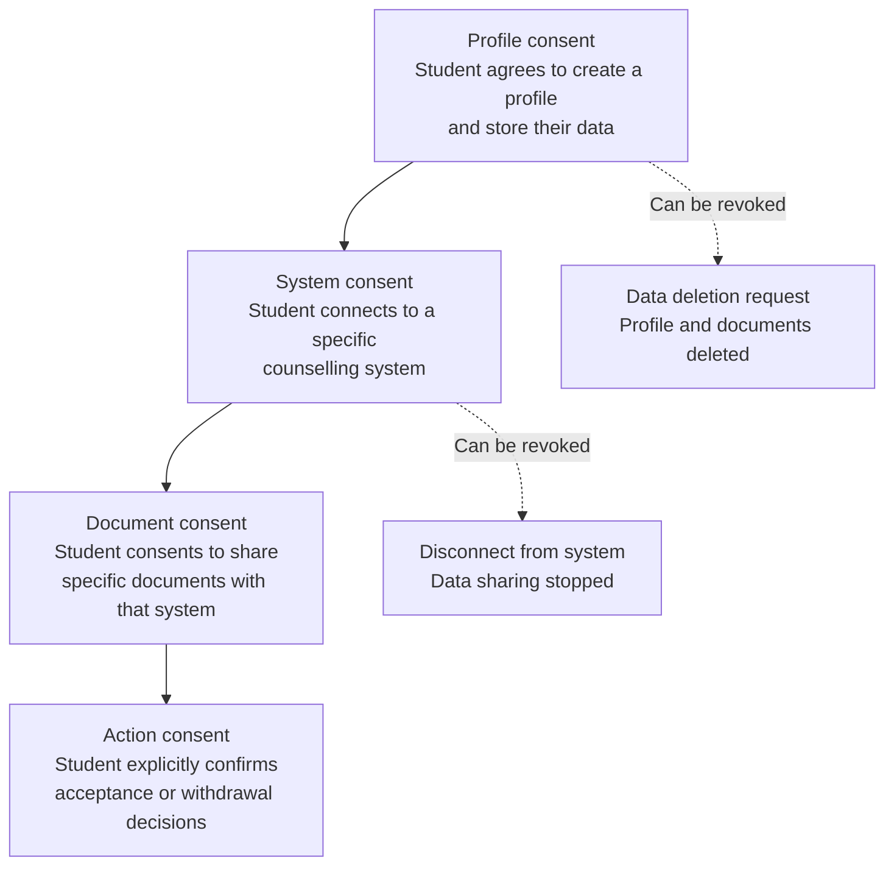

Any system handling student identity, academic records, category data, and financial transactions at scale operates within a defined regulatory environment. The Superadmission architecture is designed with these requirements in mind.

This page documents the relevant regulations, how the architecture addresses each, and where open questions remain. These are design assumptions and alignment goals — not legal certifications. Formal compliance determination requires regulatory review and legal counsel.

<Warning>
  Nothing on this page constitutes legal advice or a compliance certification. The architecture is designed to align with the regulations described. Actual compliance requires formal review, which has not occurred for Superadmission as a deployed system.
</Warning>

---

## Regulatory Landscape

---

## Digital Personal Data Protection Act (DPDP) 2023

The DPDP Act is the primary legislation governing personal data processing in India. It establishes obligations for data fiduciaries — entities that process personal data — and rights for data principals — individuals whose data is processed.

**Superadmission as a Data Fiduciary:**

Under the DPDP Act, Superadmission would be a data fiduciary, responsible for the personal data of students whose profiles are held in the system.

| DPDP Requirement | Architecture Design Response |
|-----------------|------------------------------|
| Consent before processing | Profile creation requires explicit, informed consent. Scope of consent tied to specific counselling systems the student connects to. |
| Purpose limitation | Data collected for admission purposes is not used for other purposes. Each data element is associated with a defined purpose. |
| Data minimisation | Only data required for the admission workflow is collected. No speculative data collection. |
| Data principal rights | Students can view their data, correct it, and request deletion. These rights are surfaced in the student interface. |
| Grievance mechanism | Students have access to a grievance officer contact. Complaints are tracked and resolved within defined timelines. |
| Data localisation | All student data is stored on servers located in India. No cross-border data transfer in the base architecture. |
| Security safeguards | Encryption at rest and in transit. Access controls. Audit logging. Described in detail in the infrastructure section. |

<Note>
  The DPDP Rules were still being finalised at the time this documentation was written. The architecture is designed to align with the Act as passed. Compliance with the final Rules will require review once they are notified.
</Note>

**Special category data considerations:**

Caste category data (SC, ST, OBC-NCL), disability status (PwD), and income data (EWS) are sensitive by nature. The DPDP Act does not explicitly create a separate category for caste data, but the architecture treats it with additional care:

- Category data is collected only where directly required for eligibility determination
- Category data is not shared beyond the counselling systems for which the student has enrolled
- Category verification documents are stored with stricter access controls than general documents

---

## Information Technology Act 2000

The IT Act and its amendments — particularly the IT (Amendment) Act 2008 and the IT (Reasonable Security Practices) Rules 2011 — establish baseline requirements for data security and electronic records.

<AccordionGroup>

  <Accordion title="Section 43A — Sensitive Personal Data">
    Section 43A imposes liability on companies handling sensitive personal data if they fail to implement reasonable security practices. The architecture implements AES-256 encryption for data at rest, TLS for data in transit, role-based access control, and regular security audits — aligning with the reasonable security practices standard.
  </Accordion>

  <Accordion title="Section 72A — Disclosure of Information in Breach of Contract">
    This section creates liability for disclosure of personal information without consent or in breach of contract. The architecture's data sharing model is consent-based — no data is shared with a counselling system without the student's explicit enrolment in that system's counselling.
  </Accordion>

  <Accordion title="Electronic Records and Signatures">
    Allotment letters, acceptance confirmations, and admission receipts are electronic records under the IT Act. The architecture generates and stores these records in formats that satisfy the electronic record requirements of the Act.
  </Accordion>

</AccordionGroup>

---

## Aadhaar Act 2016 and UIDAI Regulations

Where the architecture uses Aadhaar-based identity verification, it must comply with the Aadhaar Act and UIDAI regulations.

**Key constraints from the Aadhaar Act:**

| Constraint | Architecture Response |
|-----------|----------------------|
| Aadhaar number cannot be stored | Only verification status is stored, not the Aadhaar number |
| Biometric data cannot be stored by requesting entities | Biometric-based authentication is handled through UIDAI's API — no biometric data is received by Superadmission |
| Use of Aadhaar is voluntary | Aadhaar is an optional verification path. Alternative verification methods are available for all students. |
| Authentication logs must be maintained | Authentication events are logged in compliance with UIDAI log retention requirements |

---

## Consent Architecture

Consent is a recurring requirement across DPDP, the Aadhaar Act, and DigiLocker terms of use. The architecture implements a layered consent model.

Each consent is:
- Specific to a purpose
- Expressed in plain language, not legal boilerplate
- Available in multiple languages
- Revocable by the student at any time
- Logged with a timestamp

---

## Data Retention

| Data Type | Retention Period | Rationale |
|-----------|-----------------|-----------|
| Student profile | Duration of active admission cycle + 1 year | Required for grievance resolution after cycle closes |
| Documents | Duration of active admission cycle + 1 year | Required for verification disputes |
| Allotment records | 5 years | Institutional record-keeping standard |
| Audit logs | 5 years | Regulatory compliance standard |
| Payment records | 7 years | As required by financial regulations |
| Deleted data | Purged within 30 days of deletion request | DPDP compliance |

---

## Audit Requirements

The architecture is designed to produce a complete audit trail for all consequential actions.

**What is logged:**

<CardGroup cols={2}>
  <Card title="Student Actions" icon="user">
    Profile creation, document uploads, choice fills, acceptance decisions, withdrawal actions. Every student action is timestamped and logged.
  </Card>
  <Card title="System Actions" icon="cpu">
    Document verification outcomes, eligibility determinations, notification dispatches, API calls to and from counselling systems.
  </Card>
  <Card title="Authority Actions" icon="building-2">
    Override actions by authority administrators, manual review decisions, round control operations.
  </Card>
  <Card title="Access Events" icon="key">
    Every access to student data — by the student, by authority staff, by system processes — is logged with purpose, accessor identity, and timestamp.
  </Card>
</CardGroup>

**Audit log access:**
- Students can view their own action log
- Authority administrators can view actions relevant to their system
- A designated compliance officer has access to the full audit log
- Log data is write-once — no modification is possible after creation

---

## Open Compliance Questions

These questions do not have resolved answers in the current architecture. They require regulatory clarity or legal review before production deployment.

<AccordionGroup>

  <Accordion title="Classification as Significant Data Fiduciary">
    The DPDP Act creates a category of Significant Data Fiduciary (SDF) with additional obligations, applicable to entities processing large volumes of sensitive data. Whether Superadmission at scale would be classified as an SDF, and what additional obligations would apply, requires regulatory determination.
  </Accordion>

  <Accordion title="Cross-system data sharing legal basis">
    When verified document status from Superadmission is shared with a counselling authority, the precise legal basis for this sharing — whether it falls under the student's original consent to the counselling system, or requires a separate consent — requires legal review in the context of the final DPDP Rules.
  </Accordion>

  <Accordion title="Category data handling under state-specific rules">
    Some states have their own regulations regarding the handling of caste certificate data and OBC-NCL verification. The architecture's treatment of category data must be reviewed against state-level regulations in each state where the system operates.
  </Accordion>

  <Accordion title="Liability for verification errors">
    If the document verification layer incorrectly verifies a document — accepting a fraudulent certificate or rejecting a valid one — the liability framework for this error is not yet defined. This requires both legal analysis and insurance or indemnity arrangements with counselling authorities.
  </Accordion>

</AccordionGroup>

---

<CardGroup cols={2}>
  <Card title="Standards and Assumptions" icon="list-checks" href="/blueprint/standards-and-assumptions">
    The technical and operational assumptions underlying the architecture.
  </Card>
  <Card title="Audit and Explainability" icon="search" href="/praveshai/audit-and-explainability">
    How the PraveshAI™ layer implements audit logging and decision explainability.
  </Card>
</CardGroup>