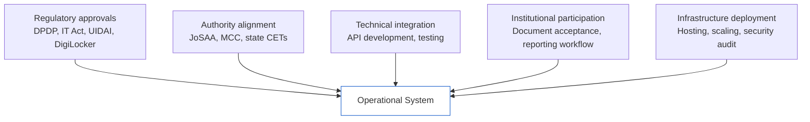

The Superadmission architecture is a proposed model. This page describes what implementation would actually require — not as a roadmap, but as an honest account of the conditions and steps that any real deployment would depend on.

This is not a plan. It is a map of the territory between here and there.

<Note>
  Superadmission is not currently in an implementation phase. This page exists to establish transparency about what implementation involves and to demonstrate that the architecture has been designed with implementation realities in mind — not in spite of them.
</Note>

---

## What Implementation Depends On

Implementation of the proposed architecture is not a single event. It depends on several independent conditions, each of which is controlled by a different set of actors.

All five conditions are necessary. None of them are sufficient individually. Progress on any one does not guarantee progress on the others.

---

## Regulatory Approvals

<AccordionGroup>
  <Accordion title="Digital Personal Data Protection Act (DPDP) compliance">
    The DPDP Act, passed in 2023 and in the process of rule-making, governs how personal data is collected, processed, and stored. Any system handling student identity, academic records, and category data at scale must be compliant with DPDP requirements — including consent frameworks, data principal rights, and data fiduciary obligations.

    A DPDP compliance review and alignment with the rules as they are finalised is a prerequisite for any production deployment.
  </Accordion>

  <Accordion title="UIDAI approval for Aadhaar integration">
    Using Aadhaar e-KYC or Aadhaar-based authentication requires explicit approval from UIDAI (Unique Identification Authority of India). This involves an application process, technical compliance review, and agreement to UIDAI's terms of use for the API. The process is well-defined but not trivial — it requires demonstrating a legitimate use case, technical readiness, and security posture.
  </Accordion>

  <Accordion title="DigiLocker registration as requester entity">
    Using DigiLocker's pull API — to fetch a student's documents with their consent — requires registration with the National Informatics Centre (NIC) as an authorised requester. This is a separate approval from UIDAI. It requires demonstrating the purpose of document access and complying with NIC's data handling guidelines.
  </Accordion>

  <Accordion title="Payment aggregator licensing or partnership">
    Collecting payments — registration fees, seat acceptance fees — requires either obtaining a payment aggregator licence from the Reserve Bank of India or partnering with a licensed payment aggregator. The former involves significant regulatory process. The latter is achievable through partnership with existing licensed aggregators.
  </Accordion>
</AccordionGroup>

---

## Authority Alignment

This is the most complex dimension of implementation. Counselling authorities are government bodies or bodies established by government mandate. Their participation cannot be compelled. It must be earned.

**What authority alignment involves:**

<Steps>
  <Step title="Demonstrating the value proposition">
    Authorities need to understand what the proposed infrastructure does for them — reduced duplicate document verification, better student experience reducing grievances, real-time monitoring capabilities. The value case must be made clearly and specifically for each authority's operational context.
  </Step>
  <Step title="Technical evaluation">
    Authorities will need to evaluate the proposed API integration — what their systems need to expose, what data flows are involved, what security guarantees are in place. This involves their technical teams and may involve the NIC or other government technical bodies.
  </Step>
  <Step title="Policy clearance">
    For central authorities — JoSAA, MCC — any formal integration is likely to require clearance from the relevant ministries. Ministry of Education for engineering counselling. Ministry of Health for medical counselling. This process has its own timeline and involves actors beyond the authority itself.
  </Step>
  <Step title="Pilot agreement">
    A formal integration is unlikely to begin without a limited pilot — a defined scope, a defined period, a defined evaluation framework. Designing and agreeing to a pilot structure is itself a significant alignment step.
  </Step>
  <Step title="Production integration">
    Full production integration, after a successful pilot, involves ongoing operational coordination — round scheduling, system availability commitments, incident response protocols, and escalation paths.
  </Step>
</Steps>

---

## Technical Integration Requirements

Connecting the proposed architecture to existing counselling systems requires technical work on both sides.

| Integration Point | What is required | Who must build it |
| --- | --- | --- |
| Registration status API | Endpoint to confirm student registration in counselling system | Counselling authority |
| Document delivery API | Endpoint to receive verified document status | Counselling authority |
| Allotment status API | Endpoint to deliver allotment outcomes to Superadmission | Counselling authority |
| Acceptance confirmation API | Endpoint to confirm student's acceptance or withdrawal action | Counselling authority |
| Identity verification | Aadhaar e-KYC integration | Superadmission \+ UIDAI |
| Document fetch | DigiLocker pull API integration | Superadmission \+ NIC |
| Payment processing | UPI integration through aggregator | Superadmission \+ RBI-licensed aggregator |

<Warning>
  Building the Superadmission side of these integrations is feasible independently. Building the counselling authority side requires authority participation. The authority-side APIs do not currently exist — they would need to be designed and built as part of an integration project, in coordination with each authority's technical team.
</Warning>

---

## What Can Be Built Independently

A meaningful portion of the proposed architecture can be built and validated without any authority integration.

<CardGroup cols={2}>
  <Card title="Student profile and identity layer" icon="user-check">
    Profile creation, document upload, verification workflows, and document storage can be built and tested without any counselling system connection.
  </Card>

  <Card title="Guidance and eligibility engine" icon="brain">
    Eligibility reasoning, choice-filling assistance, and deadline management can be built using public data — seat matrices, cutoff trends, round schedules — without live counselling system integration.
  </Card>

  <Card title="Allocation logic simulation" icon="git-branch">
    The seat allocation logic can be modelled and tested using historical data and simulated scenarios. This does not require live authority data.
  </Card>

  <Card title="Workflow and notification systems" icon="bell">
    The workflow coordination layer, deadline tracking, and notification architecture can be designed and tested in a simulated environment.
  </Card>
</CardGroup>

What cannot be built or validated without authority integration: live allotment delivery, real-time seat status, live document verification handoff, and actual round participation.

---

## Sequencing

If implementation were to begin, a rational sequence would be:

1. **Regulatory groundwork** — DPDP alignment, initial conversations with UIDAI and NIC, payment aggregator identification. This runs in parallel with everything else and takes the longest.
2. **Independent build** — Student profile, document layer, guidance engine, allocation simulation. This is buildable now without external dependencies.
3. **State-level pilot conversation** — State counselling systems are operationally simpler than JoSAA and MCC, and state government engagement is a different — often faster — process than central ministry engagement. A state pilot would produce real operational learning without requiring central authority buy-in first.
4. **Central authority engagement** — With a state pilot demonstrating operational viability, the conversation with JoSAA and MCC has a concrete reference point.
5. **Production integration** — Phased, starting with the systems that have completed their integration and expanding incrementally.

This is not a roadmap. It is a description of what a rational implementation sequence would look like based on the architecture and the institutional environment as understood today.

---

<CardGroup cols={2}>
  <Card title="Known Constraints" icon="lock" href="/changelog/known-constraints">
    What the current architecture cannot do and what it depends on externally.
  </Card>

  <Card title="Progress" icon="clock" href="/changelog/progress">
    Current stage of the project and active areas of work.
  </Card>
</CardGroup>