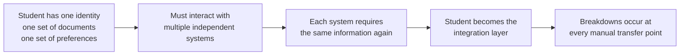

The admission process in India functions, with over 4 crore students participating annually across multiple counselling systems. The challenge lies in the cumulative time, duplication of effort, and coordination required from students.

This page documents the specific operational breakdowns.

---

## The Core Pattern

Every breakdown described on this page follows the same root cause.

---

## Breakdown 1: Repeated Identity Entry

Every counselling system requires a fresh account. The student re-enters the same personal and academic information from scratch each time.

No system accepts what another has already collected and verified. Every re-entry is a new opportunity for an error.

---

## Breakdown 2: Document Re-Upload

Verified documents are not reusable across portals. Each portal requires documents to be uploaded again, often in different formats.

---

## Breakdown 3: Disconnected Deadlines

Counselling processes operate on independent schedules with unaligned deadlines. There is no unified calendar, requiring manual tracking by students. \
\
Missing a deadline results in forfeiture of the allocated seat.

---

## Breakdown 4: No Shared Seat Status

Students cannot view their admission status across multiple systems in a single interface. Each system must be accessed and checked independently.

<CardGroup cols={2}>
  <Card title="What to Track Per System" icon="monitor">
    - Registration completion
    - Choice filling and locking status
    - Seat allotment (current round)
    - Fee payment status
    - Document upload and verification status
    - Admission confirmation status
  </Card>

  <Card title="What to Track Across Systems" icon="network">
    - Best active allotment across systems
    - Upcoming deadlines
    - Acceptance vs withdrawal decisions
    - Current round status per system
    - Remaining seat upgrade eligibility
  </Card>
</CardGroup>

No unified view exists to aggregate this information.

---

## Breakdown 5: Verification Repetition

- The same documents are verified multiple times across the admission process.
- Verification occurs at registration, during verification stages, and again at final reporting.
- Participation in multiple processes results in repeated verification cycles.

---

## Breakdown 6: Interface Inconsistency

Each portal has different terminology, different navigation logic, and different feedback mechanisms.

<AccordionGroup>
  <Accordion title="Terminology differs across systems">
    What JoSAA calls "Float" a state CET may call "Sliding" or "Upgrade Preference." "Freeze" becomes "Confirm." "Withdrawal" becomes "Exit." A student switching between portals must re-learn the vocabulary for each system.
  </Accordion>

  <Accordion title="Navigation logic differs across systems">
    JoSAA uses drag-and-drop for choice filling. Some state CETs use numbered text inputs. Others use a search-and-add interface. Same action, different paradigm, every time.
  </Accordion>

  <Accordion title="Status display differs across systems">
    Some portals show allotment status on the dashboard. Others bury it under multiple menu levels. Some send SMS notifications for every state change. Others require the student to log in and check actively. Some show a deadline countdown, others show only a static date.
  </Accordion>

  <Accordion title="Error feedback differs across systems">
    When a document upload fails, one portal says "File size exceeds limit." Another says "Upload failed — try again." A third may accept the upload silently while marking the document as under review. The student cannot distinguish between a successful upload, a pending review, and a silent failure without checking back.
  </Accordion>
</AccordionGroup>

---

## The Structural Diagnosis

The underlying problem is the absence of a coordination layer that sits across systems and removes the coordination burden from the student.

---

<CardGroup cols={2}>
  <Card title="Proposed Structure" icon="centos" href="/blueprint/proposed-structure">
    How the proposed architecture addresses the coordination gap.
  </Card>

  <Card title="Student Experience" icon="user" href="/blueprint/student-experience">
    What the student journey looks like under the proposed model.
  </Card>
</CardGroup>