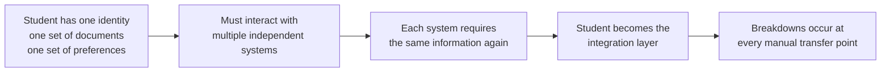
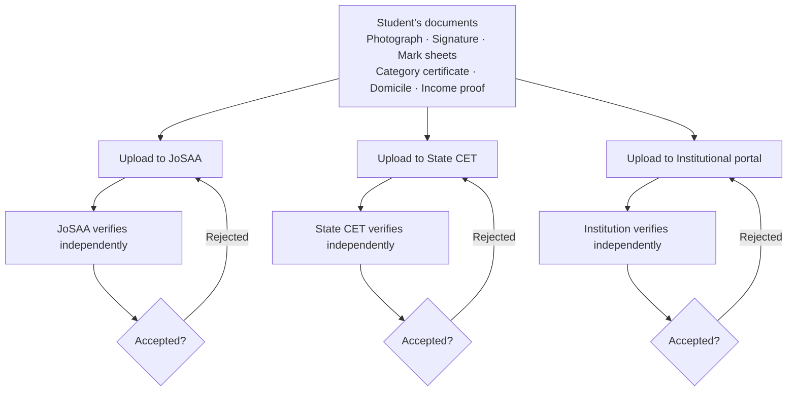
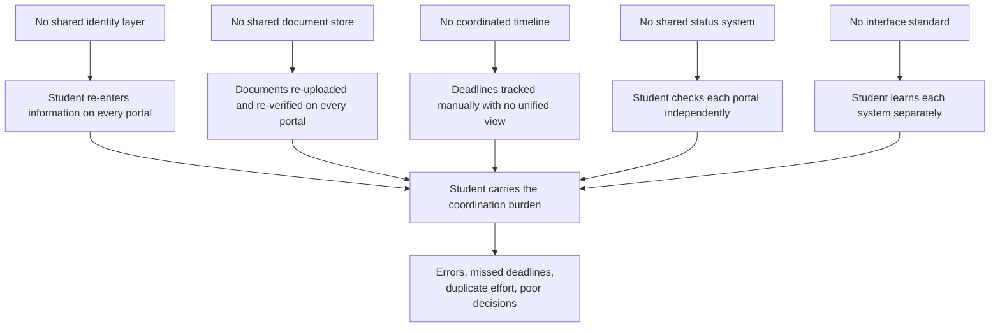

The admission process in India functions. Millions of students are admitted every year through existing systems. The problem is not that the system fails entirely. The problem is what it costs students — in time, in errors, in anxiety, and in opportunity — to navigate it.

This page documents the specific operational breakdowns. They are structural, not accidental. They emerge from a system that was built as independent parts and never designed to work together.

---

## The Core Pattern

Every breakdown described on this page follows the same root cause.

The student is not failing. The architecture is asking them to do what a coordination layer should do.

---

## Breakdown 1: Repeated Identity Entry

Every counselling system requires the student to create a fresh account and re-enter the same personal and academic information.

| Information entered | Times entered across 3 counselling systems |
|---------------------|--------------------------------------------|
| Full name | 3 |
| Date of birth | 3 |
| Parent names | 3 |
| Contact details | 3 |
| Address | 3 |
| Class 10 details | 3 |
| Class 12 details | 3 |
| Exam rank and roll number | 3 |
| Category declaration | 3 |
| Bank account for refunds | 3 |

There is no shared identity record. The student manually re-enters the same information — with risk of error at each entry — because no system accepts what another has already collected and verified.

---

## Breakdown 2: Document Re-Upload

Documents verified by one counselling authority are not accepted by another. Every portal requires fresh uploads.

<Warning>
  A document rejected by one portal may be accepted by another. Each system has its own format requirements — file size limits, resolution requirements, accepted file types. A student may need to produce three different versions of the same document to satisfy three different portals.
</Warning>

---

## Breakdown 3: Disconnected Deadlines

Counselling systems run on independent schedules. Their critical deadlines — choice fill, allotment, acceptance, reporting — do not align and are not displayed anywhere together.

A typical scenario for a student in JoSAA and one state CET:

| Date | JoSAA | State CET |
|------|-------|-----------|
| Day 1 | Choice fill opens | — |
| Day 3 | — | Choice fill opens |
| Day 5 | Choice fill closes | — |
| Day 7 | — | Choice fill closes |
| Day 9 | Round 1 allotment | Round 1 allotment |
| Day 10 | Acceptance deadline (11:59 PM) | — |
| Day 11 | — | Acceptance deadline (5:00 PM) |
| Day 13 | Round 2 allotment | — |
| Day 14 | — | Round 2 allotment |
| Day 16 | Acceptance deadline | Acceptance deadline |
| Day 22 | Reporting deadline | Reporting deadline (different date) |

The student tracks this manually. There is no unified calendar. Missing an acceptance deadline by minutes is enough to forfeit a seat.

<Info>
  Deadline formats are inconsistent across portals. Some show dates in DD/MM/YYYY format, others in MM/DD/YYYY. Some specify IST explicitly, others do not. Some acceptance windows are 24 hours, others are 48 hours. Some close at midnight, others at 5 PM.
</Info>

---

## Breakdown 4: No Shared Seat Status

A student holding a provisional allotment in JoSAA has no way to know their current status in their state CET from a single interface. Each system must be checked independently.

This creates a specific class of errors: a student accepts a seat in one system but forgets to withdraw from another. They then continue to occupy a seat in a system they do not intend to join, blocking that seat from another student. When they eventually withdraw, it may be too late for meaningful redistribution.

**Status information a student must track simultaneously:**

<CardGroup cols={2}>
  <Card title="Per System" icon="monitor">
    - Registration status
    - Document verification status
    - Current allotment (institute + programme)
    - Acceptance status
    - Round participation status
    - Reporting status
  </Card>
  <Card title="Across Systems" icon="network">
    - Which system has the best current offer
    - Which deadlines are approaching
    - Which systems to withdraw from after accepting elsewhere
    - Which round is running where
    - Which systems still have upgrade potential
  </Card>
</CardGroup>

None of this information is aggregated anywhere. The student builds their own tracking — typically a spreadsheet or a handwritten list.

---

## Breakdown 5: Verification Repetition

Document verification happens multiple times for the same student and the same documents across the lifecycle.

<Steps>
  <Step title="At Counselling Registration">
    The student uploads documents. The counselling authority verifies them — often manually, over several days. If rejected, the student re-uploads.
  </Step>
  <Step title="At Each Counselling Authority">
    If the student is in three counselling systems, verification happens three times. No authority accepts another authority's verified status.
  </Step>
  <Step title="At Document Verification Round">
    Some authorities run a separate document verification round before the final round of allotment. Students must present documents again — online or in person.
  </Step>
  <Step title="At Institution Reporting">
    The institution verifies original documents independently of the counselling authority's verification. Even if the authority confirmed document validity, the institution repeats the process with originals.
  </Step>
</Steps>

A student who goes through the full process in two counselling systems and then reports to an institution may have their documents verified four to five times.

---

## Breakdown 6: Interface Inconsistency

Each portal has a different interface, different terminology, and different navigation logic. There is no standard.

<AccordionGroup>

  <Accordion title="Terminology differences">
    What JoSAA calls "Float" a state CET may call "Sliding" or "Upgrade Preference." What one system calls "Freeze" another calls "Confirm." What one system calls "Withdrawal" another calls "Exit." A student switching between portals must re-learn the vocabulary for each system. Misunderstanding a term can lead to the wrong decision at a critical moment.
  </Accordion>

  <Accordion title="Navigation differences">
    Choice filling on JoSAA uses a drag-and-drop preference list. Some state CETs use a numbered text input. Some use a search-and-add interface. The student must locate the same functional step — ranking preferences — through different interface paradigms under time pressure.
  </Accordion>

  <Accordion title="Status display differences">
    Some portals display allotment status prominently on the dashboard. Others bury it under multiple menu levels. Some send SMS notifications for every state change. Others require the student to actively log in and check. Some show a countdown to the acceptance deadline. Others show only a static date.
  </Accordion>

  <Accordion title="Error message differences">
    When a document upload fails, one portal may say "File size exceeds limit." Another may say "Upload failed — try again." A third may not display an error at all, silently accepting the upload while marking the document as under review. The student cannot distinguish between a successful upload, a pending review, and a silent failure without checking back.
  </Accordion>

</AccordionGroup>

---

## The Structural Diagnosis

The breakdowns above share a common cause. They are not bugs. They are the predictable output of a system built without a shared identity layer, without shared document infrastructure, and without coordinated workflow design.

Fixing any one of these in isolation — a better portal design, a unified calendar app, a document upload helper — addresses a symptom. The structural problem is the absence of a coordination layer that sits across systems and removes the coordination burden from the student.

<Info>
  This is what Superadmission proposes to provide. Not a better portal. An infrastructure layer — shared identity, shared document verification, unified workflow coordination, real-time status — that makes the student's interaction with each counselling system materially simpler without requiring any authority to change how it allocates seats.
</Info>

---

<CardGroup cols={2}>
  <Card title="Proposed Structure" icon="layers" href="/blueprint/proposed-structure">
    How the proposed architecture addresses the coordination gap.
  </Card>
  <Card title="Student Experience" icon="user" href="/blueprint/student-experience">
    What the student journey looks like under the proposed model.
  </Card>
</CardGroup>