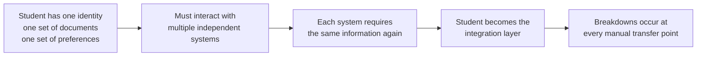
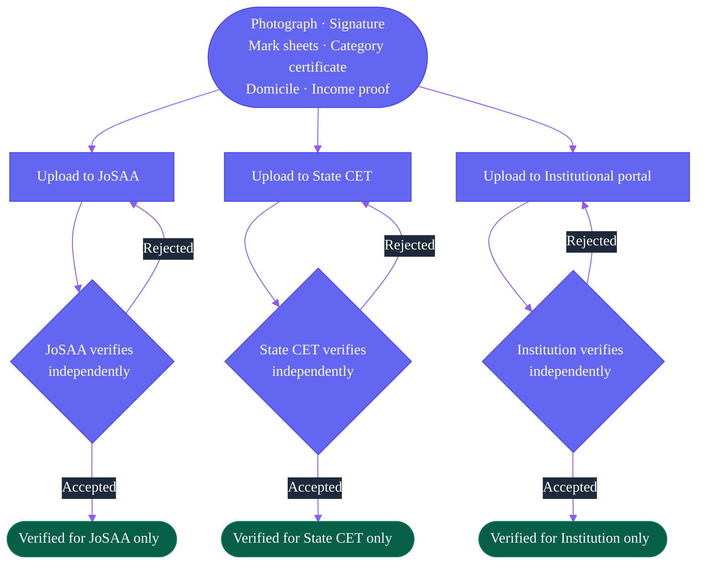
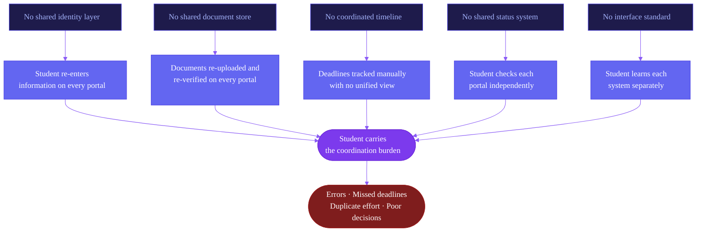

The admission process in India functions. Millions of students are admitted every year through existing systems. The problem is not that the system fails entirely. The problem is what it costs students in time, in errors, in anxiety, and in opportunity to navigate it.

This page documents the specific operational breakdowns.

---

## The Core Pattern

Every breakdown described on this page follows the same root cause.

The student is not failing. The architecture is asking them to do what a coordination layer should do.

---

## Breakdown 1: Repeated Identity Entry

Every counselling system requires a fresh account. The student re-enters the same personal and academic information from scratch each time.

No system accepts what another has already collected and verified. Every re-entry is a new opportunity for an error.

---

## Breakdown 2: Document Re-Upload

Documents verified by one counselling authority are not accepted by another. Every portal requires fresh uploads — often in different formats.

<Warning>
  A document rejected by one portal may be accepted by another — each system has its own file size limits, resolution requirements, and accepted formats. A student may need to produce three different versions of the same document to satisfy three different portals.
</Warning>

---

## Breakdown 3: Disconnected Deadlines

Counselling systems run on independent schedules. Their critical deadlines do not align and are not visible anywhere together.

The student tracks this manually. There is no unified calendar. Missing an acceptance deadline by minutes is enough to forfeit a seat.

<Info>
  Deadline formats are inconsistent across portals. Some use DD/MM/YYYY, others MM/DD/YYYY. Some specify IST, others do not. Some windows close at midnight, others at 5 PM. Some are 24 hours, others 48.
</Info>

---

## Breakdown 4: No Shared Seat Status

A student holding an allotment in JoSAA cannot check their state CET status from the same interface. Every system must be checked separately.

<CardGroup cols={2}>
  <Card title="What to Track Per System" icon="monitor">
    Registration status, document verification status, current allotment (institute and programme), acceptance status, round participation status, reporting status.
  </Card>

  <Card title="What to Track Across Systems" icon="network">
    Which system has the best current offer, which deadlines are approaching, which systems to withdraw from after accepting elsewhere, which round is running where, which systems still have upgrade potential.
  </Card>
</CardGroup>

None of this information is aggregated anywhere. Students build their own tracking typically a spreadsheet or a handwritten list.

---

## Breakdown 5: Verification Repetition

The same documents, for the same student, go through multiple verification cycles across the lifecycle.

<Steps>
  <Step title="At Each Counselling Registration">
    Documents are uploaded and verified by each counselling authority independently. A student in three counselling systems goes through this three times.
  </Step>
  <Step title="At Document Verification Round">
    Some authorities run a separate document verification round before the final allotment. Students present documents again — online or in person.
  </Step>
  <Step title="At Institution Reporting">
    The institution verifies original documents independently. Even with prior authority verification, the institution repeats the process with physical originals.
  </Step>
</Steps>

A student who participates in two counselling systems and then reports to an institution may have their documents verified four to five times.

---

## Breakdown 6: Interface Inconsistency

Each portal has different terminology, different navigation logic, and different feedback mechanisms. There is no standard across systems.

<AccordionGroup>
  <Accordion title="Terminology differs across systems">
    What JoSAA calls "Float" a state CET may call "Sliding" or "Upgrade Preference." "Freeze" becomes "Confirm." "Withdrawal" becomes "Exit." A student switching between portals must re-learn the vocabulary for each system. Misreading a term at a critical moment — under time pressure — leads to the wrong decision.
  </Accordion>

  <Accordion title="Navigation logic differs across systems">
    JoSAA uses drag-and-drop for choice filling. Some state CETs use numbered text inputs. Others use a search-and-add interface. Same action, different paradigm, every time.
  </Accordion>

  <Accordion title="Status display differs across systems">
    Some portals show allotment status on the dashboard. Others bury it under multiple menu levels. Some send SMS notifications for every state change. Others require the student to log in and check actively. Some show a deadline countdown, others show only a static date.
  </Accordion>

  <Accordion title="Error feedback differs across systems">
    When a document upload fails, one portal says "File size exceeds limit." Another says "Upload failed — try again." A third may accept the upload silently while marking the document as under review. The student cannot distinguish between a successful upload, a pending review, and a silent failure without checking back.
  </Accordion>
</AccordionGroup>

---

## The Structural Diagnosis

The underlying problem is the absence of a coordination layer that sits across systems and removes the coordination burden from the student.

<Info>
  This is what Superadmission proposes to provide. Not a better portal. An infrastructure layer — shared identity, shared document verification, unified workflow coordination, real-time status — that makes the student's interaction with each counselling system materially simpler without requiring any authority to change how it allocates seats.
</Info>

---

<CardGroup cols={2}>
  <Card title="Proposed Structure" icon="layers" href="/blueprint/proposed-structure">
    How the proposed architecture addresses the coordination gap.
  </Card>

  <Card title="Student Experience" icon="user" href="/blueprint/student-experience">
    What the student journey looks like under the proposed model.
  </Card>
</CardGroup>