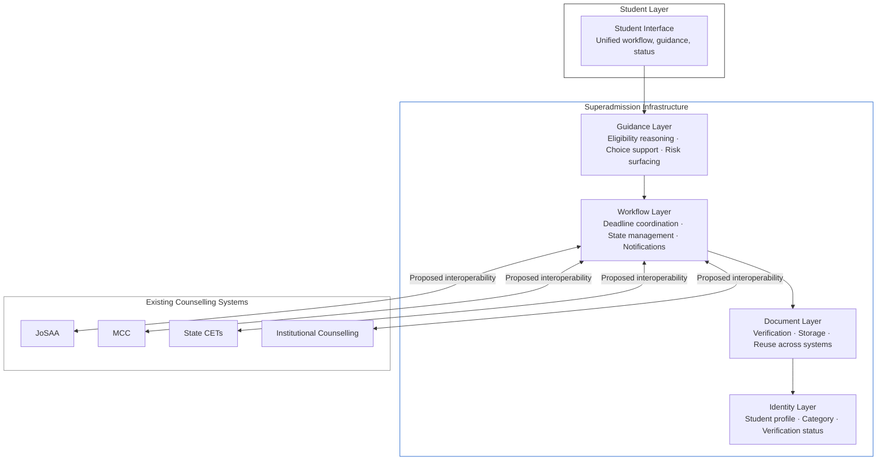
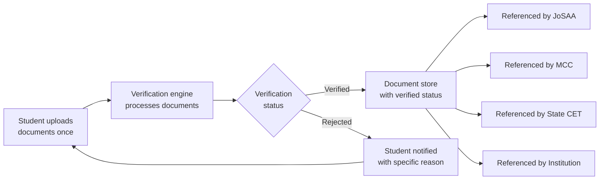

The operational challenges described above stem from the lack of a coordination layer across counselling systems. Each system functions independently, with students responsible for managing cross-system processes.\
Superadmission proposes to build that coordination layer.

---

## The Core Proposition

<Note>
  Superadmission is not a counselling system. It proposes a shared infrastructure layer.
</Note>

The shift the architecture enables:

| Currently | Proposed |
| --- | --- |
| Separate account required on each portal | Single identity-linked profile |
| Documents uploaded separately on each portal | Documents uploaded and verified once |
| Deadlines tracked manually across portals | Unified deadline tracking |
| Allotment status checked per portal | Consolidated status view |
| Different interfaces per system | Single unified interface |
| Documents verified multiple times | Verification reusable across systems |

---

## Architecture Overview

The proposed architecture is structured as five layers. Each layer addresses a specific class of the coordination problem.

---

## Layer 1: Identity

The foundation of the architecture. A student creates one identity-linked profile.

**What the identity layer contains:**

- Verified personal information — name, date of birth, contact details
- Academic record — qualifying exam, board, marks, year
- Rank information — exam rank, category ranks
- Category status — general, OBC-NCL, SC, ST, EWS, PwD, NRI
- Aadhaar-aligned identity design

**What the identity layer enables:**

- One-time entry of personal information
- Verification done once, referenced by all counselling systems
- A persistent student record across multiple academic years

## Layer 2: Documents

A shared document infrastructure that enables a student to upload and verify documents once, then have that verified status referenced by multiple counselling systems.

**How the document layer is designed to work:**

---

## Layer 3: Workflow

The coordination engine. This layer manages the student's participation across multiple counselling systems simultaneously tracking state, surfacing deadlines, and ensuring the student has the right information at the right time.

**What the workflow layer manages:**

<CardGroup cols={2}>
  <Card title="Deadline Coordination" icon="calendar">
    All deadlines across active counselling systems surfaced in a single unified view. Priority-sorted by urgency.
  </Card>

  <Card title="State Management" icon="git-branch">
    The student's current status in each counselling system  tracked and displayed in one place.
  </Card>

  <Card title="Cross-System Coordination" icon="network">
    When a student accepts a seat in one system, the workflow layer surfaces the action required in others and guides the student through it.
  </Card>

  <Card title="Notification Design" icon="bell">
    Time-sensitive notifications  delivered through a single notification layer and SMS/Email.\\
  </Card>
</CardGroup>

---

## Layer 4: PraveshAI

An AI assisted guidance layer that helps students navigate decisions with contextual insights. The student's decisions remain entirely their own.

**What the guidance layer is designed to do:**

- Surface eligible programmes based on the student's rank, category, and preferences
- Flag risk — approaching deadline, missing document, information mismatch etc.
- Assist with choice filling — presenting options, showing cutoff trends from previous years, helping the student evaluate options systematically
- Support in multiple languages — guidance in the student's preferred language, not only English

---

## Layer 5: Student Interface

The surface through which the student interacts with the entire architecture. Designed to be a single interface for all counselling participation.

**Design intent:**

- One login, one dashboard, all active counselling systems visible
- Consistent terminology across all systems
- Unified document management
- Single notification stream
- Multilingual by default\\

---

<Tabs>
  <Tab title="Registration">
    **Today:** New account per counselling. Same fields, same documents, every time.

    **Proposed:** One Aadhaar login. One verified ID. Profile carries to every participating counselling. Registration time: 5 to 10 minutes, once.
  </Tab>
  <Tab title="Documents">
    **Today:** Average 4 submissions per cycle. Each enters a new verification queue. 5 to 15 days per queue.

    **Proposed:** Fetched from source once. Verified once. Accepted at every participating counselling. Zero re-submissions after profile formation.
  </Tab>
  <Tab title="Deadlines">
    **Today:** Student tracks manually across portals. No unified view. Conflicts discovered after they have already caused a problem.

    **Proposed:** All active deadlines in one view. Proactive alerts at 72h, 24h, 6h. Conflict detection flags overlapping windows before they collide.
  </Tab>
  <Tab title="Guidance">
    **Today:** Absent from the official process. Paid consultants fill the gap for students who can afford Rs 5,000 to Rs 2 lakh.

    **Proposed:** Pravesh AI built into every decision point — eligibility, probability estimates per preference, plain-language explanation of every offer.
  </Tab>
</Tabs>

<Frame caption="The student overview dashboard — all active counsellings, document status, current stage, and next deadline in a single view">
  
  
</Frame>

---

## What the Architecture Does Not Change

<AccordionGroup>
  <Accordion title="Authority jurisdiction">
    JoSAA controls IITs, NITs, IIITs, and GFTIs. MCC controls AIQ and central institution medical seats. State CETs control state quota seats. None of this changes. The proposed layer sits above these systems — it does not alter what any authority controls.
  </Accordion>

  <Accordion title="Eligibility rules">
    Who is eligible for which counselling, at which rank threshold, under which category — all of this is determined by the authorities and the exam bodies. The proposed system applies these rules. It does not define them.
  </Accordion>

  <Accordion title="Institutional autonomy">
  </Accordion>
</AccordionGroup>

---

<CardGroup cols={2}>
  <Card title="Student Experience" icon="user" href="/blueprint/student-experience">
    How the proposed model changes the student journey.
  </Card>

  <Card title="PraveshAI™ Overview" icon="cpu" href="/praveshai/overview">
    The operational intelligence layer that powers the proposed architecture.
  </Card>

  <Card title="Public Infrastructure Alignment" icon="landmark" href="/blueprint/public-infrastructure-alignment">
    How the proposed architecture aligns with India Stack and national digital infrastructure.
  </Card>

  <Card title="Constraints and Dependencies" icon="lock" href="/blueprint/standards-and-assumptions">
    What the architecture assumes and what it depends on.\\
  </Card>
</CardGroup>