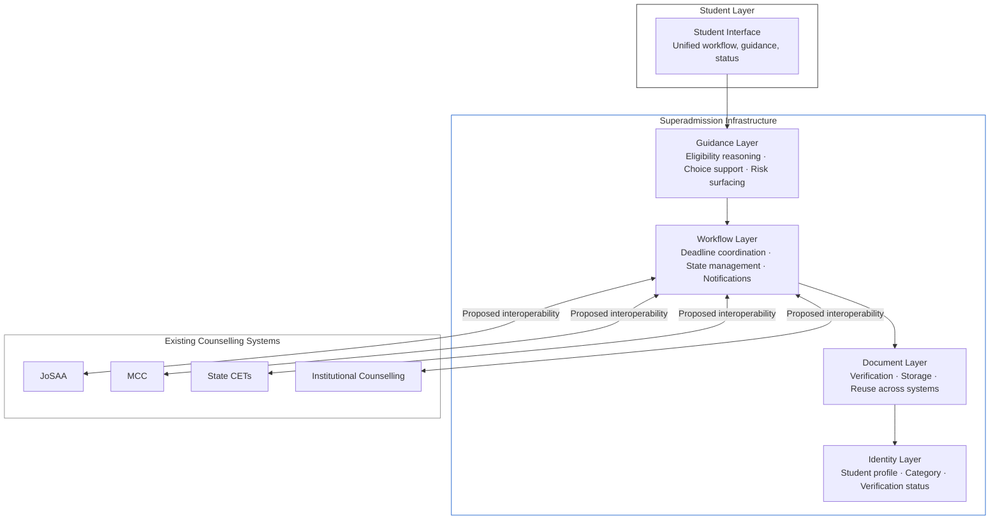
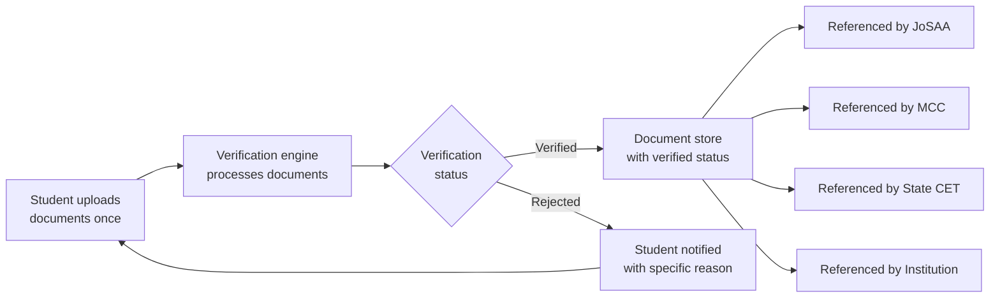

The operational challenges described in the previous section share a structural cause: there is no coordination layer between counselling systems. Each system operates as an island. The student is the only bridge between them.

Superadmission proposes to build that coordination layer.

This page describes the proposed architecture — what each layer is, what it does, and how it relates to existing systems. This is a proposed model. No part of this architecture is currently deployed or integrated with any live counselling system.

---

## The Core Proposition

<Note>
  Superadmission is not a counselling system. It does not allocate seats. It does not replace JoSAA, MCC, state CETs, or any institutional counselling process. It proposes a shared infrastructure layer — identity, documents, workflow, guidance — that sits above existing systems and removes the coordination burden currently carried by the student.
</Note>

The shift the architecture enables:

| Currently | Proposed |
| --- | --- |
| Student creates a separate account on each portal | One identity-linked profile, created once |
| Student uploads documents to each system independently | Documents uploaded and verified once, referenced across systems |
| Student tracks deadlines across portals manually | Unified deadline visibility and workflow coordination |
| Student checks allotment status on each portal separately | Single status view across all active counselling systems |
| Student learns each system's interface independently | One interface for all counselling participation |
| Documents re-verified by each authority independently | Verified document status shareable across systems |

---

## Architecture Overview

The proposed architecture is structured as five layers. Each layer addresses a specific class of the coordination problem.

---

## Layer 1: Identity

The foundation of the architecture. A student creates one identity-linked profile. This profile is the single source of truth for who the student is across all counselling interactions.

**What the identity layer contains:**

- Verified personal information — name, date of birth, contact details
- Academic record — qualifying exam, board, marks, year
- Rank information — exam rank, category ranks
- Category status — general, OBC-NCL, SC, ST, EWS, PwD, NRI
- Aadhaar-aligned identity design — not requiring Aadhaar, but designed to integrate with Aadhaar-based verification if and when appropriate

**What the identity layer enables:**

- One-time entry of personal information
- Category verification done once, referenced by all counselling systems
- A persistent student record across multiple academic years

<Info>
  The identity layer is designed to align with Aadhaar-based digital identity infrastructure. Active integration with Aadhaar requires regulatory approvals and is not assumed in the current architecture design. The system is designed to be compatible with such integration if it becomes appropriate.
</Info>

---

## Layer 2: Documents

A shared document infrastructure that enables a student to upload and verify documents once, then have that verified status referenced by multiple counselling systems.

**How the document layer is designed to work:**

**Document states in the proposed system:**

| State | Meaning |
| --- | --- |
| Uploaded | Document received, pending verification |
| Under Review | Verification in progress |
| Verified | Document accepted, status shareable |
| Rejected | Document did not pass verification, reason provided |
| Expired | Document validity period has passed, re-upload required |

**What this layer eliminates:** A student who has a Verified document status for their category certificate does not need to re-upload that certificate to each counselling system. The verified status is referenced. The student uploads once.

---

## Layer 3: Workflow

The coordination engine. This layer manages the student's participation across multiple counselling systems simultaneously — tracking state, surfacing deadlines, and ensuring the student has the right information at the right time.

**What the workflow layer manages:**

<CardGroup cols={2}>
  <Card title="Deadline Coordination" icon="calendar">
    All deadlines across active counselling systems — choice fill, acceptance, reporting — surfaced in a single unified view. Priority-sorted by urgency.
  </Card>

  <Card title="State Management" icon="git-branch">
    The student's current status in each counselling system — registered, choice filled, allotted, accepted, frozen, withdrawn — tracked and displayed in one place.
  </Card>

  <Card title="Cross-System Coordination" icon="network">
    When a student accepts a seat in one system, the workflow layer surfaces the action required in others — withdrawal, or continuation — and guides the student through it.
  </Card>

  <Card title="Notification Design" icon="bell">
    Time-sensitive notifications — allotment released, acceptance deadline approaching, document rejected — delivered through a single notification layer, not one per portal.
  </Card>
</CardGroup>

---

## Layer 4: Guidance

An AI-assisted guidance layer that helps students navigate decisions without overriding them. The student's decisions remain entirely their own. The guidance layer provides context.

**What the guidance layer is designed to do:**

- Surface eligible programmes based on the student's rank, category, and preferences
- Flag risk — a deadline approaching in 6 hours, a document missing before choice fill, a category certificate that does not match the declared category
- Assist with choice filling — presenting options, showing cutoff trends from previous years, helping the student evaluate options systematically
- Support in multiple languages — guidance in the student's preferred language, not only English

**What the guidance layer does not do:**

- Make decisions on behalf of the student
- Guarantee any outcome
- Replace the student's own judgment

<Note>
  The guidance layer is designed to assist, not prescribe. A student who ignores all guidance suggestions retains full control over their choices and outcomes. The system does not override any student decision.
</Note>

---

## Layer 5: Student Interface

The surface through which the student interacts with the entire architecture. Designed to be a single interface for all counselling participation — not a replacement for counselling portals, but a unified layer on top of them.

**Design intent:**

- One login, one dashboard, all active counselling systems visible
- Consistent terminology across all systems
- Unified document management
- Single notification stream
- Multilingual by default

---

## What the Architecture Does Not Change

This is as important as what it proposes.

<AccordionGroup>
  <Accordion title="Seat allocation logic">
    Every counselling authority runs its own allocation algorithm. Superadmission does not touch allocation logic. JoSAA's algorithm remains JoSAA's algorithm. State CETs allocate by their own rules. The proposed infrastructure has no involvement in determining who gets which seat.
  </Accordion>

  <Accordion title="Authority jurisdiction">
    JoSAA controls IITs, NITs, IIITs, and GFTIs. MCC controls AIQ and central institution medical seats. State CETs control state quota seats. None of this changes. The proposed layer sits above these systems — it does not alter what any authority controls.
  </Accordion>

  <Accordion title="Eligibility rules">
    Who is eligible for which counselling, at which rank threshold, under which category — all of this is determined by the authorities and the exam bodies. The proposed system applies these rules. It does not define them.
  </Accordion>

  <Accordion title="Institutional autonomy">
    Institutions set their own fee structures, hostel policies, reporting procedures, and academic requirements. The proposed infrastructure does not change what institutions require — it makes meeting those requirements easier to navigate.
  </Accordion>
</AccordionGroup>

---

## Current Status of the Architecture

<Warning>
  The architecture described on this page is a proposed model. It is not deployed. It is not integrated with any live counselling system. No authority partnerships or approvals are in place. The documentation reflects design intent and architectural thinking, not operational reality.
</Warning>

What has been completed:

- Core architecture design across all five layers
- Workflow simulations for single and multi-counselling student journeys
- Seat allocation logic modelling and edge case analysis
- Document verification flow design
- Identity layer design aligned with India Stack patterns

What is in progress:

- Allocation behaviour simulation and testing
- Institution-side workflow design
- Infrastructure evaluation for scale requirements

What requires external action:

- Authority alignment and coordination agreements
- Regulatory approvals for identity and data handling
- Production-scale interoperability with existing counselling portals

---

<CardGroup cols={2}>
  <Card title="Student Experience" icon="user" href="/blueprint/student-experience">
    How the proposed model changes the student journey.
  </Card>

  <Card title="PraveshAI™ Overview" icon="cpu" href="/praveshai/overview">
    The operational intelligence layer that powers the proposed architecture.
  </Card>

  <Card title="Public Infrastructure Alignment" icon="landmark" href="/blueprint/public-infrastructure-alignment">
    How the proposed architecture aligns with India Stack and national digital infrastructure.
  </Card>

  <Card title="Constraints and Dependencies" icon="lock" href="/blueprint/standards-and-assumptions">
    What the architecture assumes and what it depends on.
  </Card>
</CardGroup>