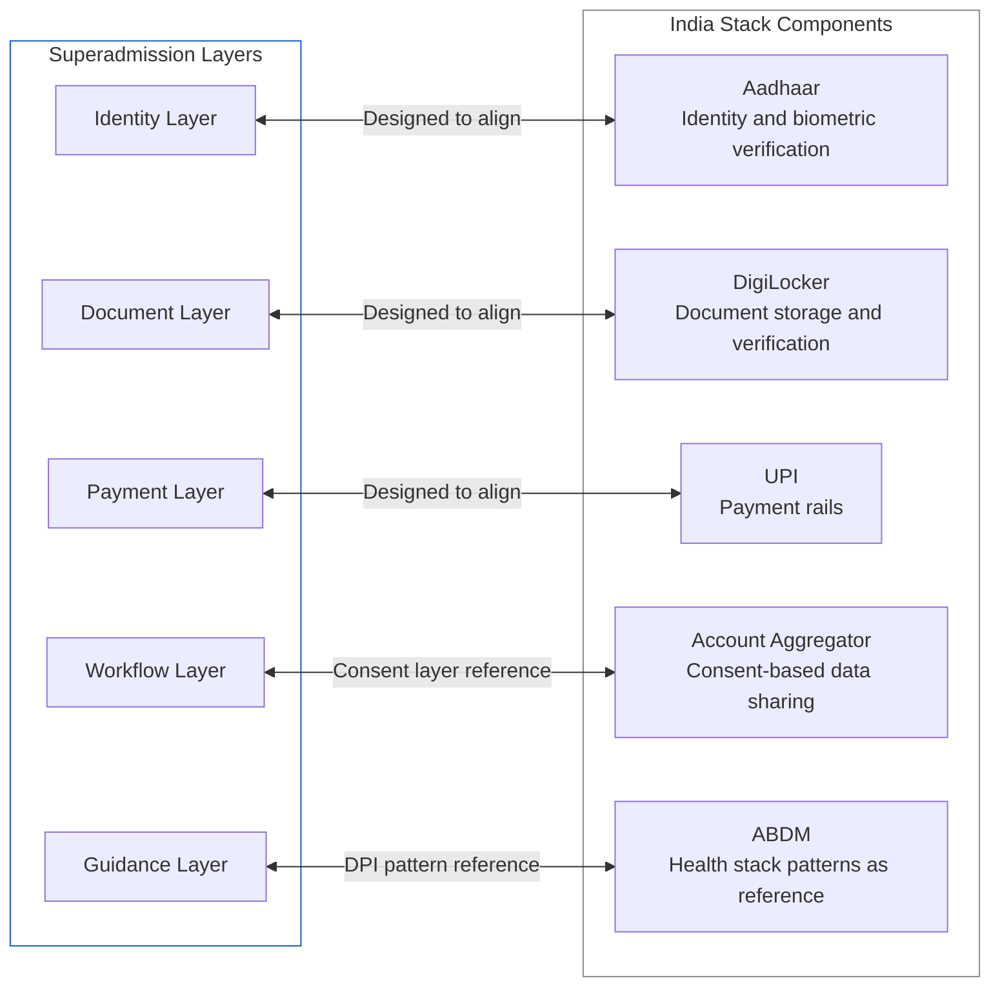
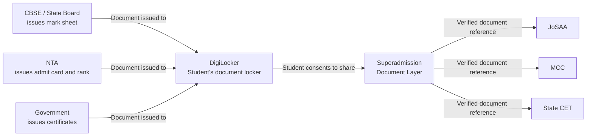

India has built significant public digital infrastructure over the past decade. These systems — Aadhaar, DigiLocker, UPI, and others collectively described as India Stack — provide identity verification, document storage, and payment rails at national scale.

The Superadmission architecture is designed to align with these existing systems where appropriate. This page describes what that alignment means in practice, which infrastructure components are relevant to which proposed layers, and what the current status of that alignment is.

<Warning>
  No active integration exists between Superadmission and any India Stack component. The alignments described on this page are design decisions — the architecture is built to be compatible with these systems. Actual integration would require regulatory approvals, technical implementation, and appropriate data governance agreements.
</Warning>

---

## Infrastructure Map

The following diagram shows how each proposed Superadmission layer maps to existing public infrastructure components.

---

## Aadhaar — Identity Layer Alignment

Aadhaar provides a biometrically-verified digital identity for over 1.3 billion residents. The Superadmission identity layer is designed to be compatible with Aadhaar-based verification.

**What this alignment means in design terms:**

- Student identity can be anchored to an Aadhaar-based verification rather than requiring document-based identity proof separately
- Name, date of birth, and address verification through Aadhaar e-KYC removes the need for the student to upload a separate identity document
- Aadhaar-based authentication can serve as the login mechanism for the student profile, removing the need for a separate username-password system

**What this alignment does not mean:**

<AccordionGroup>

  <Accordion title="Aadhaar is not mandatory by design">
    The architecture is designed to function with or without Aadhaar-based verification. Students without Aadhaar, or students who choose not to use Aadhaar for verification, can complete identity verification through alternative document-based methods. Aadhaar use is designed to be optional.
  </Accordion>

  <Accordion title="No Aadhaar data is stored by Superadmission">
    The design intent is to use Aadhaar for verification at the point of identity creation — the verified status is stored, not the Aadhaar number or biometric data. This aligns with UIDAI guidelines on Aadhaar data handling.
  </Accordion>

  <Accordion title="Integration requires UIDAI approval">
    Any production use of Aadhaar e-KYC or authentication APIs requires approval from UIDAI (Unique Identification Authority of India) and compliance with the Aadhaar Act. This approval is not in place. The architecture is designed for compatibility, not active integration.
  </Accordion>

</AccordionGroup>

---

## DigiLocker — Document Layer Alignment

DigiLocker is a government-operated cloud platform for storage and sharing of official documents. Issued documents from connected issuers — CBSE, state boards, NTA, and others — are stored in DigiLocker and can be shared with requesters with the document owner's consent.

**How DigiLocker aligns with the document layer:**

**Documents available through DigiLocker relevant to admissions:**

| Document | Issuer on DigiLocker | Relevance |
|----------|---------------------|-----------|
| Class 10 mark sheet | State boards, CBSE, ICSE | Academic eligibility |
| Class 12 mark sheet | State boards, CBSE | Primary eligibility document |
| JEE / NEET rank card | NTA | Rank verification |
| Aadhaar | UIDAI | Identity |
| Category certificates | Some state governments | Category eligibility |

<Note>
  Not all documents required for admissions are currently available through DigiLocker. Category certificates, domicile certificates, and income certificates are issued by state governments, and DigiLocker availability varies by state. The architecture is designed to use DigiLocker where documents are available and accept manual upload where they are not.
</Note>

**Integration requirement:** Use of DigiLocker's pull API — which allows a verified system to request documents with the student's consent — requires registration with DigiLocker as a requester entity and compliance with NIC's API terms. This is not in place.

---

## UPI — Payment Layer Alignment

UPI (Unified Payments Interface) provides real-time payment infrastructure across banks and payment apps. It is the logical choice for the payment layer in the proposed architecture.

**Relevant payment points in the admission process:**

| Payment | Amount range | Current state |
|---------|-------------|---------------|
| Counselling registration fee | ₹500 – ₹3,000 per system | Paid separately per portal |
| Seat acceptance fee | ₹10,000 – ₹35,000 | Paid separately per portal |
| Institutional first-semester fee | ₹20,000 – ₹5,00,000+ | Paid at institution |

**What UPI alignment enables:**
- A single payment interface for all counselling fees across systems
- Instant payment confirmation with verifiable transaction reference
- Refund processing through the same interface
- Payment history visible in one place

**Integration requirement:** UPI integration for collecting payments requires registration as a payment aggregator or partnership with a licensed payment aggregator. This is a well-defined regulatory process under RBI guidelines. It is not in place for Superadmission currently.

---

## Account Aggregator — Consent Layer Reference

The Account Aggregator framework provides a consent-based data-sharing infrastructure. While primarily used for financial data today, the consent architecture it establishes is a relevant design reference for how Superadmission thinks about data sharing between the student, the infrastructure, and counselling systems.

**Relevant design principles adopted from AA framework:**
- The student (data principal) explicitly consents to each data share
- Consent is purpose-limited — data shared for admission verification cannot be used for other purposes
- Consent can be revoked
- The student has a record of every consent granted

This is a design reference, not a technical integration. Superadmission is not part of the Account Aggregator ecosystem.

---

## Alignment Summary

| India Stack Component | Proposed Alignment | Integration Status |
|----------------------|-------------------|-------------------|
| Aadhaar (e-KYC) | Identity layer — optional verification mechanism | Not integrated. Requires UIDAI approval. |
| Aadhaar (Auth) | Student login — biometric or OTP-based | Not integrated. Requires UIDAI approval. |
| DigiLocker (Pull API) | Document layer — fetch verified documents with consent | Not integrated. Requires DigiLocker registration. |
| UPI | Payment layer — registration fees, acceptance fees | Not integrated. Requires payment aggregator setup. |
| Account Aggregator | Consent architecture reference | Design reference only. No integration planned at this stage. |

---

## Why This Alignment Matters

Building on existing public infrastructure rather than building parallel infrastructure has three consequences.

**Lower onboarding friction for students.** If a student's Class 12 mark sheet is already in DigiLocker, they do not upload it again. If Aadhaar is used for identity, there is no separate KYC process. The student uses infrastructure they already interact with.

**Alignment with government digital direction.** India Stack is the direction of national digital infrastructure. A proposed system designed to align with it is more likely to be considered for formal integration by authorities than one that builds parallel systems.

**Trust through known infrastructure.** Students and institutions are more likely to trust a system that uses DigiLocker for documents and Aadhaar for identity than one that builds its own identity and document systems from scratch. The trust already established by India Stack transfers partially to systems built on top of it.

<Info>
  The alignment described on this page is a design choice, not a deployment status. Every integration listed above requires approvals, registrations, and compliance processes that are independent of the Superadmission architecture itself. The architecture being compatible with these systems is a precondition for those processes, not a substitute for them.
</Info>

---

<CardGroup cols={2}>
  <Card title="Standards and Assumptions" icon="list-checks" href="/blueprint/standards-and-assumptions">
    The technical and operational assumptions the architecture is built on.
  </Card>
  <Card title="Governance and Compliance" icon="scale" href="/blueprint/governance-and-compliance">
    How the architecture aligns with DPDP, IT Act, and data governance requirements.
  </Card>
</CardGroup>