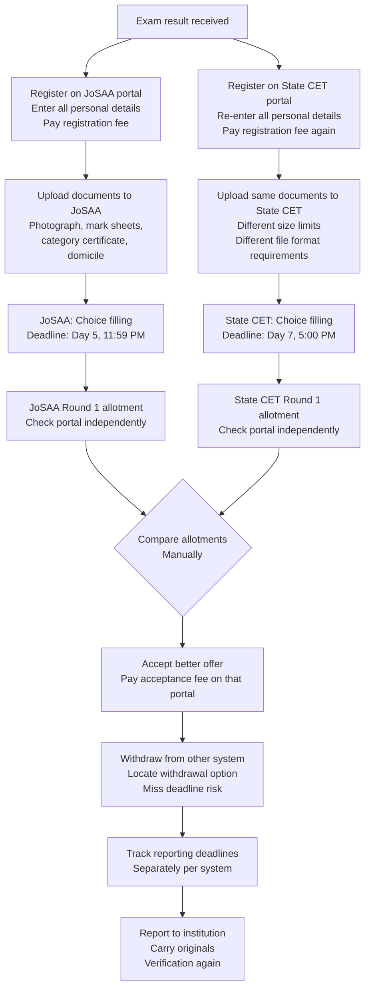
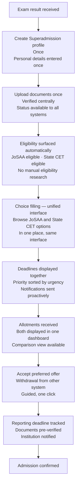

The operational challenges in the current system fall disproportionately on students. They register multiple times, upload the same documents repeatedly, track disconnected deadlines, and manually coordinate between systems that do not communicate with each other.

This page shows what that experience looks like today — and what it is designed to look like under the proposed model. Both versions describe the same student: one applying after JEE Main, participating in JoSAA and a state CET simultaneously.

This is a description of intended design. The proposed experience does not exist in a deployed form.

---

## The Same Student, Two Journeys

<Note>
  The student's rank, eligibility, choices, and outcomes are identical in both journeys. What changes is the operational burden of navigating the process. The allocation logic, the authority structures, and the seat availability are unchanged.
</Note>

---

## Current Journey

**What the student manages manually in the current journey:**

| Task | Times performed |
|------|-----------------|
| Account creation | Once per counselling system |
| Personal information entry | Once per counselling system |
| Document upload | Once per counselling system |
| Deadline tracking | Independently per system, per round |
| Portal login to check status | Daily, across multiple portals |
| Allotment comparison | Manually, with no aggregated view |
| Withdrawal from non-accepted systems | Manually, with risk of missing deadline |

---

## Intended Journey

**What the student does differently in the intended journey:**

| Task | Current | Intended |
|------|---------|----------|
| Profile creation | Once per system | Once, total |
| Document upload | Once per system | Once, total |
| Deadline tracking | Manual, per portal | Unified, automated |
| Status checking | Log into each portal | Single dashboard |
| Allotment comparison | Manual | Side-by-side view |
| Withdrawal from other systems | Manual, risk of missing | Guided, prompted |

---

## Key Differences

<CardGroup cols={2}>

  <Card title="One Profile" icon="user-check">
    The student creates one identity-linked profile. Personal details, academic record, category status — entered once, referenced everywhere. No re-entry across systems.
  </Card>

  <Card title="Documents Verified Once" icon="file-check">
    Documents are uploaded and verified once. The verified status is referenced by all counselling systems the student participates in. No re-upload, no re-verification.
  </Card>

  <Card title="Unified Deadline View" icon="calendar-check">
    All active deadlines — choice fill, allotment response, acceptance, reporting — across all counselling systems in a single view, sorted by urgency. Notifications before critical deadlines.
  </Card>

  <Card title="Guided Decision Points" icon="compass">
    At each major decision — accept or float, which system to prioritise, when to withdraw — the guidance layer surfaces relevant information. The student makes the decision. The system ensures they have the context to make it well.
  </Card>

</CardGroup>

---

## What Does Not Change

This is important. The proposed experience does not change the fundamental nature of the admission process.

<AccordionGroup>

  <Accordion title="The student's rank determines outcomes">
    The allotment the student receives is still determined entirely by their rank, category, and choices. Superadmission does not improve a student's chances of getting a specific seat. It improves their ability to navigate the process of getting the seat their rank entitles them to.
  </Accordion>

  <Accordion title="Counselling authorities retain full control">
    JoSAA still runs JoSAA. State CETs still run their own counselling. Each authority's allocation algorithm, round schedule, and eligibility rules remain entirely unchanged. Superadmission does not interact with any authority's core functions.
  </Accordion>

  <Accordion title="Deadlines are still real">
    The acceptance deadline is still a hard deadline. Missing it still forfeits the seat. What the proposed system changes is that the student is better informed about when that deadline is and is notified proactively before it arrives.
  </Accordion>

  <Accordion title="Document requirements are still set by authorities">
    Each counselling system's document requirements are defined by the authority. The proposed system does not reduce what documents a student must provide — it reduces how many times they must provide the same documents to different systems.
  </Accordion>

  <Accordion title="Institutions still conduct their own reporting">
    The institution still verifies documents and confirms admission at the reporting stage. The proposed architecture is designed to make document verification at the institution level smoother by providing pre-verified document status — but the institution's reporting process itself does not change.
  </Accordion>

</AccordionGroup>

---

## Student Control and Data

The proposed architecture is designed around the principle that the student owns their profile and their data.

**What the student controls:**
- Which counselling systems to connect to their profile
- Which documents to share with which systems
- Choice filling preferences — the system assists but does not pre-fill or lock preferences
- Acceptance decisions — no decision is made automatically on the student's behalf
- Data deletion — the student can request deletion of their profile after the admission cycle

**What the system does not do:**
- Make any acceptance or rejection decision on behalf of the student
- Share the student's data with any system without the student's explicit participation in that system's counselling
- Retain data beyond the academic cycle without explicit consent

---

<CardGroup cols={2}>
  <Card title="PraveshAI™ Guidance" icon="brain" href="/praveshai/guidance-and-support">
    How the guidance layer assists students through choices and decisions.
  </Card>
  <Card title="Public Infrastructure Alignment" icon="landmark" href="/blueprint/public-infrastructure-alignment">
    How the proposed model aligns with national digital infrastructure.
  </Card>
</CardGroup>