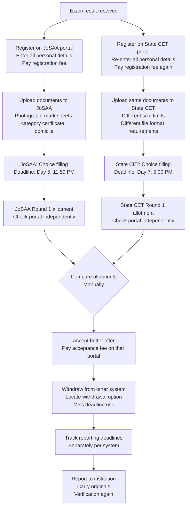

## Current Journey

**What the student manages manually in the current journey:**

| Task | Times performed |
| --- | --- |
| Account creation | Once per counselling system |
| Personal information entry | Once per counselling system |
| Document upload | Once per counselling system |
| Deadline tracking | Independently per system, per round |
| Portal login to check status | Daily, across multiple portals |
| Allotment comparison | Manually, with no aggregated view |
| Withdrawal from non-accepted systems | Manually, with risk of missing deadline |
| Choice Filling | Without any structured guidance |

---

## Intended Journey

```mermaid
flowchart LR
    R[Exam result received] --> A[Create Superadmission profile\nOnce\nPersonal details entered once]
    
    A --> B[Upload documents once\nVerified centrally\nStatus available to all systems]
    
    B --> C[Eligibility surfaced automatically\nJoSAA eligible · State CET eligible\nNo manual eligibility research]
    
    C --> D[Choice filling — unified interface\nBrowse JoSAA and State CET options\nIn one place, same interface]
    
    D --> E[Deadlines displayed together\nPriority sorted by urgency\nNotifications sent proactively]
    
    E --> F[Allotments received\nBoth displayed in one dashboard\nComparison view available]
    
    F --> G[Accept preferred offer\nWithdrawal from other system\nGuided, one click]
    
    G --> H[Reporting deadline tracked\nDocuments pre-verified\nInstitution notified]
    
    H --> I[Admission confirmed]
```

<Frame caption="The student overview : all active counsellings, document status, current stage, and next deadline in a single view">
  
  
</Frame>

{/* Row 1 — full width, the dashboard oneview strip is wide, give it its own frame */}

<Frame caption="One-view strip : profile, rank, category, and live status indicators">
  
  
</Frame>

{/* Row 2 — three compact UI elements, similar height */}

<CardGroup cols={2}>
  <Frame caption="Upcoming deadlines with countdown">
    
    
  </Frame>

  <Frame caption="Notifications panel">
    
    
  </Frame>
</CardGroup>

{/* Row 3 — two similarly-shaped items: calendar and calsync modal */}

<CardGroup cols={2}>
  <Frame caption="Month view : deadline dots plotted on calendar">
    
    
  </Frame>

  <Frame caption="Calendar sync : one-tap Google Calendar sync for any counselling deadline">
    
    
  </Frame>
</CardGroup>

**What the student does differently in the intended journey:**

| Task | Intended |
| --- | --- |
| Profile creation | Once, total |
| Document upload | Once, total |
| Deadline tracking | Unified, automated |
| Status checking | Single dashboard |
| Allotment comparison | Side-by-side view |
| Withdrawal from other systems | Guided, prompted |
| Choice Filling | with PraveshAI guidance |

---

## Key Differences

<CardGroup cols={2}>
  <Card title="One Profile" icon="user-check">
    The student creates one identity-linked profile. Personal details, academic record, category status entered once, referenced everywhere. No re-entry across systems.
  </Card>

  <Card title="Documents Verified Once" icon="file-check">
    Documents are uploaded and verified once. The verified status is referenced by all counselling systems the student participates in. No re-upload, no re-verification.
  </Card>

  <Card title="Unified Deadline View" icon="calendar-check">
    All active deadlines, choice fill, allotment response, acceptance, reporting across all counselling systems in a single view, sorted by urgency.
  </Card>

  <Card title="Guided Decision Points" icon="compass">
    At each major decision  the guidance layer surfaces relevant information. The student makes the decision. The system ensures they have the context to make it well.
  </Card>
</CardGroup>

---

## Student Control and Data

The proposed architecture is designed around the principle that the student owns their profile and their data.

**What the student controls:**

- Which counselling systems to connect to their profile
- Which documents to share with which systems
- Choice filling preferences - the system assists but does not pre-fill or lock preferences
- Acceptance decisions - no decision is made automatically on the student's behalf

---

<CardGroup cols={2}>
  <Card title="PraveshAI™ Guidance" icon="brain" href="/praveshai/guidance-and-support">
    How the guidance layer assists students through choices and decisions.
  </Card>

  <Card title="Public Infrastructure Alignment" icon="landmark" href="/blueprint/public-infrastructure-alignment">
    How the proposed model aligns with national digital infrastructure.
  </Card>
</CardGroup>