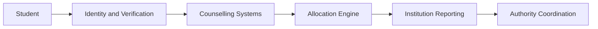

import { Card, CardGroup, Steps, Step, Note, Info, Warning } from 'mintlify/components'

{/* ── HERO ─────────────────────────────────────────────── */}

  

    Proposed Infrastructure · Documentation
  

  <h1 style={{fontSize: "44px", fontWeight: 650, lineHeight: 1.1, color: "#0a0a0a", marginBottom: "20px", letterSpacing: "-0.025em"}}>
    Superadmission
  </h1>
  

    A proposed operational and technical framework for India's admissions infrastructure.
  

  

    This documentation outlines the structure, workflows, assumptions, and implementation considerations being explored across identity, verification, counselling, allocation, and institutional reporting.
  

  

    <a href="/blueprint/admissions-landscape" style={{display: "inline-flex", alignItems: "center", gap: "6px", padding: "9px 18px", background: "#0a0a0a", color: "#fff", borderRadius: "7px", fontSize: "13.5px", fontWeight: 500, textDecoration: "none"}}>
      Read Blueprint
    </a>
    <a href="/praveshai/overview" style={{display: "inline-flex", alignItems: "center", gap: "6px", padding: "9px 18px", background: "#f3f4f6", color: "#0a0a0a", borderRadius: "7px", fontSize: "13.5px", fontWeight: 500, textDecoration: "none"}}>
      Explore PraveshAI™
    </a>
    <a href="https://cal.com/aashrut/talk-to-founders" style={{display: "inline-flex", alignItems: "center", gap: "6px", padding: "9px 18px", background: "transparent", color: "#6b7280", border: "1px solid #e5e7eb", borderRadius: "7px", fontSize: "13.5px", fontWeight: 500, textDecoration: "none"}}>
      Talk to Founders
    </a>
  

{/* ── SYSTEM FLOW ──────────────────────────────────────── */}

  
Architecture

  <h2 style={{fontSize: "26px", fontWeight: 600, color: "#0a0a0a", marginBottom: "10px", letterSpacing: "-0.015em"}}>Proposed System Flow</h2>
  

    A simplified view of the operational layers being studied across the admissions workflow.
  

{/* ── INFRASTRUCTURE ALIGNMENT ─────────────────────────── */}

  
Alignment

  <h2 style={{fontSize: "26px", fontWeight: 600, color: "#0a0a0a", marginBottom: "10px", letterSpacing: "-0.015em"}}>Public Infrastructure Alignment</h2>
  

    Designed around existing public digital infrastructure, identity systems, and policy frameworks already used across India.
  

  

    {[
      { name: "Aadhaar", src: "/images/logos/aadhaar.svg" },
      { name: "DigiLocker", src: "/images/logos/digilocker.svg" },
      { name: "APAAR", src: "/images/logos/apaar.svg" },
      { name: "India Stack", src: "/images/logos/indiastack.svg" },
      { name: "Digital India", src: "/images/logos/digital-india.svg" },
      { name: "IndiaAI", src: "/images/logos/indiaai.svg" },
      { name: "NEP 2020", src: "/images/logos/nep2020.svg" },
      { name: "SDGs", src: "/images/logos/sdg.svg" },
      { name: "Startup India", src: "/images/logos/startup-india.svg" },
      { name: "MeitY Startup Hub", src: "/images/logos/meity-startup-hub.svg" },
    ].map((logo) => (
      

        
        {logo.name}
      

    ))}
  

{/* ── DOCUMENTATION STRUCTURE ──────────────────────────── */}

  
Documentation

  <h2 style={{fontSize: "26px", fontWeight: 600, color: "#0a0a0a", marginBottom: "10px", letterSpacing: "-0.015em"}}>Documentation Structure</h2>
  

    Organized around operational systems, workflows, infrastructure assumptions, and implementation direction.
  

  <CardGroup cols={3}>
    <Card title="Blueprint" icon="book-open" href="/blueprint/admissions-landscape">
      Admissions systems, lifecycle flows, proposed structure, and governance context.
    </Card>
    <Card title="PraveshAI™" icon="sparkles" href="/praveshai/overview">
      Verification, guidance, allocation reasoning, coordination workflows, and explainability.
    </Card>
    <Card title="Operations" icon="building-2" href="/operations/authority-workflows">
      Authority and institution workflows, monitoring, verification review, and controls.
    </Card>
    <Card title="Stakeholders" icon="users" href="/stakeholders">
      Student, institution, authority, and governance perspectives.
    </Card>
    <Card title="Organisation" icon="briefcase" href="/organisation">
      Research direction, field observations, and project context.
    </Card>
    <Card title="Changelog" icon="clock" href="/changelog/changelog">
      Progress updates, readiness tracking, and known constraints.
    </Card>
  </CardGroup>

{/* ── PROPOSED JOURNEY ─────────────────────────────────── */}

  
Process

  <h2 style={{fontSize: "26px", fontWeight: 600, color: "#0a0a0a", marginBottom: "10px", letterSpacing: "-0.015em"}}>Proposed Admission Journey</h2>
  

    A simplified view of the workflows currently being explored and documented.
  

  <Steps>
    <Step title="Registration">
      Student profile creation, examination record linkage, and identity binding.
    </Step>
    <Step title="Verification">
      Document review, validation workflows, and reusable verification across counselling systems.
    </Step>
    <Step title="Counselling">
      Eligibility checks, choice filling assistance, and guidance support.
    </Step>
    <Step title="Allocation">
      Seat allotment, upgrade states, freeze and float decisions.
    </Step>
    <Step title="Reporting">
      Institution confirmation, seat synchronization, and authority-side updates.
    </Step>
  </Steps>

{/* ── CURRENT DIRECTION ────────────────────────────────── */}

  
Status

  <h2 style={{fontSize: "26px", fontWeight: 600, color: "#0a0a0a", marginBottom: "32px", letterSpacing: "-0.015em"}}>Current Direction</h2>

  

    {[
      {
        title: "Documentation",
        badge: "Active",
        badgeColor: "#16a34a",
        badgeBg: "#f0fdf4",
        text: "Architecture, workflows, and operational structures are being documented and refined."
      },
      {
        title: "Research",
        badge: "Ongoing",
        badgeColor: "#2563eb",
        badgeBg: "#eff6ff",
        text: "Counselling systems, student workflows, and operational patterns continue to be studied."
      },
      {
        title: "Technical Exploration",
        badge: "Under Review",
        badgeColor: "#d97706",
        badgeBg: "#fffbeb",
        text: "Identity systems, verification models, interoperability, and coordination workflows are being evaluated."
      },
      {
        title: "Deployment",
        badge: "Not Initiated",
        badgeColor: "#6b7280",
        badgeBg: "#f9fafb",
        text: "No official deployment, institutional integration, or government implementation currently exists."
      },
    ].map((item) => (
      

        

          {item.title}
          {item.badge}
        

        
{item.text}

      

    ))}
  

{/* ── KEY AREAS ────────────────────────────────────────── */}

  
Research

  <h2 style={{fontSize: "26px", fontWeight: 600, color: "#0a0a0a", marginBottom: "32px", letterSpacing: "-0.015em"}}>Key Questions Under Study</h2>

  

    {[
      { title: "Identity Reuse", text: "Can verification workflows become reusable across multiple counselling systems?" },
      { title: "Counselling Coordination", text: "How can fragmented admission workflows become easier to navigate for students?" },
      { title: "Operational Visibility", text: "How can students and institutions gain consistent, real-time workflow visibility?" },
      { title: "Allocation Transparency", text: "How can allocation outcomes become more traceable and explainable?" },
      { title: "Institutional Reporting", text: "How can seat reporting and acceptance workflows become more synchronized?" },
    ].map((item) => (
      

        
{item.title}

        
{item.text}

      

    ))}
  

