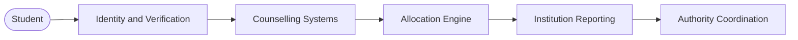

  Proposed Infrastructure

<h1 style={{ fontSize: "40px", fontWeight: 650, lineHeight: 1.1, color: "#0a0a0a", marginBottom: "16px", letterSpacing: "-0.025em", maxWidth: "600px" }}>
  A proposed infrastructure layer for India's admissions system.
</h1>

  This documentation covers the architecture, workflows, and implementation considerations being studied across identity, verification, counselling, allocation, and institutional reporting.

<CardGroup cols={3}>
  <Card title="Read Blueprint" icon="book-open" href="/blueprint/admissions-landscape">
    Start with the admissions landscape, lifecycle, and proposed structure.
  </Card>

  <Card title="Explore PraveshAI™" icon="sparkles" href="/praveshai/overview">
    The operational intelligence layer. Guidance, verification, and allocation reasoning.
  </Card>

  <Card title="Talk to Founders" icon="calendar" href="https://cal.com/aashrut/talk-to-founders">
    For institutional conversations, technical review, or collaboration.
  </Card>
</CardGroup>

---

  Architecture

<h2 style={{ fontSize: "24px", fontWeight: 600, color: "#0a0a0a", marginBottom: "8px", letterSpacing: "-0.015em" }}>
  Proposed System Flow
</h2>

  A simplified view of the operational layers being studied across the admissions workflow.

---

  Process

<h2 style={{ fontSize: "24px", fontWeight: 600, color: "#0a0a0a", marginBottom: "8px", letterSpacing: "-0.015em" }}>
  Proposed Admission Journey
</h2>

  A simplified view of the workflows currently being documented.

<Steps>
  <Step title="Registration" icon="user-round-plus">
    Student profile creation, examination record linkage, and identity binding.
  </Step>
  <Step title="Verification" icon="shield-check">
    Document review, validation workflows, and reusable verification across counselling systems.
  </Step>
  <Step title="Counselling" icon="list-ordered">
    Eligibility checks, choice filling assistance, and guidance support.
  </Step>
  <Step title="Allocation" icon="waypoints">
    Seat allotment, upgrade states, and freeze and float decisions.
  </Step>
  <Step title="Reporting" icon="building">
    Institution confirmation, seat synchronization, and authority-side updates.
  </Step>
</Steps>

---

  Documentation

<h2 style={{ fontSize: "24px", fontWeight: 600, color: "#0a0a0a", marginBottom: "8px", letterSpacing: "-0.015em" }}>
  Documentation Structure
</h2>

  Organized around operational systems, workflows, and implementation direction.

<CardGroup cols={2}>
  <Card title="Blueprint" icon="book-open" href="/blueprint/admissions-landscape">
    Admissions systems, lifecycle flows, proposed structure, and governance context.
  </Card>

  <Card title="PraveshAI™" icon="sparkles" href="/praveshai/overview">
    Verification, guidance, allocation reasoning, coordination, and explainability.
  </Card>

  <Card title="Operations" icon="building-2" href="/operations/authority-workflows">
    Authority and institution workflows, monitoring, verification review, and controls.
  </Card>

  <Card title="Stakeholders" icon="users" href="/stakeholders">
    Student, institution, authority, and governance perspectives.
  </Card>

  <Card title="Organisation" icon="briefcase" href="/organisation">
    Research direction, field observations, and project context.
  </Card>

  <Card title="Changelog" icon="clock" href="/changelog/changelog">
    Progress updates, readiness tracking, and known constraints.
  </Card>
</CardGroup>

---

  Status

<h2 style={{ fontSize: "24px", fontWeight: 600, color: "#0a0a0a", marginBottom: "8px", letterSpacing: "-0.015em" }}>
  Current Direction
</h2>

  No deployment exists. No government approvals have been obtained. This is a proposed and documented architecture.

<CardGroup cols={2}>
  <Card title="Documentation" icon="pen-line">
    Architecture, workflows, and operational structures are being documented and refined.
  </Card>

  <Card title="Research" icon="microscope">
    Counselling systems, student workflows, and operational patterns continue to be studied.
  </Card>

  <Card title="Technical Exploration" icon="layers">
    Identity systems, verification models, interoperability, and coordination workflows are under evaluation.
  </Card>

  <Card title="Deployment" icon="circle-off">
    No official deployment, institutional integration, or government implementation currently exists.
  </Card>
</CardGroup>

---

  Alignment

<h2 style={{ fontSize: "24px", fontWeight: 600, color: "#0a0a0a", marginBottom: "8px", letterSpacing: "-0.015em" }}>
  Public Infrastructure Alignment
</h2>

  Designed around existing public digital infrastructure, identity systems, and policy frameworks already used across India.

<CardGroup cols={4}>
  <Card title="Aadhaar" img="/images/logos/aadhaar.svg">
  </Card>

  <Card title="DigiLocker" img="/images/logos/digilocker.svg">
  </Card>

  <Card title="APAAR" img="/images/logos/apaar.svg">
  </Card>

  <Card title="India Stack" img="/images/logos/indiastack.svg">
  </Card>

  <Card title="Digital India" img="/images/logos/digital-india.svg">
  </Card>

  <Card title="IndiaAI" img="/images/logos/indiaai.svg">
  </Card>

  <Card title="NEP 2020" img="/images/logos/nep2020.svg">
  </Card>

  <Card title="Startup India" img="/images/logos/startup-india.svg">
  </Card>
</CardGroup>

---

  Research

<h2 style={{ fontSize: "24px", fontWeight: 600, color: "#0a0a0a", marginBottom: "8px", letterSpacing: "-0.015em" }}>
  Key Questions Under Study
</h2>

  These are the operational questions driving the architecture and documentation work.

<AccordionGroup>
  <Accordion title="Can verification workflows become reusable across counselling systems?" icon="fingerprint">
    Students currently re-upload and re-verify documents for each counselling system they participate in. The architecture explores whether a single verified identity layer could serve multiple systems.
  </Accordion>

  <Accordion title="How can fragmented admission workflows become easier to navigate?" icon="route">
    Students manage multiple portals, deadlines, and interfaces simultaneously. The proposed coordination layer is designed to reduce this operational overhead.
  </Accordion>

  <Accordion title="How can allocation outcomes become more traceable and explainable?" icon="search">
    Seat allocation decisions are difficult for students to interpret. The architecture includes an explainability layer designed to surface reasoning in clear terms.
  </Accordion>

  <Accordion title="How can seat reporting and acceptance workflows become more synchronized?" icon="building">
    Institutions and authorities currently operate on separate systems with limited real-time visibility. The proposed infrastructure is designed to support synchronized reporting.
  </Accordion>
</AccordionGroup>

<Note>
  This is a proposed architecture. Nothing described here is deployed or officially approved. All workflows and integrations are under study and subject to institutional alignment.
</Note>