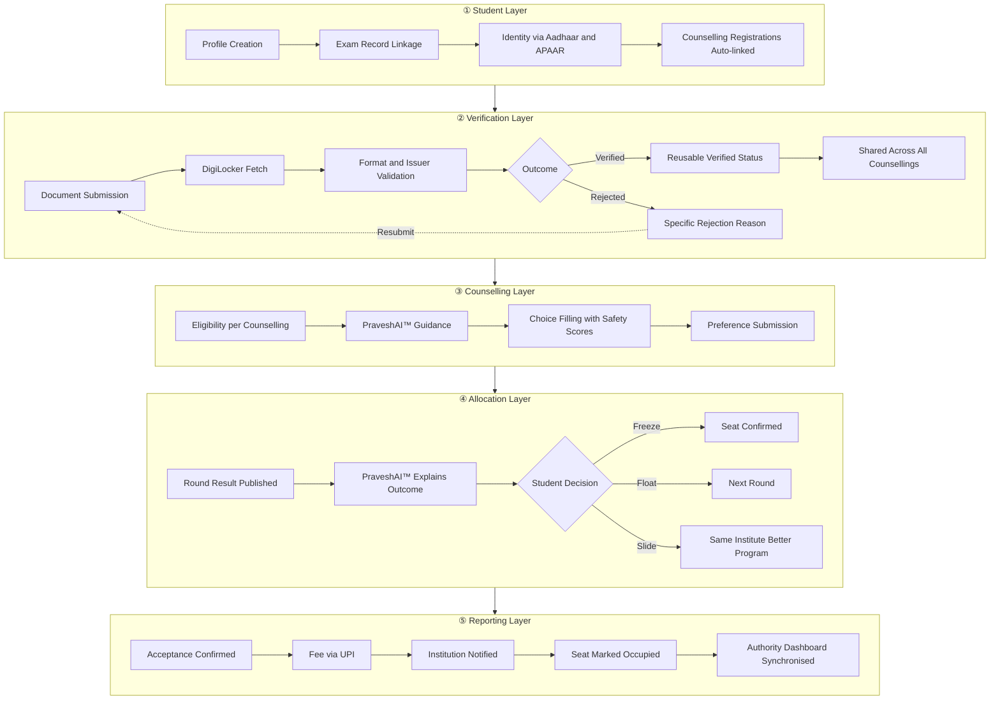

<CardGroup cols={2}>
  <Card>
    

      

        The infrastructure layer for Indian admissions
      

      

        India's undergraduate admissions process is fragmented across dozens of independent counselling portals. Students register separately, upload documents separately, and track deadlines separately for each one. There is no unified view at any stage.
      

      

        SuperAdmission is a proposed platform. One verified identity. Documents submitted once. All counselling systems connected. Allocation outcomes explained. Every step in one place.
      

      

        <Badge>Proposal Stage</Badge>
        <Badge color="yellow">Not Deployed</Badge>
        <Badge color="purple">PraveshAI™ Included</Badge>
      

    

  </Card>
  <Card>
    <svg viewBox="0 0 480 320" xmlns="http://www.w3.org/2000/svg" style={{ width: "100%", borderRadius: "8px" }}>
      <rect width="480" height="320" rx="10" fill="var(--colors-background-subtle, #f8f9fa)" stroke="var(--colors-border-default, #e5e7eb)" strokeWidth="1"/>

      <!-- Header bar -->
      <rect x="0" y="0" width="480" height="40" rx="10" fill="var(--colors-background-default, #ffffff)" stroke="var(--colors-border-default, #e5e7eb)" strokeWidth="1"/>
      <rect x="0" y="30" width="480" height="10" fill="var(--colors-background-default, #ffffff)"/>
      <circle cx="18" cy="20" r="5" fill="#ff5f57"/>
      <circle cx="34" cy="20" r="5" fill="#febc2e"/>
      <circle cx="50" cy="20" r="5" fill="#28c840"/>
      <text x="200" y="25" fontSize="11" fill="var(--colors-content-secondary, #6b7280)" textAnchor="middle" fontFamily="monospace">superadmission.in/dashboard</text>

      <!-- Sidebar -->
      <rect x="0" y="40" width="110" height="280" fill="var(--colors-background-default, #ffffff)" stroke="var(--colors-border-default, #e5e7eb)" strokeWidth="0.5"/>
      <text x="16" y="68" fontSize="9" fill="var(--colors-content-secondary, #9ca3af)" fontFamily="sans-serif" fontWeight="600" letterSpacing="0.08em">NAVIGATION</text>
      <rect x="10" y="76" width="90" height="22" rx="4" fill="var(--colors-primary-light, #eff6ff)"/>
      <text x="20" y="91" fontSize="10" fill="var(--colors-primary, #2563eb)" fontFamily="sans-serif">Dashboard</text>
      <text x="20" y="115" fontSize="10" fill="var(--colors-content-secondary, #6b7280)" fontFamily="sans-serif">Documents</text>
      <text x="20" y="133" fontSize="10" fill="var(--colors-content-secondary, #6b7280)" fontFamily="sans-serif">Counsellings</text>
      <text x="20" y="151" fontSize="10" fill="var(--colors-content-secondary, #6b7280)" fontFamily="sans-serif">Choice Filling</text>
      <text x="20" y="169" fontSize="10" fill="var(--colors-content-secondary, #6b7280)" fontFamily="sans-serif">Allotments</text>
      <text x="20" y="187" fontSize="10" fill="var(--colors-content-secondary, #6b7280)" fontFamily="sans-serif">Spot Round</text>
      <text x="16" y="218" fontSize="9" fill="var(--colors-content-secondary, #9ca3af)" fontFamily="sans-serif" fontWeight="600" letterSpacing="0.08em">AI LAYER</text>
      <text x="20" y="234" fontSize="10" fill="var(--colors-content-secondary, #6b7280)" fontFamily="sans-serif">PraveshAI™</text>

      <!-- Main content area -->
      <!-- Stat cards -->
      <rect x="126" y="56" width="100" height="52" rx="6" fill="var(--colors-background-default, #ffffff)" stroke="var(--colors-border-default, #e5e7eb)" strokeWidth="1"/>
      <text x="136" y="74" fontSize="9" fill="var(--colors-content-secondary, #9ca3af)" fontFamily="sans-serif">Counsellings Active</text>
      <text x="136" y="92" fontSize="18" fill="var(--colors-content-primary, #111827)" fontFamily="sans-serif" fontWeight="700">4</text>

      <rect x="238" y="56" width="100" height="52" rx="6" fill="var(--colors-background-default, #ffffff)" stroke="var(--colors-border-default, #e5e7eb)" strokeWidth="1"/>
      <text x="248" y="74" fontSize="9" fill="var(--colors-content-secondary, #9ca3af)" fontFamily="sans-serif">Documents</text>
      <text x="248" y="92" fontSize="18" fill="#16a34a" fontFamily="sans-serif" fontWeight="700">Verified</text>

      <rect x="350" y="56" width="116" height="52" rx="6" fill="var(--colors-background-default, #ffffff)" stroke="var(--colors-border-default, #e5e7eb)" strokeWidth="1"/>
      <text x="360" y="74" fontSize="9" fill="var(--colors-content-secondary, #9ca3af)" fontFamily="sans-serif">Next Deadline</text>
      <text x="360" y="92" fontSize="13" fill="var(--colors-content-primary, #111827)" fontFamily="sans-serif" fontWeight="600">JoSAA R3</text>

      <!-- Choice list preview -->
      <rect x="126" y="120" width="220" height="130" rx="6" fill="var(--colors-background-default, #ffffff)" stroke="var(--colors-border-default, #e5e7eb)" strokeWidth="1"/>
      <text x="140" y="140" fontSize="10" fill="var(--colors-content-primary, #111827)" fontFamily="sans-serif" fontWeight="600">Choice List</text>
      <text x="310" y="140" fontSize="9" fill="var(--colors-primary, #2563eb)" fontFamily="sans-serif">Edit</text>
      <line x1="136" y1="148" x2="336" y2="148" stroke="var(--colors-border-default, #e5e7eb)" strokeWidth="0.8"/>
      <rect x="136" y="156" width="16" height="16" rx="3" fill="var(--colors-primary-light, #eff6ff)"/>
      <text x="140" y="168" fontSize="9" fill="var(--colors-primary, #2563eb)" fontFamily="sans-serif" fontWeight="600">1</text>
      <text x="160" y="164" fontSize="9" fill="var(--colors-content-primary, #111827)" fontFamily="sans-serif">IIT Bombay — CSE</text>
      <text x="160" y="176" fontSize="8" fill="#16a34a" fontFamily="sans-serif">Safe · Cutoff 67</text>
      <rect x="136" y="184" width="16" height="16" rx="3" fill="var(--colors-background-subtle, #f9fafb)"/>
      <text x="140" y="196" fontSize="9" fill="var(--colors-content-secondary, #6b7280)" fontFamily="sans-serif" fontWeight="600">2</text>
      <text x="160" y="192" fontSize="9" fill="var(--colors-content-primary, #111827)" fontFamily="sans-serif">IIT Delhi — CSE</text>
      <text x="160" y="204" fontSize="8" fill="#d97706" fontFamily="sans-serif">Reach · Cutoff 54</text>
      <rect x="136" y="212" width="16" height="16" rx="3" fill="var(--colors-background-subtle, #f9fafb)"/>
      <text x="140" y="224" fontSize="9" fill="var(--colors-content-secondary, #6b7280)" fontFamily="sans-serif" fontWeight="600">3</text>
      <text x="160" y="220" fontSize="9" fill="var(--colors-content-primary, #111827)" fontFamily="sans-serif">IIT Madras — EE</text>
      <text x="160" y="232" fontSize="8" fill="#16a34a" fontFamily="sans-serif">Safe · Cutoff 71</text>

      <!-- PraveshAI panel -->
      <rect x="358" y="120" width="108" height="130" rx="6" fill="var(--colors-background-default, #ffffff)" stroke="var(--colors-border-default, #e5e7eb)" strokeWidth="1"/>
      <text x="373" y="140" fontSize="10" fill="var(--colors-content-primary, #111827)" fontFamily="sans-serif" fontWeight="600">PraveshAI™</text>
      <rect x="368" y="150" width="88" height="28" rx="4" fill="var(--colors-background-subtle, #f3f4f6)"/>
      <text x="376" y="161" fontSize="8" fill="var(--colors-content-secondary, #6b7280)" fontFamily="sans-serif">Your JoSAA R2 allotment</text>
      <text x="376" y="172" fontSize="8" fill="var(--colors-content-secondary, #6b7280)" fontFamily="sans-serif">shows Float is viable.</text>
      <rect x="368" y="186" width="88" height="20" rx="4" fill="var(--colors-primary-light, #eff6ff)"/>
      <text x="376" y="200" fontSize="8" fill="var(--colors-primary, #2563eb)" fontFamily="sans-serif">Explain my options →</text>
      <rect x="368" y="214" width="88" height="28" rx="4" fill="var(--colors-background-subtle, #f3f4f6)"/>
      <text x="376" y="225" fontSize="8" fill="var(--colors-content-secondary, #6b7280)" fontFamily="sans-serif">Rank 1,204 · OBC-NCL</text>
      <text x="376" y="236" fontSize="8" fill="var(--colors-content-secondary, #6b7280)" fontFamily="sans-serif">3 counsellings active</text>

      <!-- Bottom bar -->
      <rect x="126" y="262" width="340" height="44" rx="6" fill="var(--colors-background-default, #ffffff)" stroke="var(--colors-border-default, #e5e7eb)" strokeWidth="1"/>
      <rect x="136" y="272" width="8" height="8" rx="2" fill="#16a34a"/>
      <text x="150" y="280" fontSize="9" fill="var(--colors-content-primary, #111827)" fontFamily="sans-serif">Identity verified</text>
      <rect x="230" y="272" width="8" height="8" rx="2" fill="#16a34a"/>
      <text x="244" y="280" fontSize="9" fill="var(--colors-content-primary, #111827)" fontFamily="sans-serif">Documents cleared</text>
      <rect x="340" y="272" width="8" height="8" rx="2" fill="#d97706"/>
      <text x="354" y="280" fontSize="9" fill="var(--colors-content-primary, #111827)" fontFamily="sans-serif">Choice list pending</text>
      <text x="136" y="296" fontSize="8" fill="var(--colors-content-secondary, #9ca3af)" fontFamily="sans-serif">Aadhaar · APAAR · DigiLocker · JoSAA · JAC Delhi · WBJEE · MHT-CET · COMEDK</text>
    </svg>
  </Card>
</CardGroup>

---

## Orientation

<CardGroup cols={3}>
  <Card title="What SuperAdmission is" icon="layers" href="/blueprint/admissions-landscape">
    A proposed infrastructure layer connecting students, counselling authorities, and institutions through a single verified identity and shared document layer.
  </Card>
  <Card title="What the documentation covers" icon="book-open" href="/blueprint/proposed-model">
    Architecture, system design, student workflows, authority operations, AI layer internals, governance model, and open questions.
  </Card>
  <Card title="Current status" icon="clock" href="/changelog/changelog">
    This is a proposal under development. Nothing is deployed. All integrations are under study. Documentation reflects the architecture as currently designed.
  </Card>
</CardGroup>

---

## System scope

SuperAdmission operates across five distinct layers. Each layer handles a specific concern and connects to the next.

<Steps>
  <Step title="Student layer">
    Profile creation, exam record linkage, identity binding via Aadhaar and APAAR. All counselling registrations are pulled in automatically based on scores and state. The student sees every active counselling from day one.
  </Step>
  <Step title="Verification layer">
    Documents submitted once. Fetched from DigiLocker where available. Verified status carries across all active counselling registrations without re-upload. Missing documents surface with specific reasons.
  </Step>
  <Step title="Counselling layer">
    PraveshAI™ checks eligibility across all registered counselling systems. Students see ranked recommendations with historical cutoffs and safety scores. Choice lists autosave. Deadlines tracked per counselling.
  </Step>
  <Step title="Allocation layer">
    Round results arrive from counselling authorities. PraveshAI™ explains what drove each result and what freeze, float, and slide mean for the student's exact rank before the decision window closes.
  </Step>
  <Step title="Reporting layer">
    Accepted seats trigger fee payment via UPI. The institution is notified. Seat status updates in the authority dashboard. The student receives an enrollment record and allotment letter.
  </Step>
</Steps>

---

## Documentation sections

<CardGroup cols={2}>
  <Card title="Blueprint" icon="book-open" href="/blueprint/admissions-landscape">
    Admissions landscape analysis, current counselling systems, fragmentation diagnosis, proposed model, and governance context.
  </Card>
  <Card title="PraveshAI™" icon="sparkles" href="/praveshai/overview">
    Intelligence layer internals. Eligibility reasoning, document interpretation, allocation logic, choice filing assistance, and explainability engine.
  </Card>
  <Card title="Operations" icon="building-2" href="/operations/authority-workflows">
    Authority workflows, institution coordination, verification review, seat reporting, and operational controls.
  </Card>
  <Card title="Stakeholders" icon="users" href="/stakeholders">
    How the system serves students, counselling authorities, institutions, and policy reviewers differently.
  </Card>
  <Card title="Organisation" icon="briefcase" href="/organisation">
    Research approach, field observations, what has been learned, and current project context.
  </Card>
  <Card title="Changelog" icon="clock" href="/changelog/changelog">
    Documentation updates, architecture revisions, progress tracking, and known constraints.
  </Card>
</CardGroup>

---

## Student systems

<CardGroup cols={2}>
  <Card title="Identity and registration" icon="fingerprint" href="/blueprint/student-layer">
    How a student profile is created, how exam records are linked, and how Aadhaar and APAAR bind identity across all active counselling registrations.
  </Card>
  <Card title="Document verification" icon="shield-check" href="/blueprint/verification-layer">
    Single submission, DigiLocker fetch, format and issuer validation, reusable verified status across counsellings, and specific rejection handling.
  </Card>
  <Card title="Choice filling" icon="list-ordered" href="/blueprint/counselling-layer">
    Eligibility check across all registered counsellings, ranked recommendations with historical cutoffs, safety scores, autosave, and per-counselling deadlines.
  </Card>
  <Card title="Allotment and decision" icon="search" href="/blueprint/allocation-layer">
    How round results are delivered, what PraveshAI™ explains before the decision window closes, and how freeze, float, and slide work for a specific rank and category.
  </Card>
  <Card title="Spot round" icon="zap" href="/blueprint/spot-round">
    Digital replacement for the physical queue. Queue position, live seat availability by branch, and seat confirmation in a structured online session.
  </Card>
  <Card title="Reporting and confirmation" icon="check-circle" href="/blueprint/reporting-layer">
    Fee payment via UPI, institution notification, real-time seat status synchronisation, enrollment record, and allotment letter.
  </Card>
</CardGroup>

---

## PraveshAI™

PraveshAI™ is the intelligence layer. It is not a general-purpose chatbot. It reasons about eligibility, assists with choice filling, reads allotment results, and explains outcomes in terms the student can act on. It knows the student's rank, documents, category, registered counsellings, and saved choices at every point.

<CardGroup cols={2}>
  <Card title="Overview" icon="sparkles" href="/praveshai/overview">
    What PraveshAI™ is, what it is not, how it fits into the platform, and why it is treated as infrastructure rather than a feature.
  </Card>
  <Card title="Eligibility reasoning" icon="check-square" href="/praveshai/eligibility-reasoning">
    How the system determines which programs a student qualifies for across multiple counselling systems simultaneously.
  </Card>
  <Card title="Choice filing assistance" icon="list" href="/praveshai/choice-filing">
    How recommendations are generated, how safety scores are calculated, how historical cutoff data is interpreted, and how preferences are ranked.
  </Card>
  <Card title="Allocation interpretation" icon="bar-chart-2" href="/praveshai/allocation-interpretation">
    How round results are parsed, how outcomes are explained in plain language, and how freeze, float, and slide decisions are surfaced before the window closes.
  </Card>
  <Card title="Explainability engine" icon="eye" href="/audit-explainability">
    How every recommendation is traceable, how authority review works, and what the audit trail contains.
  </Card>
  <Card title="Multilingual output" icon="languages" href="/praveshai/multilingual">
    How guidance is delivered in regional languages and why translation is treated as a core infrastructure requirement, not a surface-level feature.
  </Card>
</CardGroup>

---

## Counselling systems in scope

The platform is designed to connect with the following counselling systems in the initial scope.

<CardGroup cols={3}>
  <Card title="JoSAA" icon="graduation-cap" href="/blueprint/josaa">
    Joint Seat Allocation Authority. Central counselling for IITs, NITs, IIITs, and GFTIs based on JEE Advanced and JEE Main ranks.
  </Card>
  <Card title="JAC Delhi" icon="building" href="/blueprint/jac-delhi">
    Joint Admission Counselling for Delhi technical institutions. Covers DTU, NSUT, IGDTUW, IIIT Delhi, and others.
  </Card>
  <Card title="WBJEE" icon="building" href="/blueprint/wbjee">
    West Bengal Joint Entrance Examination counselling covering state engineering and pharmacy institutions.
  </Card>
  <Card title="MHT-CET" icon="building" href="/blueprint/mht-cet">
    Maharashtra Common Entrance Test counselling for engineering and pharmacy admissions across Maharashtra.
  </Card>
  <Card title="COMEDK" icon="building" href="/blueprint/comedk">
    Consortium of Medical, Engineering and Dental Colleges of Karnataka counselling.
  </Card>
  <Card title="State CETs" icon="map" href="/blueprint/state-cets">
    Architecture for extending the platform to additional state-level common entrance test counselling systems.
  </Card>
</CardGroup>

---

## Operations

<CardGroup cols={2}>
  <Card title="Authority workflows" icon="sitemap" href="/operations/authority-workflows">
    How counselling authorities publish round results, manage seat matrices, review disputes, and access reporting dashboards.
  </Card>
  <Card title="Institution coordination" icon="building-2" href="/operations/institution-coordination">
    How institutions receive enrollment confirmations, report seat status, and maintain synchronisation with the authority dashboard.
  </Card>
  <Card title="Verification review" icon="shield" href="/operations/verification-review">
    How document verification decisions are made, how edge cases are escalated, and how institutions can flag verification anomalies.
  </Card>
  <Card title="Seat reporting" icon="bar-chart" href="/operations/seat-reporting">
    How accepted, rejected, and vacant seats are synchronised in real time across students, institutions, and counselling authorities.
  </Card>
</CardGroup>

---

## Governance and trust

<Callout type="info" title="Governance context">
SuperAdmission operates in a domain where decisions have legally binding consequences for students and institutions. The architecture treats auditability, explainability, and authority oversight as design requirements, not features.
</Callout>

<CardGroup cols={2}>
  <Card title="Audit and explainability" icon="eye" href="/audit-explainability">
    How every allocation decision, document verification outcome, and PraveshAI™ recommendation is logged, traceable, and reviewable by authorities.
  </Card>
  <Card title="Override controls" icon="shield-alert" href="/governance/overrides">
    How counselling authorities can review, override, or flag AI-assisted recommendations. Authority decision always takes precedence.
  </Card>
  <Card title="Data governance" icon="lock" href="/governance/data">
    How student data is scoped, how access is controlled across system roles, and how DigiLocker and Aadhaar data is handled.
  </Card>
  <Card title="Transparency model" icon="file-text" href="/governance/transparency">
    What the platform discloses to students about how recommendations are generated and what data is used at each step.
  </Card>
</CardGroup>

---

## Public infrastructure alignment

SuperAdmission is designed around public digital infrastructure already in use across India. No proprietary identity or document system is assumed where a public alternative exists.

<CardGroup cols={3}>
  <Card title="Aadhaar" icon="fingerprint" href="/infrastructure/aadhaar">
    Identity binding layer. Used for student identity verification at registration.
  </Card>
  <Card title="APAAR" icon="id-card" href="/infrastructure/apaar">
    Academic Bank of Credits ID. Used for linking academic records across institutions.
  </Card>
  <Card title="DigiLocker" icon="folder-open" href="/infrastructure/digilocker">
    Document fetch and issuer verification. Primary source for academic and identity documents.
  </Card>
  <Card title="India Stack" icon="layers" href="/infrastructure/india-stack">
    Underlying digital public infrastructure stack. UPI for fee payments, eSign for digital confirmation.
  </Card>
  <Card title="UPI" icon="credit-card" href="/infrastructure/upi">
    Fee payment layer. Used for seat acceptance payments from students to institutions.
  </Card>
  <Card title="NEP 2020 alignment" icon="book" href="/infrastructure/nep-alignment">
    How the platform's architecture maps to the National Education Policy 2020 goals for academic mobility and digital access.
  </Card>
</CardGroup>

---

## Architecture

<Frame caption="System architecture — five operational layers from student identity through seat reporting">

</Frame>

---

## Open questions

These are the core architectural questions the platform is designed to address. Each links to the relevant section of the documentation.

<AccordionGroup>
  <Accordion title="Can document verification be made reusable across counselling systems?" icon="fingerprint">
    Students re-upload and re-verify the same documents for every counselling system. The architecture explores a single verified layer where verification done once carries across JoSAA, JAC Delhi, WBJEE, and all other registered counsellings without re-submission.

    [Read the verification architecture →](/blueprint/verification-layer)
  </Accordion>
  <Accordion title="How can allotment outcomes be explained before the student acts?" icon="search">
    Results arrive without reasoning. A student receiving a round result has no way to understand what drove it or whether float is worth attempting within their decision window. PraveshAI™ is designed to surface that reasoning before the window closes.

    [Read the allocation interpretation design →](/praveshai/allocation-interpretation)
  </Accordion>
  <Accordion title="How can physical spot rounds become a digital workflow?" icon="zap">
    Spot rounds currently require students to appear in person, queue physically, and decide under pressure. The architecture explores a digital model where queue position, seat availability, and seat confirmation are handled in a structured online session.

    [Read the spot round design →](/blueprint/spot-round)
  </Accordion>
  <Accordion title="How can seat reporting synchronise in real time?" icon="building">
    Institutions and authorities currently update seat status through manual processes with delays. The proposed reporting layer is designed to synchronise accepted, rejected, and vacant seats in real time across both sides without manual entry.

    [Read the reporting layer design →](/operations/seat-reporting)
  </Accordion>
  <Accordion title="What does multilingual support require at the infrastructure level?" icon="languages">
    Guidance and allotment explanations need to be accurate in regional languages, not just translated at the surface. The architecture treats multilingual output as a core requirement built into PraveshAI™ from the reasoning layer up.

    [Read the multilingual design →](/praveshai/multilingual)
  </Accordion>
  <Accordion title="How does authority oversight work alongside AI-assisted decisions?" icon="shield">
    Every recommendation PraveshAI™ makes is logged and reviewable. Counselling authorities retain override controls at every stage. The audit trail is designed for regulatory review, not just internal debugging.

    [Read the governance model →](/governance/overrides)
  </Accordion>
</AccordionGroup>

---

## Stakeholder entry points

<CardGroup cols={2}>
  <Card title="Students" icon="user" href="/stakeholders/students">
    What the platform provides for students navigating multiple counselling systems simultaneously. Dashboard, documents, choice filling, allotment guidance, and spot round.
  </Card>
  <Card title="Counselling authorities" icon="gavel" href="/stakeholders/authorities">
    How counselling authorities publish results, manage seat matrices, review verification decisions, and access real-time reporting.
  </Card>
  <Card title="Institutions" icon="building-2" href="/stakeholders/institutions">
    How institutions receive seat confirmations, report enrollment status, and access student verification records relevant to their intake.
  </Card>
  <Card title="Policy reviewers" icon="file-text" href="/stakeholders/policy">
    Architecture overview, governance model, public infrastructure alignment, open questions, and proposal context for policy and regulatory review.
  </Card>
</CardGroup>

---

## Proposal context

<Callout type="warning" title="This is a proposed architecture">
  SuperAdmission is not deployed. No government approvals have been obtained. No integrations with Aadhaar, DigiLocker, or any counselling authority are live. All systems, workflows, and integrations described in this documentation are under study and subject to institutional alignment before any implementation begins.
</Callout>

<CardGroup cols={2}>
  <Card title="Research basis" icon="microscope" href="/organisation">
    Field observations, student interviews, authority workflow analysis, and the evidence base that informed the architecture.
  </Card>
  <Card title="What remains open" icon="circle-help" href="/blueprint/open-questions">
    Unresolved questions about institutional adoption, regulatory alignment, data governance, and technical feasibility at scale.
  </Card>
</CardGroup>

---

<CardGroup cols={3}>
  <Card title="Read the Blueprint" icon="book-open" href="/blueprint/admissions-landscape">
    Start with the admissions landscape and the case for a unified infrastructure layer.
  </Card>
  <Card title="Explore PraveshAI™" icon="sparkles" href="/praveshai/overview">
    Understand the intelligence layer that sits across the entire admission lifecycle.
  </Card>
  <Card title="Review the changelog" icon="clock" href="/changelog/changelog">
    See what has been documented, what has changed, and what remains in progress.
  </Card>
</CardGroup>