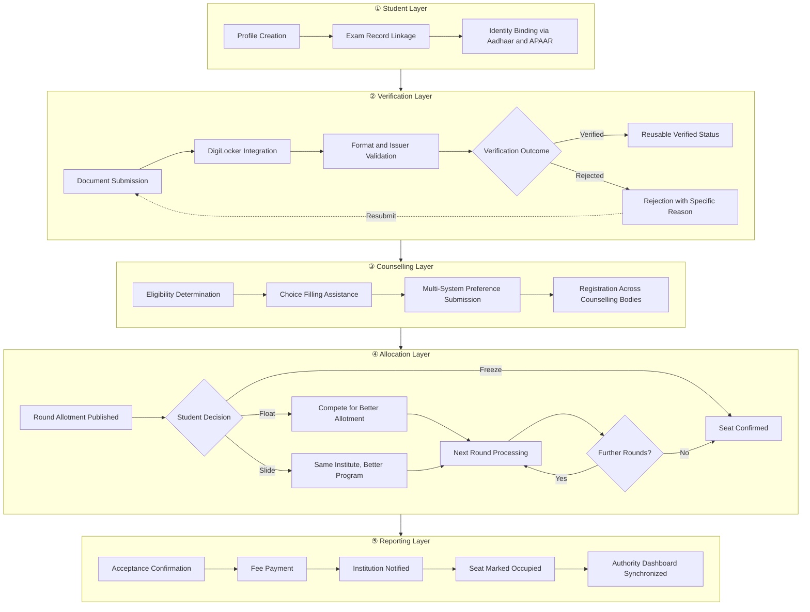
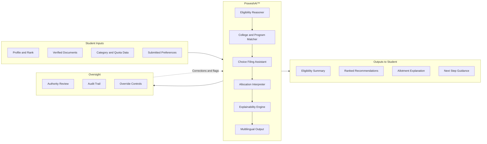

India's undergraduate admissions system is fragmented across dozens of independent counselling portals, each with separate registrations, documents, deadlines, and interfaces. Students navigate this alone.

Superadmission is a proposed infrastructure layer designed to study how identity, verification, counselling, allocation, and reporting across these systems could work together.

This documentation covers the architecture, workflows, and design decisions being developed.

<CardGroup cols={3}>
  <Card title="Blueprint" icon="book-open" href="/blueprint/admissions-landscape">
    The admissions landscape, lifecycle, fragmentation points, and proposed model.
  </Card>
  <Card title="PraveshAI™" icon="sparkles" href="/praveshai/overview">
    The intelligence layer. Eligibility reasoning, guidance, allocation interpretation, and explainability.
  </Card>
  <Card title="Talk to Founders" icon="calendar" href="https://cal.com/aashrut/talk-to-founders">
    Institutional conversations, technical review, and collaboration.
  </Card>
</CardGroup>

---

## The problem

A student appearing for JEE, NEET, or a state CET today interacts with the following simultaneously:

- A national or state exam portal for results
- One or more counselling portals for registration and choice filling
- A document system requiring repeated uploads across each portal
- An institution portal for verification and reporting
- No unified view of any of it

Each system is independent. Deadlines do not align. Document requirements differ. Seat status updates are scattered. There is no single point of clarity at any stage.

<Warning>
  Nothing described in this documentation is deployed or officially approved. All systems, workflows, and integrations are proposed and under study.
</Warning>

---

## Proposed system architecture

The architecture is structured as five distinct operational layers. Each handles a specific concern. Together they form a coordinated workflow.

---

## PraveshAI™

PraveshAI™ is the operational intelligence layer. It is not a chatbot. It reasons about student eligibility, assists with preference submission, interprets allotment outcomes, and explains decisions in terms a student can act on. It operates within defined boundaries. Human oversight exists at every critical decision point.

---

## Admission journey

<Steps>
  <Step title="Registration and identity">
    The student creates a unified profile. Examination records are linked. Identity is bound via Aadhaar or APAAR. This profile is designed to be recognised across all registered counselling systems without re-entry.
  </Step>
  <Step title="Document verification">
    Documents are uploaded once. Where available, they are fetched directly from DigiLocker. Automated checks validate format, issuer, and data consistency. A verified status is designed to carry across multiple counselling rounds without re-submission.
  </Step>
  <Step title="Counselling and choice filling">
    PraveshAI™ checks eligibility across all registered counselling systems. Students receive structured guidance for ranking their college and program preferences. Multi-system registration is handled through a single workflow.
  </Step>
  <Step title="Allotment and decision">
    Results arrive from counselling authorities. PraveshAI™ explains each allotment outcome and the implications of each available decision before the student acts. Students choose to freeze, float, or slide their allotment.
  </Step>
  <Step title="Reporting and confirmation">
    Accepted seats trigger fee payment. The institution is notified. Seat status is updated in the authority dashboard. The student receives a confirmed enrollment record.
  </Step>
</Steps>

---

## Documentation

<CardGroup cols={2}>
  <Card title="Blueprint" icon="book-open" href="/blueprint/admissions-landscape">
    Admissions landscape, lifecycle, existing system structure, fragmentation analysis, proposed model, and governance context.
  </Card>
  <Card title="PraveshAI™" icon="sparkles" href="/praveshai/overview">
    Intelligence layer internals. Eligibility reasoning, document interpretation, allocation logic, orchestration, and trust architecture.
  </Card>
  <Card title="Operations" icon="building-2" href="/operations/authority-workflows">
    Authority and institution workflows, verification review, reporting, grievance handling, and operational controls.
  </Card>
  <Card title="Stakeholders" icon="users" href="/stakeholders">
    How the system is designed to serve students, counselling authorities, institutions, and policy reviewers.
  </Card>
  <Card title="Organisation" icon="briefcase" href="/organisation">
    Research approach, field observations, what has been learned, and current operational context.
  </Card>
  <Card title="Changelog" icon="clock" href="/changelog/changelog">
    Documentation updates, progress tracking, validation status, and known constraints.
  </Card>
</CardGroup>

---

## Infrastructure alignment

The architecture is designed around public digital infrastructure already in use across India. No proprietary identity or document infrastructure is assumed where public alternatives exist.

<CardGroup cols={2}>
  <Card title="Aadhaar" icon="fingerprint">
    National identity system. Used for student identity binding and verification.
  </Card>
  <Card title="DigiLocker" icon="folder-open">
    Government document repository. Used for fetching and validating academic documents.
  </Card>
  <Card title="APAAR" icon="id-card">
    Academic Bank of Credits identity. Used for academic record linkage.
  </Card>
  <Card title="India Stack" icon="layers">
    Underlying API infrastructure. Informs the interoperability model.
  </Card>
  <Card title="UPI" icon="credit-card">
    Unified Payments Interface. Used for seat acceptance fee payment.
  </Card>
  <Card title="NEP 2020" icon="landmark">
    National Education Policy. Informs the choice architecture and credit transfer assumptions.
  </Card>
</CardGroup>

---

## Questions driving this work

<AccordionGroup>
  <Accordion title="Can document verification be made reusable across counselling systems?" icon="fingerprint">
    Students currently re-upload and re-verify documents for every counselling system they participate in. The architecture explores whether a single verified identity layer can serve multiple systems without requiring repeated submission.
  </Accordion>
  <Accordion title="How can a student managing multiple counselling systems stay in control?" icon="route">
    JoSAA, state CET, and institutional counselling each have separate portals, deadlines, and interfaces. The proposed coordination layer is designed to give students a single operational view across all active counselling registrations.
  </Accordion>
  <Accordion title="How can seat allotment outcomes be made understandable?" icon="search">
    Allotment results today arrive as outcomes without explanation. The architecture includes an explainability layer designed to surface the specific factors behind each allotment decision in language a student can act on.
  </Accordion>
  <Accordion title="How can seat reporting become real-time across institutions and authorities?" icon="building">
    Institutions and authorities currently operate on separate systems. Acceptance, rejection, and vacancy updates are delayed and manual. The proposed reporting layer is designed to synchronize seat status in real time.
  </Accordion>
  <Accordion title="What does multilingual support require at the infrastructure level?" icon="languages">
    Guidance, status updates, and allotment explanations must be accurate in regional languages. The architecture treats multilingual output as an infrastructure requirement built into PraveshAI™, not a surface-level translation added after the fact.
  </Accordion>
</AccordionGroup>

<Note>
  This is a proposed and documented architecture. No part of Superadmission is currently deployed. No official government approvals have been obtained. All workflows, integrations, and systems described here are under study and subject to institutional alignment.
</Note>