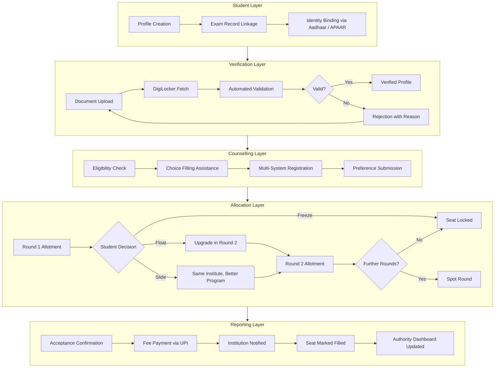
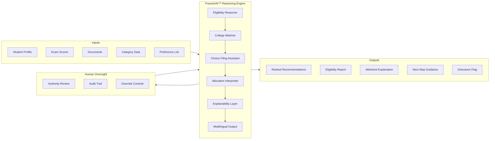

{/* ── HERO ─────────────────────────────────────────────────────── */}

  

    

      

      Documentation · Proposed Infrastructure
    

    
    
    

      A proposed infrastructure layer for India's admissions system.
    

    

      This documentation covers architecture, workflows, and implementation considerations being studied across identity, verification, counselling, allocation, and institutional reporting.
    

    

      <a href="/blueprint/admissions-landscape" style={{display: "inline-flex", alignItems: "center", gap: "6px", padding: "9px 20px", background: "#f9fafb", color: "#111827", border: "1px solid #e5e7eb", borderRadius: "8px", fontSize: "13.5px", fontWeight: 500, textDecoration: "none"}}>
        Read Blueprint
      </a>
      <a href="/praveshai/overview" style={{display: "inline-flex", alignItems: "center", gap: "6px", padding: "9px 20px", background: "#f9fafb", color: "#111827", border: "1px solid #e5e7eb", borderRadius: "8px", fontSize: "13.5px", fontWeight: 500, textDecoration: "none"}}>
        PraveshAI™ Overview
      </a>
      <a href="https://cal.com/aashrut/talk-to-founders" style={{display: "inline-flex", alignItems: "center", gap: "6px", padding: "9px 20px", background: "#0a0a0a", color: "#ffffff", borderRadius: "8px", fontSize: "13.5px", fontWeight: 500, textDecoration: "none"}}>
        Talk to Founders →
      </a>
    

  

  

    
Current Status

    {[
      { label: "Documentation", status: "Active", color: "#16a34a", bg: "#f0fdf4" },
      { label: "Research", status: "Ongoing", color: "#2563eb", bg: "#eff6ff" },
      { label: "Technical Exploration", status: "Under Review", color: "#d97706", bg: "#fffbeb" },
      { label: "Deployment", status: "Not Initiated", color: "#9ca3af", bg: "#f9fafb" },
    ].map(item => (
      

        {item.label}
        {item.status}
      

    ))}
    

      No official approvals. No institutional integrations currently exist.
    

  

{/* ── SYSTEM ARCHITECTURE ──────────────────────────────────────── */}

  
Architecture

  <h2 style={{fontSize: "22px", fontWeight: 600, color: "#0a0a0a", marginBottom: "6px", letterSpacing: "-0.015em"}}>Proposed System Architecture</h2>
  

    The proposed infrastructure is structured as a layered coordination model. Each layer handles a distinct operational concern. Together they form a unified workflow across India's fragmented admissions ecosystem.
  

{/* ── PRAVESHAI INTELLIGENCE ───────────────────────────────────── */}

  
Intelligence Layer

  <h2 style={{fontSize: "22px", fontWeight: 600, color: "#0a0a0a", marginBottom: "6px", letterSpacing: "-0.015em"}}>PraveshAI™ Operational Overview</h2>
  

    PraveshAI™ is not a chatbot. It is an operational reasoning system designed to assist, coordinate, and explain across the admission workflow. It operates within defined boundaries with human oversight at critical decision points.
  

{/* ── ADMISSION JOURNEY ────────────────────────────────────────── */}

  
Process

  <h2 style={{fontSize: "22px", fontWeight: 600, color: "#0a0a0a", marginBottom: "6px", letterSpacing: "-0.015em"}}>Proposed Admission Journey</h2>
  

    The intended student workflow across the five operational phases.
  

  <Steps>
    <Step title="Registration and Identity">
      Student creates a unified profile. Exam records are linked. Identity is bound via Aadhaar or APAAR. This profile is designed to persist across all counselling systems.
    </Step>
    <Step title="Document Verification">
      Documents are uploaded once and fetched from DigiLocker where available. Automated validation checks format, issuer, and data consistency. Verified status is designed to be reusable across multiple counselling rounds.
    </Step>
    <Step title="Counselling and Choice Filling">
      PraveshAI™ checks eligibility across registered counselling systems. Students receive assisted guidance for ranking college and program preferences. Multi-system registration is handled through a single interface.
    </Step>
    <Step title="Seat Allocation and Decisions">
      Allotment results arrive from counselling authorities. Students choose to freeze, float, or slide. PraveshAI™ explains each allotment outcome and the implications of each decision before the student acts.
    </Step>
    <Step title="Reporting and Confirmation">
      Accepted seats trigger fee payment via UPI. The institution is notified automatically. Seat status is marked filled in the authority dashboard. The student receives a confirmed enrollment record.
    </Step>
  </Steps>

{/* ── DOCUMENTATION STRUCTURE ──────────────────────────────────── */}

  
Documentation

  <h2 style={{fontSize: "22px", fontWeight: 600, color: "#0a0a0a", marginBottom: "6px", letterSpacing: "-0.015em"}}>Documentation Structure</h2>
  

    Organized around operational systems, workflows, and implementation direction.
  

  <CardGroup cols={3}>
    <Card title="Blueprint" icon="book-open" href="/blueprint/admissions-landscape">
      The admissions landscape, lifecycle, fragmentation, and proposed model. Start here.
    </Card>
    <Card title="PraveshAI™" icon="sparkles" href="/praveshai/overview">
      Verification, guidance, allocation reasoning, coordination, and explainability layers.
    </Card>
    <Card title="Operations" icon="building-2" href="/operations/authority-workflows">
      Authority and institution workflows, monitoring, verification review, and controls.
    </Card>
    <Card title="Stakeholders" icon="users" href="/stakeholders">
      Student, institution, authority, and governance perspectives across the system.
    </Card>
    <Card title="Organisation" icon="briefcase" href="/organisation">
      Research approach, field observations, operational context, and project direction.
    </Card>
    <Card title="Changelog" icon="clock" href="/changelog/changelog">
      Documentation updates, progress tracking, and known constraints.
    </Card>
  </CardGroup>

{/* ── INFRASTRUCTURE ALIGNMENT ─────────────────────────────────── */}

  
Alignment

  <h2 style={{fontSize: "22px", fontWeight: 600, color: "#0a0a0a", marginBottom: "6px", letterSpacing: "-0.015em"}}>Public Infrastructure Alignment</h2>
  

    Designed around existing public digital infrastructure, identity systems, and policy frameworks. No custom infrastructure is assumed where public alternatives exist.
  

  

    {[
      { name: "Aadhaar", label: "Identity", src: "/images/logos/aadhaar.svg" },
      { name: "DigiLocker", label: "Documents", src: "/images/logos/digilocker.svg" },
      { name: "APAAR", label: "Academic ID", src: "/images/logos/apaar.svg" },
      { name: "India Stack", label: "Infrastructure", src: "/images/logos/indiastack.svg" },
      { name: "Digital India", label: "Policy", src: "/images/logos/digital-india.svg" },
      { name: "IndiaAI", label: "AI Framework", src: "/images/logos/indiaai.svg" },
      { name: "NEP 2020", label: "Education Policy", src: "/images/logos/nep2020.svg" },
      { name: "Startup India", label: "Ecosystem", src: "/images/logos/startup-india.svg" },
    ].map(logo => (
      

        
        {logo.name}
        {logo.label}
      

    ))}
  

{/* ── KEY QUESTIONS ────────────────────────────────────────────── */}

  
Research

  <h2 style={{fontSize: "22px", fontWeight: 600, color: "#0a0a0a", marginBottom: "6px", letterSpacing: "-0.015em"}}>Key Questions Under Study</h2>
  

    These are the operational questions driving the architecture and documentation work.
  

  <AccordionGroup>
    <Accordion title="Can verification be made reusable across counselling systems?" icon="fingerprint">
      Students currently re-upload and re-verify documents for every counselling system they participate in. The architecture explores a single verified identity layer that can serve multiple systems without requiring repeated document submission.
    </Accordion>
    <Accordion title="How can fragmented admission workflows become navigable?" icon="route">
      A student managing JoSAA, state CET, and an institutional counselling simultaneously faces three different portals, three deadline structures, and three interfaces. The proposed coordination layer is designed to reduce this to a single managed workflow.
    </Accordion>
    <Accordion title="How can allocation outcomes become explainable?" icon="search">
      Seat allotment results are currently delivered as outcomes without reasoning. The architecture includes an explainability layer designed to surface the factors behind each allotment decision in language a student can act on.
    </Accordion>
    <Accordion title="How can seat reporting become synchronized in real time?" icon="building">
      Institutions and authorities currently operate on separate systems. Seat acceptance, rejection, and vacancy updates are delayed. The proposed infrastructure is designed to support real-time synchronization across institution and authority-side dashboards.
    </Accordion>
    <Accordion title="What does multilingual support require at the infrastructure level?" icon="languages">
      Guidance systems, status updates, and allotment explanations need to be accurate and accessible in regional languages. The architecture considers multilingual output as an infrastructure requirement, not a UI addition.
    </Accordion>
  </AccordionGroup>

  <Note>
    This is a proposed architecture. Nothing described here is deployed or officially approved. All workflows, integrations, and infrastructure components are under study and subject to institutional alignment.
  </Note>

