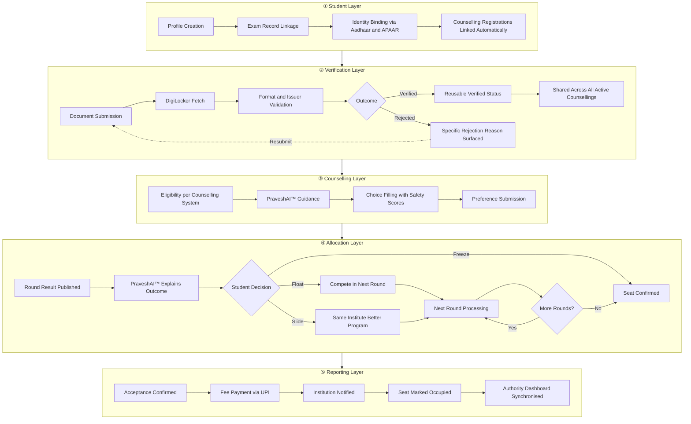
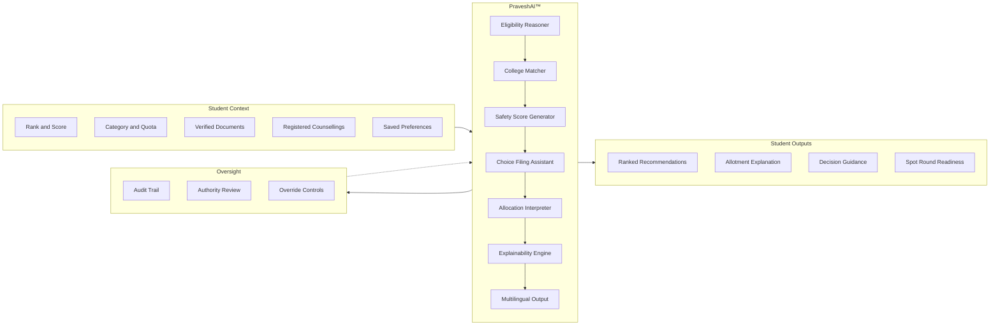

India's undergraduate admissions system runs across dozens of independent counselling portals. Students register separately, upload documents separately, and track deadlines separately for each one. There is no unified view at any stage.

Superadmission is a proposed infrastructure layer. One verified identity. Documents submitted once. All counselling systems connected. Allocation outcomes explained. Every step in one place.

 

[Read Blueprint →](/blueprint/admissions-landscape)　　[PraveshAI™ →](/praveshai/overview)

---

## The platform

<Frame caption="Student dashboard — active counsellings, document status, choice filling, deadlines, and PraveshAI™ in one view">
  
</Frame>

 

<iframe
  src="https://demo.arcade.software/YOUR_ARCADE_DEMO_ID?embed"
  title="Superadmission product walkthrough"
  width="100%"
  height="500"
  style={{ borderRadius: "10px", border: "1px solid #e5e7eb" }}
  allowFullScreen
/>

---

## What it does

<CardGroup cols={2}>
  <Card title="One verified identity" icon="fingerprint">
    A single profile linked to Aadhaar and APAAR, recognised across every counselling system the student is registered with. No re-entry, no duplicate registration.
  </Card>
  <Card title="Documents verified once" icon="shield-check">
    Documents fetched from DigiLocker and verified once. That status carries across JoSAA, JAC Delhi, state CETs, and institutional counselling without re-upload.
  </Card>
  <Card title="All counsellings in one place" icon="layout-dashboard">
    JoSAA, JAC Delhi, WBJEE, MHT-CET, COMEDK. Active registrations, deadlines, and choice filling tracked together in one view.
  </Card>
  <Card title="Allocation explained" icon="search">
    PraveshAI™ reads each round result and explains what drove it. What freeze, float, and slide mean for the student's exact rank and category — before they decide.
  </Card>
  <Card title="Digital spot round" icon="zap">
    Queue position, eligibility check, live seat availability by branch, and seat confirmation in one structured session. No physical queue.
  </Card>
  <Card title="Authority visibility" icon="bar-chart-2">
    Real-time seat status, document verification states, and reporting confirmation for counselling authorities and institutions.
  </Card>
</CardGroup>

---

## More views

<Frame caption="Choice filling — ranked recommendations with historical cutoffs and safety scores per college">
  
</Frame>

<Frame caption="Document management — verification status, DigiLocker sync, and counselling-specific requirements">
  
</Frame>

<Frame caption="Spot round — live queue, real-time seat board, and eligibility check in one session">
  
</Frame>

<Frame caption="PraveshAI™ — context-aware guidance scoped to the student's rank, documents, and active counsellings">
  
</Frame>

---

## System architecture

Five distinct operational layers. Each handles a specific concern.

---

## PraveshAI™

PraveshAI™ is the intelligence layer. Not a chatbot. It reasons about eligibility, assists with choice filling, reads allotment results, and explains outcomes in terms the student can act on. It knows the student's rank, documents, category, registered counsellings, and saved choices at every point.

---

## Admission journey

<Steps>
  <Step title="Identity and registration">
    The student creates a profile. Exam records are linked. Identity is bound via Aadhaar or APAAR. All active counselling registrations are pulled in automatically based on exam scores and state. The student sees every active counselling from day one.
  </Step>
  <Step title="Document verification">
    Documents are submitted once and fetched from DigiLocker where available. Verified status carries across all active counselling registrations. Missing documents surface with specific reasons, not generic errors.
  </Step>
  <Step title="Choice filling">
    PraveshAI™ checks eligibility across all registered counselling systems. Students see ranked college and program recommendations with historical cutoff data and safety scores. Choice lists autosave. Deadlines are tracked per counselling.
  </Step>
  <Step title="Allotment and decision">
    Round results arrive from counselling authorities. PraveshAI™ explains what drove each result and what freeze, float, and slide mean for the student's exact rank before the decision window closes.
  </Step>
  <Step title="Spot round">
    Where seats remain after standard rounds, a digital spot round replaces the physical queue. Students see their queue position, live seat availability by branch, and confirm a seat when their turn arrives.
  </Step>
  <Step title="Reporting and confirmation">
    Accepted seats trigger fee payment via UPI. The institution is notified. Seat status updates in the authority dashboard. The student receives an enrollment record and allotment letter.
  </Step>
</Steps>

---

## Infrastructure alignment

Built around public digital infrastructure already in use across India. No proprietary identity or document system is assumed where a public alternative exists.

 

 

---

## Documentation

<CardGroup cols={2}>
  <Card title="Blueprint" icon="book-open" href="/blueprint/admissions-landscape">
    Admissions landscape, counselling systems, lifecycle, fragmentation analysis, proposed model, and governance context.
  </Card>
  <Card title="PraveshAI™" icon="sparkles" href="/praveshai/overview">
    Intelligence layer internals. Eligibility reasoning, document interpretation, allocation logic, orchestration, and explainability.
  </Card>
  <Card title="Operations" icon="building-2" href="/operations/authority-workflows">
    Authority workflows, institution coordination, verification review, reporting, and operational controls.
  </Card>
  <Card title="Stakeholders" icon="users" href="/stakeholders">
    How the system serves students, counselling authorities, institutions, and policy reviewers.
  </Card>
  <Card title="Organisation" icon="briefcase" href="/organisation">
    Research approach, field observations, what has been learned, and current project context.
  </Card>
  <Card title="Changelog" icon="clock" href="/changelog/changelog">
    Documentation updates, progress tracking, and known constraints.
  </Card>
</CardGroup>

---

## Open questions

<AccordionGroup>
  <Accordion title="Can document verification be made reusable across counselling systems?" icon="fingerprint">
    Students re-upload and re-verify the same documents for every counselling system. The architecture explores a single verified layer where verification done once carries across JoSAA, JAC Delhi, WBJEE, and all other registered counsellings.
  </Accordion>
  <Accordion title="How can allotment outcomes be explained before the student acts?" icon="search">
    Results arrive without reasoning. A student receiving a round two result has no way to understand what drove it or whether float is worth attempting. PraveshAI™ is designed to surface that reasoning before the decision window closes.
  </Accordion>
  <Accordion title="How can physical spot rounds become a digital workflow?" icon="zap">
    Spot rounds require students to appear in person, queue physically, and decide under pressure. The architecture explores a digital model where queue position, seat availability, and seat confirmation are handled in a structured online session.
  </Accordion>
  <Accordion title="How can seat reporting synchronise in real time?" icon="building">
    Institutions and authorities update seat status through manual processes with delays. The proposed reporting layer is designed to synchronise accepted, rejected, and vacant seats in real time across both sides.
  </Accordion>
  <Accordion title="What does multilingual support require at the infrastructure level?" icon="languages">
    Guidance and allotment explanations need to be accurate in regional languages, not just translated at the surface. The architecture treats multilingual output as a core requirement built into PraveshAI™ from the reasoning layer up.
  </Accordion>
</AccordionGroup>

<Note>
  This is a proposed architecture. Nothing is deployed. No government approvals have been obtained. All systems and integrations are under study and subject to institutional alignment before any implementation.
</Note>