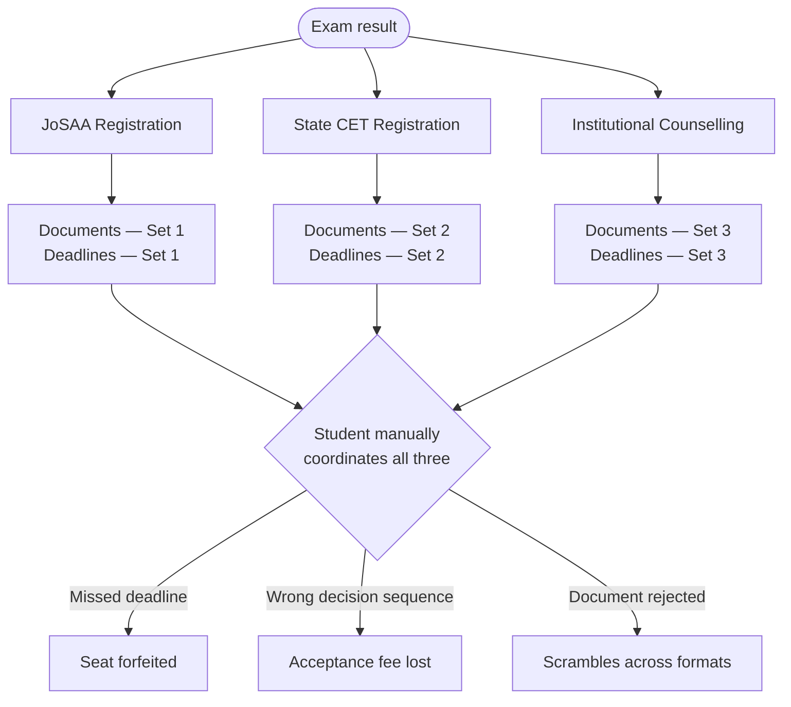

## The problem, plainly stated

A student with a JEE Main rank registers on JoSAA. Then registers again on their state CET. Uploads the same photograph, the same mark sheets, the same category certificate — twice, to two separate portals, with different file size limits. Tracks two sets of deadlines manually. Makes acceptance decisions in one system with no visibility into the other.

**No coordination exists between these systems.** The student carries that burden alone.

Superadmission is the coordination layer that should exist between them.

---

## What this documentation covers

<CardGroup cols={2}>
  <Card
    title="The Landscape"
    icon="map"
    href="/landscape/admissions-landscape"
    img="/images/cards/landscape-bg.png"
  >
    How admissions works in India today. The authorities, the systems, and where the process breaks for students navigating more than one simultaneously.
  </Card>
  <Card
    title="The Proposed Model"
    icon="layers"
    href="/blueprint/proposed-structure"
    img="/images/cards/model-bg.png"
  >
    A layered infrastructure approach. Identity, documents, workflow coordination, and guidance — built above existing systems, not replacing them.
  </Card>
  <Card
    title="PraveshAI™"
    icon="cpu"
    href="/praveshai/overview"
    img="/images/cards/praveshai-bg.png"
  >
    The intelligence layer. Tracks state across systems, surfaces what matters, and supports every decision point without making decisions for the student.
  </Card>
  <Card
    title="Operations"
    icon="sliders"
    href="/operations/authority-workflows"
    img="/images/cards/operations-bg.png"
  >
    How authorities configure rounds, manage verification queues, trigger allocation, and control what publishes. Everything audited, nothing automated without authorisation.
  </Card>
</CardGroup>

---

## What is actually being proposed

<Note>
  Superadmission is not a counselling system. JoSAA allocates IIT and NIT seats. MCC allocates AIQ medical seats. State CETs allocate within their jurisdiction. **None of this changes.** The proposed layer sits above these systems and removes the coordination burden the student currently carries alone.
</Note>

The shift is structural, not cosmetic. A cleaner portal that still requires four separate registrations solves nothing.

| What students do today | What changes |
| --- | --- |
| New account per counselling | One Aadhaar-linked profile, created once |
| Same documents uploaded 4.1 times per cycle on average | Documents fetched from DigiLocker, verified once, accepted everywhere |
| Deadlines tracked manually across portals | All active deadlines in one view with proactive alerts |
| Allotment status checked per portal independently | Consolidated status, side-by-side comparison |
| Paid consultants fill the guidance gap (Rs 5,000 to Rs 2 lakh) | Pravesh AI at every decision point, available to every student |

The numbers above are not projections. They come from approximately 2,000 student journeys tracked through CollegeCult operations.

---

## The coordination gap

This is the standard experience for a student with a competitive JEE Main rank. Not an edge case.

---

## Five layers, one profile

<Steps>
  <Step title="Identity">
    One Aadhaar-linked profile. Personal details, academic record, category status, and rank entered once — referenced by every participating counselling.
  </Step>
  <Step title="Documents">
    Mark sheets, rank cards, and certificates fetched from issuing authorities via DigiLocker with student consent. Verified once. The verified status travels to each system.
  </Step>
  <Step title="Workflow Coordination">
    All active deadlines in a unified view, priority-sorted by urgency. When a student accepts a seat in one system, the platform surfaces the required action in every other active system.
  </Step>
  <Step title="PraveshAI™">
    Eligibility surfaces automatically. Cutoff trends from prior years appear alongside each preference. Risk flags — approaching deadline, document mismatch, overlapping acceptance windows — arrive before they become problems.
  </Step>
  <Step title="Student Interface">
    One login. One dashboard. All active counsellings visible. Consistent terminology across systems. Single notification stream.
  </Step>
</Steps>

---

## Who this is for

<CardGroup cols={3}>
  <Card title="Students" icon="user-graduate">
    One profile across every counselling. Deadlines tracked. Decisions guided. No consultant required.
  </Card>
  <Card title="Counselling Authorities" icon="building-columns">
    Pre-verified intake. Faster rounds. Every allocation decision auditable and explainable.
  </Card>
  <Card title="Institutions" icon="school">
    Complete student records arrive before reporting day. Two touchpoints — a verified allotment, and a QR scan.
  </Card>
</CardGroup>

---

## Scale context

More than **23 lakh students** appeared for JEE Main in 2024. More than **24 lakh** for NEET UG. Each completing an average of 2.3 separate counselling registrations, submitting the same documents an average of 4.1 times per cycle.

NEP 2020 targets 50% Gross Enrolment Ratio by 2035, against a current rate of 28.4%. The volume entering this process grows every year. The coordination infrastructure has not.

<Info>
  Superadmission is not a government initiative. No authority integrations exist. No approvals are in place. This documentation describes the proposed architecture with precision so it can be evaluated honestly — by students, by authorities, and by institutions.
</Info>

---

## India Stack alignment

The proposed architecture is designed to sit on existing public digital infrastructure — the same approach UPI used for payments and ONDC used for commerce.

| Stack Component | Role in the proposed model |
| --- | --- |
| **Aadhaar** | Identity layer. Optional e-KYC and OTP-based authentication. |
| **DigiLocker** | Document layer. Mark sheets and rank cards fetched from issuing authorities with consent. |
| **UPI** | Payment layer. One interface for all registration and acceptance fees across counsellings. |
| **APAAR** | Academic identity. Persistent, portable student record aligned with the ABC framework under NEP. |

A shared protocol above existing actors. No actor is replaced.

---

## Navigate by role

<Tabs>
  <Tab title="Student">
    Start with [Admissions Landscape](/landscape/admissions-landscape) to understand how the current system is structured. Then [Student Experience](/blueprint/student-experience) to see what changes. [Identity and Profile](/praveshai/identity-and-profile) shows how your profile is formed and what it contains.
  </Tab>
  <Tab title="Counselling Authority">
    Read [Proposed Structure](/blueprint/proposed-structure) for the architecture overview, then [Authority Workflows](/operations/authority-workflows) for the operational detail. [Governance and Compliance](/blueprint/governance-and-compliance) covers DPDP, IT Act, and data handling obligations.
  </Tab>
  <Tab title="Institution">
    [Institution Workflows](/operations/institution-workflows) covers the two touchpoints institutions have in the proposed model. [Student Experience](/blueprint/student-experience) covers what arrives before reporting day.
  </Tab>
  <Tab title="Policy / Government">
    [Public Infrastructure Alignment](/blueprint/public-infrastructure-alignment) covers the India Stack design decisions in detail. [Policy and Government](/stakeholders/policy-and-government) covers NEP alignment, DPDP design intent, and what formal engagement would involve.
  </Tab>
</Tabs>

---

## What is not being claimed

<Warning>
  Read this before sharing this documentation with any institutional or government contact.

  * No counselling authority has agreed to integrate with this platform
  * No government approvals are in place
  * No production system is running
  * No DPDP compliance certification has been obtained
  * No security audit has been completed

  This is a proposed infrastructure model at design and early prototype stage. The documentation exists at this level of detail so that evaluation is possible. Every claim is bounded by what exists, not what is intended.
</Warning>

---

<CardGroup cols={2}>
  <Card title="Start with the landscape" icon="map" href="/landscape/admissions-landscape">
    Understand the current system before the proposed model.
  </Card>
  <Card title="Talk to the founders" icon="message-square" href="https://superadmission.com/contact">
    Evaluating this for an institution or authority? Skip the docs and start a direct conversation.
  </Card>
</CardGroup>