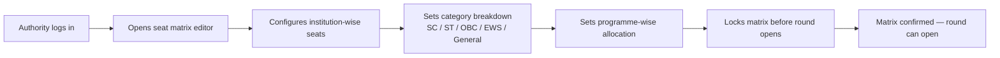
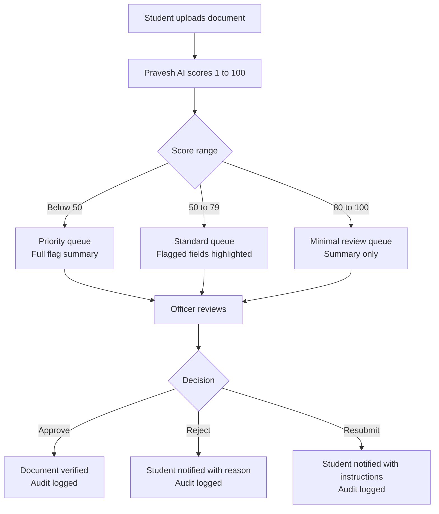
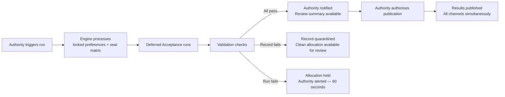

A counselling authority on Superadmission retains full control of its process. The platform provides the infrastructure. The authority defines its rules, manages its intake, runs its rounds, and triggers its allocation.

Four core capabilities. Each authority-controlled.

---

## The four workflows

<CardGroup cols={2}>
  <Card title="Seat Matrix" icon="table-cells">
    Configure seats category-wise, programme-wise, institution-wise before a round opens
  </Card>
  <Card title="Student Intake" icon="users">
    View registered students, their verification status, and application completeness
  </Card>
  <Card title="Verification Queue" icon="list-check">
    Manage manually uploaded document review — confidence-sorted, pre-annotated by Pravesh AI
  </Card>
  <Card title="Allocation" icon="gavel">
    Trigger the allocation run, review validation results, and authorise publication
  </Card>
</CardGroup>

---

## 1. Seat matrix configuration

Before a round opens, the authority defines the seat structure.

**What can be edited:** Seat counts, category splits, programme mapping.

**What cannot be changed after round opens:** Seat matrix is locked at round start. Updates require authority-level override with reason logged.

---

## 2. Student intake view

Once a round is active, the authority sees the incoming student pool.

| View | What it shows |
|---|---|
| Registered students | Count by category, domicile, and programme preference |
| Verification status | How many profiles are fully verified, pending, or flagged |
| Document queue | Manually uploaded documents awaiting officer review |
| Application completeness | Percentage of registered students with locked preferences |

<Tip>
**The intake view is read-only for the authority.** Individual student data is visible within governed access boundaries. The authority sees aggregate states and manages the verification queue — they do not edit student profile data.
</Tip>

---

## 3. Verification queue

Manually uploaded documents are scored by Pravesh AI and queued for officer review. The authority manages this queue.

Officers assigned by the authority work within this queue. Every decision is logged against their account with a timestamp and reason.

---

## 4. Allocation workflow

**The authority initiates. The authority authorises.** The system runs the engine and validates — it does not publish independently.

---

## What authorities retain full control over

<CardGroup cols={2}>
  <Card title="Eligibility rules" icon="filter">
    Domicile requirements, subject combinations, minimum marks — configured by the authority, enforced by the system
  </Card>
  <Card title="Reservation mandates" icon="scale-balanced">
    SC, ST, OBC, EWS, sub-category rules and carry-forward logic — authority-defined
  </Card>
  <Card title="Round structure" icon="arrows-rotate">
    Number of rounds, opening and closing dates, acceptance window duration
  </Card>
  <Card title="Publication timing" icon="clock">
    Results do not go live until the authority explicitly authorises publication
  </Card>
</CardGroup>

---

## Round controls

| Control | Who can use it | Logged |
|---|---|---|
| Open a round | Authority | Yes — timestamp, account |
| Pause a round | Authority | Yes — reason required |
| Extend a deadline | Authority | Yes — reason required |
| Trigger allocation | Authority | Yes — timestamp, account |
| Authorise publication | Authority | Yes — timestamp, account |

---

<Info>
What institutions can do after allocation — receiving confirmed allotments and verifying students at reporting — is in Institution Workflows.
</Info>