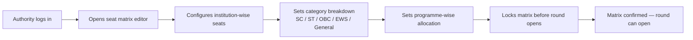
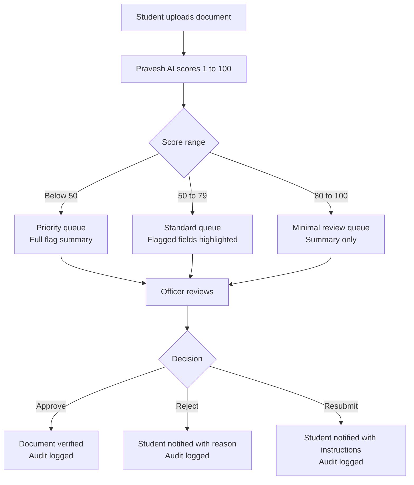
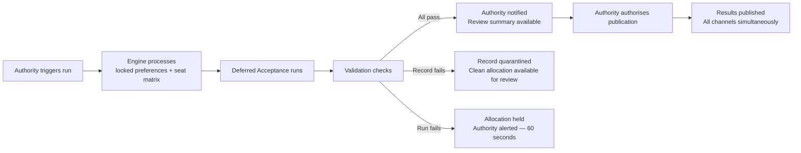

A counselling authority defines and manages its own process on Superadmission. The platform provides the infrastructure, while the authority configures rules, manages intake, conducts rounds, and initiates allocation.

---

## The four workflows

<CardGroup cols={2}>
  <Card title="Seat Matrix" icon="table-cells">
    Configure seats category-wise, programme-wise, institution-wise before a round opens
  </Card>

  <Card title="Student Intake" icon="users">
    View registered students, their verification status, and application completeness
  </Card>

  <Card title="Verification Queue" icon="list-check">
    Manage manually uploaded document review, SLA-sorted, pre-annotated by Pravesh AI
  </Card>

  <Card title="Allocation" icon="gavel">
    Trigger the allocation run, review validation results, and authorise publication
  </Card>
</CardGroup>

---

## 1. Seat matrix configuration

The authority defines the seat structure before the start of a round.

**Editable before round start**

> Seat counts, category distribution, and programme mapping.

**Locked after round start**

> The seat matrix is fixed once the round begins. Any changes require explicit authorisation with a recorded reason.

---

## 2. Student intake view

Once a round is active, the authority sees the incoming student pool.

| View | What it shows |
| --- | --- |
| Registered students | Count by category, domicile, and programme preference |
| Verification status | How many profiles are fully verified, pending, or flagged |
| Document queue | Manually uploaded documents awaiting officer review |
| Application completeness | Percentage of registered students with locked preferences |

<Tip>
  **The intake view is read-only for the authority.** Individual student data is visible within governed access boundaries. The authority sees aggregate states and manages the verification queue — they do not edit student profile data.
</Tip>

---

## 3. Verification queue

Manually uploaded documents are scored by Pravesh AI and queued for officer review. The authority manages this queue.

Officers assigned by the authority operate within the review queue. Each action is recorded with the officer’s identity, timestamp, and decision reason.

---

## 4. Allocation workflow

The authority initiates and authorises all key actions. The system executes defined logic and validations but does not publish outcomes without explicit authorisation.

---

## What authorities retain full control over

<CardGroup cols={2}>
  <Card title="Eligibility rules" icon="filter">
    Domicile requirements, subject combinations, and minimum marks are defined by the authority and enforced by the system.
  </Card>

  <Card title="Reservation mandates" icon="scale-balanced">
    Reservation categories, sub-category rules, and carry-forward logic are defined by the authority and applied during allocation.
  </Card>

  <Card title="Round structure" icon="arrows-rotate">
    The authority defines the number of rounds, their timelines, and the duration of acceptance windows.
  </Card>

  <Card title="Publication timing" icon="clock">
    Results are published only after review and explicit authorisation by the authority.
  </Card>
</CardGroup>

---

<Info>
  To know what institutions can do after allocation view Institution Workflows.
</Info>