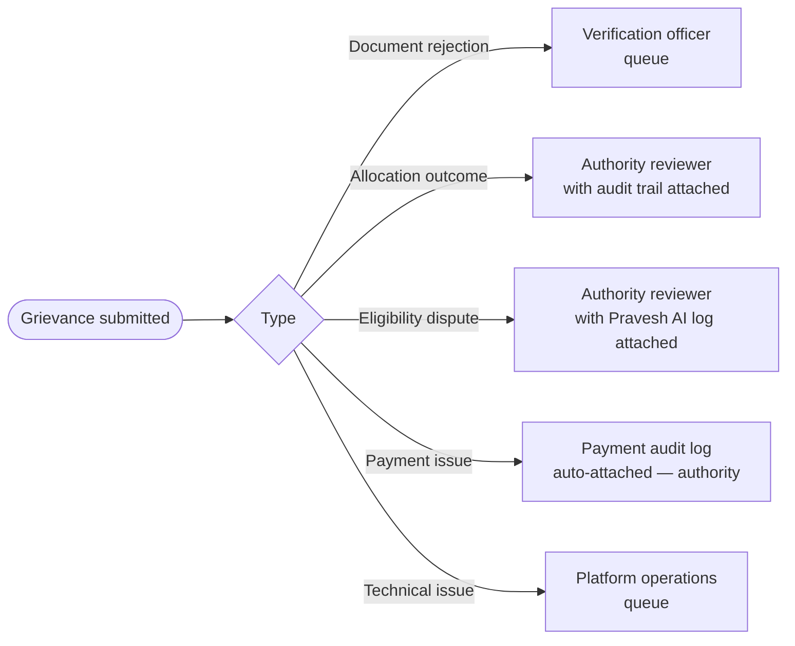
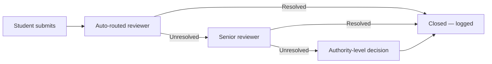

Most grievances arise from document decisions without recorded reasons or allocation outcomes without clear traceability. Superadmission records both. When a grievance is raised, it follows a defined review and resolution process.

---

## Submission

Students submit grievances through the platform. Three required fields:

1. **Type** - selected from a structured list, not free text
2. **Reference** - the specific action, document, or allotment being disputed
3. **Details** - what the student believes is incorrect and why

![\[SCREENSHOT NEEDED: Student grievance submission screen — showing type dropdown, reference field, and details text area\]](/images/samplescreenshot.jpg)

---

## Grievance types and auto-routing

Every grievance routes to the right person automatically. No triage by hand.

---

## Resolution paths

<Tabs>
  <Tab title="Document rejection">
    | Step | Action |
    | --- | --- |
    | 1 | Verification officer reviews original decision and audit record |
    | 2 | If decision was correct — reason re-communicated to student with specifics |
    | 3 | If decision is reversed — document approved, student notified, original audit record annotated |
    | 4 | If contested further — escalated to senior reviewer |
  </Tab>
  <Tab title="Allocation outcome">
    | Step | Action |
    | --- | --- |
    | 1 | Authority reviewer accesses student's allocation audit trail |
    | 2 | Allocation chain reviewed — preference tried, constraint applied, outcome |
    | 3 | If allocation was correct — explanation provided to student from audit record |
    | 4 | If error found — flagged for authority action, correction logged |
  </Tab>
  <Tab title="Eligibility dispute">
    | Step | Action |
    | --- | --- |
    | 1 | Pravesh AI eligibility log for this student pulled automatically |
    | 2 | Which criterion failed and why — visible to reviewer |
    | 3 | If criterion was applied incorrectly — eligibility status updated, student notified |
    | 4 | If criterion was correct — explanation communicated with specific rule cited |
  </Tab>
</Tabs>

---

## Response SLA design

| Grievance type | Target response | Target resolution |
| --- | --- | --- |
| Document rejection | 24 hours | 48 hours |
| Allocation outcome | 48 hours | 72 hours |
| Eligibility dispute | 48 hours | 72 hours |
| Payment issue | 12 hours | 24 hours |
| Technical issue | 6 hours | 24 hours |

<Warning>
  These are design intent targets. Actual SLAs are defined and enforced by each counselling authority. The platform surfaces SLA status — it does not override authority-set timelines.
</Warning>

---

## Escalation path

Every step is timestamped. The student can see where their grievance is in the path.

---

## Authority notification

Authorities receive a daily grievance summary — open count by type, resolved count by type, escalated count, average resolution time. High-volume grievance patterns trigger an alert — a spike in document rejection grievances, for example, may indicate a verification configuration issue.

![\[SCREENSHOT NEEDED: Authority grievance summary panel — showing open/resolved/escalated counts by type, with a trend line for the current round\]](/images/samplescreenshot.jpg)

---

## Audit trail per grievance

Every grievance action is logged:

| Field | Captured |
| --- | --- |
| Grievance ID | Yes |
| Type | Yes |
| Submitting student | Yes |
| Auto-route destination | Yes |
| Reviewer assigned | Yes |
| Each action taken | Yes — timestamped |
| Resolution decision | Yes |
| Student notification sent | Yes \+ timestamp |

No grievance closes without a logged resolution. No resolution is communicated outside the platform without a record.

---

<Info>
  For platform-level controls during a round — pausing, overriding, emergency actions — see Operational Controls.
</Info>