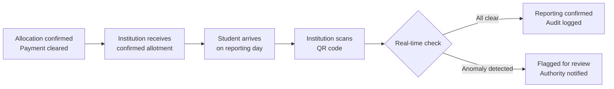

Institutions operate at the final stage of the admission process. They verify documents physically, confirm admissions, and update reporting status. All actions are recorded and tied to the institution’s account.

---

## Two touchpoints

---

## 1: Confirmed allotment

When a student's payment clears, the institution receives a confirmed allotment record automatically.

<CardGroup cols={2}>
  <Card title="Student identity" icon="fingerprint">
    Complete student profile with all relevant details is available.
  </Card>

  <Card title="Allotment details" icon="file-lines">
    Programme, category seat type, round number, closing rank for this seat
  </Card>

  <Card title="Documents" icon="shield-check">
    All submitted documents are available with their current status.
  </Card>

  <Card title="Payment confirmation" icon="circle-check">
    UPI transaction reference and timestamp
  </Card>
</CardGroup>

The student record is available in a complete and structured format prior to reporting.

## 2: Physical reporting

The student arrives with a digital admission letter containing a single-use, time-limited QR code.

<Steps>
  <Step title="Scan QR code">
    Institution staff scan the code on any authorised device.
  </Step>
  <Step title="Real-time verification">
    The system checks three things instantly: payment received, allotment valid, no duplicate admission detected.
  </Step>
  <Step title="Confirmation or flag">
    - Clear: Reporting completed and recorded, with audit log updated.
    - Flagged : Case flagged for review, authority notified, and reporting status held pending resolution.
  </Step>
  <Step title="Physical document check">
    Physical copies cross-checked against DigiLocker-fetched records. This is an audit step. The documents were already verified.
  </Step>
</Steps>

---

## QR code properties

| Property | Detail |
| --- | --- |
| Single-use | Expires after first scan or as designated by institute requirement |
| Time-limited | Valid only within the reporting window |
| Linked to allotment | Carries full allotment reference |

## What institutions do not need to do

<CardGroup cols={2}>
  <Card title="Re-verify documents" icon="check-double">
    Every document is pre-verified. Physical check is audit-only.
  </Card>

  <Card title="Chase incomplete records" icon="files-pinwheel">
    Confirmed allotment records are complete before the student arrives.
  </Card>

  <Card title="Rebuild internal systems" icon="solar-system">
    No integration with internal institution systems is required.
  </Card>

  <Card title="Manage multiple portals" icon="portal-enter">
    One interface. One allotment record per student. One QR scan at reporting.
  </Card>
</CardGroup>

---