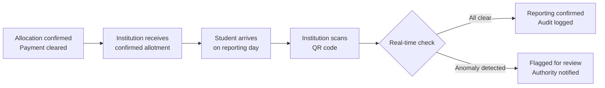

Institutions have a focused role on Superadmission. They receive confirmed allotments and verify students at physical reporting. Nothing more is required of them. Nothing about their internal systems needs to change.

---

## Two touchpoints

---

## Touchpoint 1: Confirmed allotment

When a student's payment clears, the institution receives a confirmed allotment record automatically.

<CardGroup cols={2}>
  <Card title="Student identity" icon="fingerprint">
    Superadmission ID, name, category, and domicile — pre-verified
  </Card>
  <Card title="Allotment details" icon="file-lines">
    Programme, category seat type, round number, closing rank for this seat
  </Card>
  <Card title="Document status" icon="shield-check">
    Verification status of all documents — fetched from source or officer-approved
  </Card>
  <Card title="Payment confirmation" icon="circle-check">
    UPI transaction reference and timestamp
  </Card>
</CardGroup>

The institution receives a student whose record is clean, complete, and machine-readable before they arrive. No chasing documents. No incomplete intake.

---

## Touchpoint 2: Physical reporting

The student arrives with a digital admission letter containing a single-use, time-limited QR code.

<Steps>
  <Step title="Scan QR code">
    Institution staff scan the code on any authorised device.
  </Step>
  <Step title="Real-time verification">
    The system checks three things instantly: payment received, allotment valid, no duplicate admission detected.
  </Step>
  <Step title="Confirmation or flag">
    All clear — reporting marked complete, audit logged. Anomaly detected — case flagged, authority notified, reporting paused pending review.
  </Step>
  <Step title="Physical document check">
    Physical copies cross-checked against DigiLocker-fetched records. This is an audit step — not a primary verification. The documents were already verified.
  </Step>
</Steps>

---

## QR code properties

| Property | Detail |
|---|---|
| Single-use | Expires after first scan |
| Time-limited | Valid only within the reporting window |
| Non-transferable | Tied to student Superadmission ID |
| Linked to allotment | Carries full allotment reference |

<Warning>
A QR code that has already been scanned cannot be used again. Duplicate scan attempts are flagged immediately and logged to the audit trail.
</Warning>

---

## What institutions do not need to do

<CardGroup cols={2}>
  <Card title="Re-verify documents" icon="xmark">
    Every document is pre-verified. Physical check is audit-only.
  </Card>
  <Card title="Chase incomplete records" icon="xmark">
    Confirmed allotment records are complete before the student arrives.
  </Card>
  <Card title="Rebuild internal systems" icon="xmark">
    No integration with internal institution systems is required.
  </Card>
  <Card title="Manage multiple portals" icon="xmark">
    One interface. One allotment record per student. One QR scan at reporting.
  </Card>
</CardGroup>

---

## Before and after

| Step | Today | Superadmission |
|---|---|---|
| Receiving allotment data | Varies — portal download, batch files, manual | Automatic on payment confirmation |
| Student record completeness | Incomplete — documents often missing | Complete before student arrives |
| Document verification at reporting | Re-done from scratch | Audit check only |
| Duplicate admission detection | Manual, error-prone | Real-time QR validation |
| Reporting confirmation | Paper-based or manual entry | Digital — logged automatically |

---

<Tip>
**The institution's workload at reporting drops significantly.** The verification has already happened. The record is already clean. The QR scan confirms. That is the entire institution-side workflow.
</Tip>