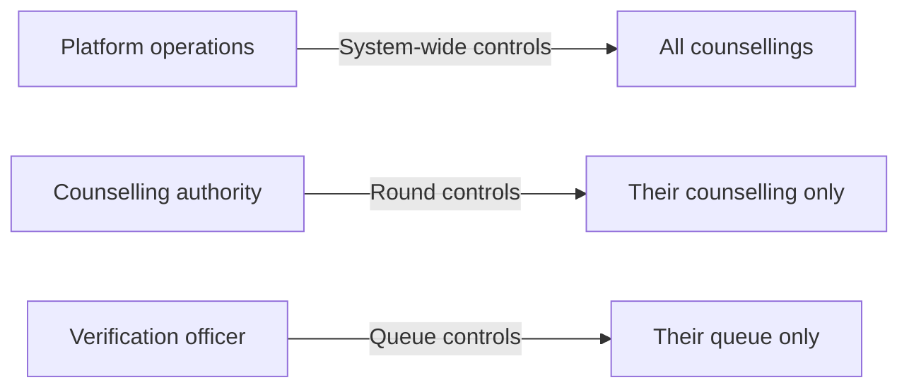

Every control action on Superadmission requires explicit human authorisation. No automated system action changes a round's state. This page documents what controls exist, who holds them, and what happens when they are used.

---

## Control hierarchy

Each level can only act within its scope. An authority cannot affect another authority's round. An officer cannot affect round state.

---

## Round controls — authority level

| Control | What it does | Requires |
| --- | --- | --- |
| Open round | Activates registration and choice-filling | Authority account |
| Pause round | Halts all student-facing actions in the round | Authority account \+ reason |
| Extend deadline | Pushes a deadline forward | Authority account \+ reason \+ new timestamp |
| Close round early | Ends choice-filling before scheduled close | Authority account \+ reason |
| Trigger allocation | Initiates the allocation engine run | Authority account |
| Authorise publication | Releases results after validation review | Authority account |

Every action on this table is logged — account, timestamp, reason where required.

---

## What happens when a round is paused

<Steps>
  <Step title="Authority initiates pause">
    Reason entered. Confirmation required. Action logged.
  </Step>
  <Step title="Student-facing actions halt">
    Choice-filling, document uploads, and payment flows are suspended. Students see a status message — round temporarily paused.
  </Step>
  <Step title="In-progress actions complete">
    Any action already in progress at pause time — a UPI payment mid-flow, for example — completes before the pause takes effect.
  </Step>
  <Step title="Resume or close">
    Authority resumes the round or closes it. Both actions logged with reason.
  </Step>
</Steps>

![\[SCREENSHOT NEEDED: Authority round control panel — showing round status, pause/resume button, deadline extension input, and last action log\]](/images/samplescreenshot.jpg)

---

## Deadline extension

<CardGroup cols={2}>
  <Card title="When it is used" icon="clock">
    Platform downtime, verified technical issue affecting student access, or documented force majeure event
  </Card>

  <Card title="What it requires" icon="file-signature">
    Authority account login, reason entered, new deadline timestamp confirmed — no bulk override possible
  </Card>

  <Card title="What it logs" icon="file-lines">
    Original deadline, new deadline, reason, authorising account, timestamp
  </Card>

  <Card title="What it does not do" icon="xmark">
    Does not retroactively unlock preferences already submitted. Extends the window for students who had not yet locked.
  </Card>
</CardGroup>

---

## Emergency communication

When a control action affects students — a round pause, a deadline change — the platform sends notifications automatically across all active channels.

| Channel | Content |
| --- | --- |
| SMS | Short status update — round paused / deadline extended to \[date\] |
| Email | Full explanation with new timeline |
| Dashboard | Status banner shown on every student's active screen |
| Push notification | Immediate alert if opted in |

The communication is automatic on control action. The authority does not draft the message — the platform generates it from the action parameters.

---

## Audit log for control actions

Every control action produces an immutable audit record:

| Field | Captured |
| --- | --- |
| Action type | Yes |
| Authorising account | Yes |
| Timestamp | Yes |
| Reason | Yes — required for all pause, extend, and close actions |
| Student notification sent | Yes \+ channels \+ timestamp |
| Previous state | Yes |
| New state | Yes |

<Tip>
  **Control actions are the most audited category in the system.** Any action that changes round state — pause, extend, close, trigger, authorise — generates a record that cannot be edited or deleted.
</Tip>

---

## What no single actor can do unilaterally

No individual account — authority, officer, or platform operations — can publish an allocation without the full validation sequence completing. No account can delete an audit record. No account can access another counselling authority's data or controls. These are architectural constraints, not policy rules.

---

<Info>
  The full audit architecture — how records are structured, who can query them, and how long they are retained — is in Audit and Explainability.
</Info>