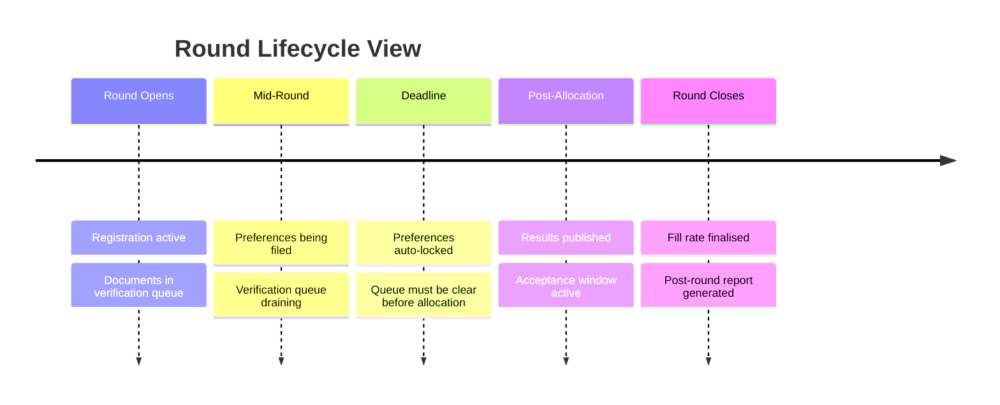

> Authorities have a live view of round data during execution, including seat fill status and application progress, without waiting for round completion.

---

## Real-time seat fill

The seat fill view updates continuously as the round progresses. Authorities see:

| Dimension | What is shown |
| --- | --- |
| By institution | Fill rate per college |
| By programme | Fill rate per course |
| By category | SC / ST / OBC / EWS / General all separately |
| By round | Current round vs prior rounds |

## Round tracking dashboard

Each stage shows a status indicator - active, complete, or attention needed.

---

## Health indicators

<CardGroup cols={2}>
  <Card title="Verification queue depth" icon="list">
    How many documents are pending review. Alerts fire if queue grows beyond a set threshold before the allocation trigger deadline.
  </Card>

  <Card title="Preference lock rate" icon="lock">
    Percentage of registered students who have locked preferences. Low lock rate close to deadline triggers an alert.
  </Card>

  <Card title="Payment confirmation rate" icon="circle-check">
    Percentage of accepted seats with confirmed payment. Unpaid acceptances approaching window close are flagged.
  </Card>

  <Card title="Allocation validation status" icon="shield-check">
    After allocation round how many records passed clean, how many were quarantined, what was published.
  </Card>
</CardGroup>

---

## Alert design

Alerts are specific, not generic. Every alert names the exact condition and the recommended action.

| Alert | Condition | Recipient |
| --- | --- | --- |
| Queue threshold | Verification queue above set depth with 24h to deadline | Authority |
| Low lock rate | Under 60% preferences locked with 12h to deadline | Authority |
| Allocation record quarantined | Any record fails validation | Authority |
| Allocation run failed | Full run fails validation | Authority (60 second SLA) |
| Payment window closing | Accepted seats with unpaid status - 6h remaining | Student \+ Authority |
| QR scan anomaly | Duplicate or expired QR attempted at institution | Authority \+ Institution |

---

## Data export

After each round, authorities can export structured data:

<CardGroup cols={2}>
  <Card title="Allocation summary" icon="file-export">
    Student-wise allotment results, institution, course, category, rank
  </Card>

  <Card title="Seat fill report" icon="table">
    Category-wise fill rates per institution and programme
  </Card>

  <Card title="Verification log" icon="file-lines">
    All document decisions have officer, timestamp, outcome
  </Card>

  <Card title="Audit extract" icon="database">
    Full round audit trail in structured format for regulatory submission
  </Card>
</CardGroup>

---

## Post-round summary

Generated automatically when a round closes. Contains:

- Total seats in matrix
- Seats filled, by category
- Seats vacant, by category and institution
- Acceptance window outcomes, accepted vs declined vs lapsed
- Verification queue resolution rate
- Grievances filed during the round
- Allocation validation summary includes records passed, quarantined, published

---