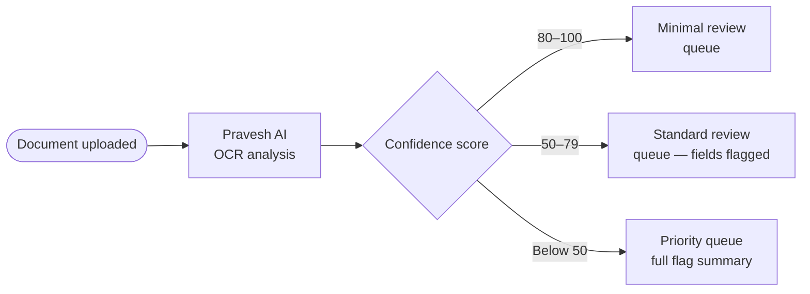

Every manually uploaded document enters a structured review process. Nothing sits in an unmanaged queue. Every document arrives pre-analysed. Every decision is logged.

---

## How a document enters review

Three queues. Officers work priority-first. No document is treated identically — attention scales with risk.

---

## What the reviewer sees

Each document in the queue opens with:

- **Confidence score** — prominently displayed
- **Flagged fields** — exactly which data points Pravesh AI questioned
- **Student profile context** — the fields the document is being checked against
- **Document preview** — full view alongside the flag summary

The officer does not read documents blind. They review annotated cases.

---

## Decision flows

<CardGroup cols={3}>
  <Card title="Approve" icon="circle-check">
    Document marked verified. Student profile updated. Audit record created with officer ID and timestamp.
  </Card>
  <Card title="Reject" icon="circle-xmark">
    Rejection reason selected from structured list. Student notified with specific reason. Audit record created.
  </Card>
  <Card title="Request resubmission" icon="arrow-rotate-left">
    Student notified with instructions on what to correct. Original document retained in audit. New upload enters the queue fresh.
  </Card>
</CardGroup>

---

## Escalation path

| Situation | Next step |
|---|---|
| Officer unsure — borderline case | Escalates to senior reviewer |
| Senior reviewer unsure | Escalates to authority-level decision |
| Student contests rejection | Grievance path — separate from review queue |
| Suspected fraud | Flagged to authority — manual hold on application |

Every escalation is logged. The case history travels with the document.

---

## Bulk review

For high-confidence document batches, officers can bulk-approve within a confidence band. Bulk actions require:

- Confidence score above the authority's set threshold
- No active flags on any document in the batch
- Officer confirmation — one explicit action per batch, not auto-approve

<Warning>
Bulk approval is available only for documents Pravesh AI scored above 80 with zero field-level flags. Below that threshold, every document requires individual review.
</Warning>

---

## Audit trail per decision

Every review action creates an immutable record:

| Field | Captured |
|---|---|
| Document ID | Yes |
| Officer account | Yes |
| Confidence score at review | Yes |
| Decision | Approve / Reject / Resubmit |
| Reason | Required for reject and resubmit |
| Timestamp | Yes |
| Student notification sent | Yes / No + timestamp |

---

<Info>
How verification decisions feed into round-level monitoring — fill rates, queue health, alert triggers — is in Reporting and Monitoring.
</Info>