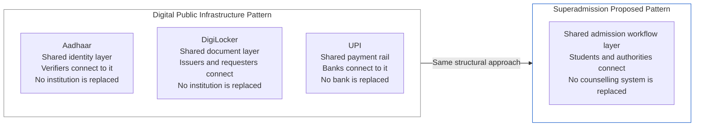
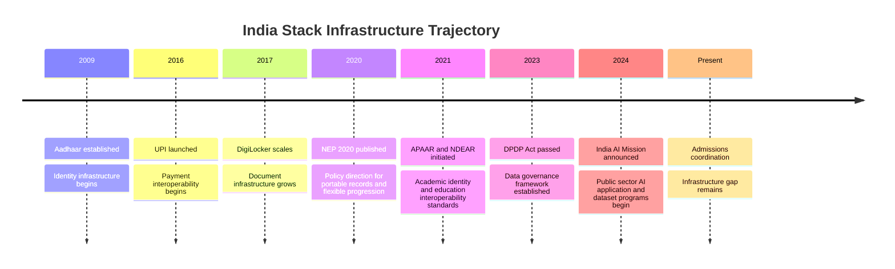

India's digital public infrastructure has expanded significantly over the past decade. Identity, payments, document exchange, and educational records are increasingly supported by interoperable national platforms.In parallel, education policy has moved toward greater digitization, portability of academic records, standardized data exchange, and improved access to higher education.

Superadmission is emerging within this ecosystem.

---

## The Digital Public Infrastructure Pattern

The systems collectively described as India Stack share a structural characteristic: they provide a shared protocol or infrastructure layer that multiple parties connect to, rather than a centralised system that displaces existing actors.

Each of these systems creates value by enabling coordination between existing actors. Superadmission proposes the same structural approach for admissions: a shared coordination layer that counselling systems connect to, producing a consistent student experience across systems without replacing any of them.

---

## The Infrastructure That Already Exists

The Indian Stack provides the foundational layers an admissions coordination system requires. These are not components Superadmission needs to build; they are components it connects to.

<Tabs>
  <Tab title="Aadhaar">
    <CardGroup cols={2}>
      <Card title="139 Crore Enrollments" icon="id-card">
        eKYC is operational. Identity verification completes in seconds.
      </Card>

      <Card title="Superadmission Integration" icon="link">
        Optional Aadhaar-based verification where regulatory approval permits. Removes manual document-based identity checks from the application workflow.
      </Card>
    </CardGroup>

    Aadhaar is India's foundational identity layer. For admissions, the relevant capability is eKYC: a student's identity can be verified programmatically against the Aadhaar database without requiring manual document verification. Each counselling system currently runs its own identity verification process. A shared identity layer eliminates that duplication.
  </Tab>
  <Tab title="DigiLocker">
    <CardGroup cols={2}>
      <Card title="51.52 Crore Registered Users" icon="folder-open">
        Verified academic and identity documents directly fetchable with student consent.
      </Card>

      <Card title="Superadmission Integration" icon="link">
        Class 10 and 12 certificates, domicile documents, and category certificates fetched once, reused across all counselling applications.
      </Card>
    </CardGroup>

    A student who has linked their academic certificates to DigiLocker does not need to re-upload or re-verify them across multiple applications. The document collection and physical verification steps that currently occur independently within each counselling system are replaced by a single consent-based fetch.
  </Tab>
  <Tab title="UPI Payments">
    <CardGroup cols={2}>
      <Card title="1,867 Crore Transactions" icon="indian-rupee-sign">
        Processed in April 2025 alone. Proven infrastructure for high-volume, interoperable payments.
      </Card>

      <Card title="Superadmission Integration" icon="link">
        Admission fee payments across multiple counselling systems route through a single, auditable payment interface.
      </Card>
    </CardGroup>

    Students currently navigate separate payment portals for each counselling system, each with different failure modes and refund workflows. UPI provides an existing, interoperable rail. A unified fee payment interface built on UPI eliminates the per-portal payment overhead and produces a single, auditable transaction record across all applications.
  </Tab>
  <Tab title="APAAR + NDEAR">
    <CardGroup cols={2}>
      <Card title="One Identity Per Student" icon="graduation-cap">
        APAAR assigns a unique academic identity across all institutions. NDEAR enforces interoperability standards across education systems.
      </Card>

      <Card title="Superadmission Integration" icon="link">
        Student record architecture designed to be compatible with APAAR IDs and conformant with NDEAR data specifications.
      </Card>
    </CardGroup>

    APAAR (Academic Bank of Credits) and NDEAR (National Digital Education Architecture) together establish that academic records should be portable and that systems operating in the education domain should conform to shared data standards. Superadmission's student record design is built to operate within these constraints, not parallel to them.
  </Tab>
</Tabs>

---

## What NEP 2020 Establishes

The National Education Policy 2020 identifies several directions that are structurally relevant to the admissions coordination problem.

<AccordionGroup>
  <Accordion title="GER 50% target and enrollment growth">
    NEP 2020 targets a Gross Enrollment Ratio of 50% in higher education by 2035, against a current GER of approximately 28%. This implies roughly 70 million additional students entering the higher education pipeline. The counselling and admissions infrastructure that exists today was not designed for that volume. A coordination layer that reduces per-student overhead across counselling systems is a prerequisite for handling that increase without proportional growth in administrative capacity.
  </Accordion>

  <Accordion title="Multiple entry and exit points">
    NEP 2020 advocates for flexible progression through higher education: students entering and exiting at different points, accumulating credits across institutions. This requires a student record that persists and is portable across institutions and across admissions cycles. The identity and document layer Superadmission proposes is aligned with this requirement. A persistent, portable student record is a precondition for the flexible progression model NEP describes.
  </Accordion>

  <Accordion title="Technology in education administration">
    NEP 2020 explicitly calls for using technology to reduce administrative burden on students and institutions. The admissions coordination problem is one of the more operationally significant burdens in higher education administration. Multiple fee payments, redundant document submissions, and disconnected workflows are not inherent to the admissions process; they are artifacts of systems that were not designed to interoperate.
  </Accordion>

  <Accordion title="Academic Bank of Credits">
    The Academic Bank of Credits is a DigiLocker-based system for storing and transferring student credit records. It establishes that the Indian education system is moving toward digital, portable academic records as a default. Superadmission's student record design is compatible with the ABC architecture.
  </Accordion>
</AccordionGroup>

---

## India AI Mission

<CardGroup cols={3}>
  <Card title="INR 10,372 Crore" icon="microchip">
    Budget announced in 2024. Covers compute infrastructure, dataset programs, and public sector AI applications.
  </Card>

  <Card title="Education as Priority Sector" icon="school">
    The mission identifies education as a priority domain for AI application development.
  </Card>

  <Card title="Dataset Programs" icon="database">
    Structured, national-scale datasets in priority sectors are a stated program objective.
  </Card>
</CardGroup>

The relevance to Superadmission is specific. The admissions workflow generates structured, high-volume data: applications, eligibility verifications, seat allocations, fee transactions, and enrollment confirmations. This data is currently fragmented across dozens of independent counselling systems and is not aggregated in any form that supports analysis or planning.

A coordination layer that standardises application data across counselling systems produces, as a byproduct, a structured dataset of admissions activity at national scale. This dataset has direct utility for capacity planning, equity analysis, and policy evaluation within the education ministry and state governments. The India AI Mission's dataset programs are a direct alignment point for this data infrastructure component.

---

## Reach and Infrastructure Conditions

The infrastructure conditions that make a national-scale digital admissions system viable now exist in a form they did not five years ago.

<CardGroup cols={2}>
  <Card title="96.8%" icon="mobile-screen">
    **Rural youth use mobile phones.** 95.5% own smartphones. No device barrier for applicants from non-urban India.
  </Card>

  <Card title="95.15%" icon="wifi">
    **Villages with 3G/4G connectivity.** 488 million rural internet users, the fastest-growing segment.
  </Card>
</CardGroup>

These numbers matter for one specific reason: a coordination layer that requires a smartphone and an internet connection is no longer excluding the majority of applicants from rural India. The device and connectivity barrier that would have made a digital-first admissions system structurally inequitable in 2018 is not present in the same form today.

---

## Where the Project Fits

Superadmission is not a government initiative. It is an independent project whose architecture is designed to be compatible with the public digital infrastructure direction India has established.

The goal is eventual formal alignment: not a government takeover of the project, but recognition by the relevant authorities that the infrastructure layer is operationally useful and that an appropriate integration or approval pathway exists. That recognition depends on demonstrated utility, documented architecture, and engagement with the counselling authorities and regulators who would need to connect to the layer.

Each domain where coordination was operationally costly has produced an infrastructure layer. The admissions domain has not produced one yet. Superadmission is a documented proposal for what that layer could look like.

<Info>
  Superadmission does not claim to be the only viable approach to the admissions coordination problem. The documentation exists to make evaluation possible by the authorities, regulators, and institutions whose engagement is required for the layer to function at the scale the problem demands.
</Info>

---

## Summary of Alignment Points

<CardGroup cols={2}>
  <Card title="Aadhaar" icon="id-card">
    Identity layer alignment. Optional eKYC-based verification where approved.
  </Card>

  <Card title="DigiLocker" icon="folder-open">
    Document layer alignment. Fetch verified academic and identity records with student consent.
  </Card>

  <Card title="UPI" icon="indian-rupee-sign">
    Payment layer alignment. Unified, auditable fee payment across counselling systems.
  </Card>

  <Card title="APAAR" icon="graduation-cap">
    Student identity alignment. Compatible with one academic identity per student across institutions.
  </Card>

  <Card title="NDEAR" icon="network-wired">
    Interoperability standards alignment. Data architecture designed to conform to NDEAR specifications.
  </Card>

  <Card title="Academic Bank of Credits" icon="building-columns">
    Compatible student record design. Persistent, portable academic record across institutions and cycles.
  </Card>

  <Card title="NEP 2020" icon="scroll">
    Policy direction alignment. Technology-enabled administration, flexible progression, portable records.
  </Card>

  <Card title="India AI Mission" icon="microchip">
    Data infrastructure alignment. Structured national-scale admissions dataset as a byproduct of the coordination layer.
  </Card>

  <Card title="DPDP Act" icon="shield">
    Compliance framework. Data governance, consent architecture, student data rights.
  </Card>

  <Card title="Viksit Bharat 2047" icon="flag">
    Equitable access alignment. Merit-based admissions infrastructure that does not impose coordination costs disproportionately on first-generation applicants.
  </Card>
</CardGroup>