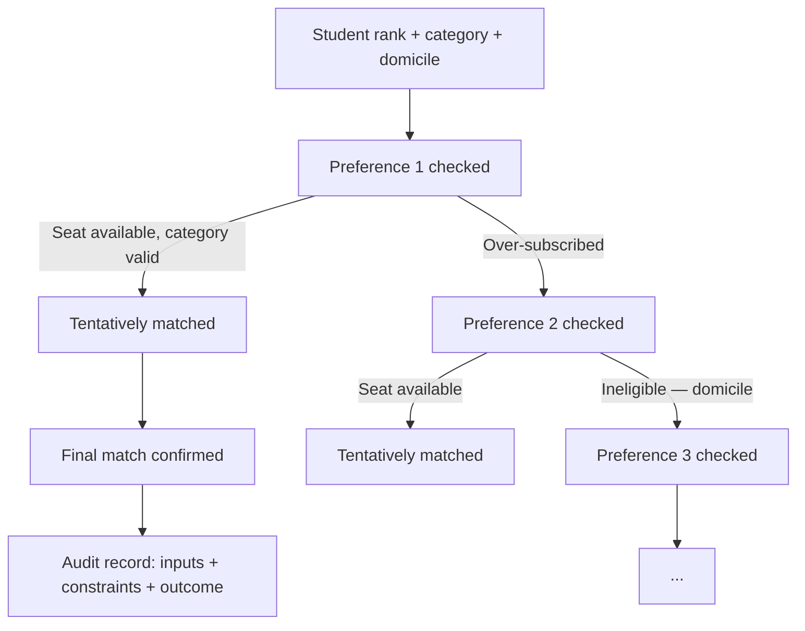
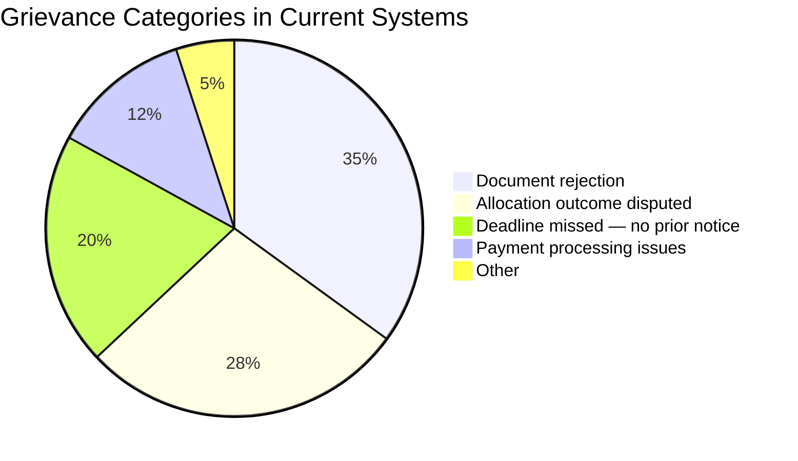

Allocation trust breaks when outcomes cannot be explained. Superadmission's audit layer is not a compliance checkbox — it is the foundation of the system's credibility.

Every write operation across the platform produces an audit record. No deletions. No overwrites. Every decision has a chain.

---

## What gets logged

<CardGroup cols={3}>
  <Card title="Student actions" icon="user">
    Every preference change, document upload, acceptance, and payment — timestamped
  </Card>
  <Card title="Officer actions" icon="user-tie">
    Every document decision — approve, reject, resubmission request — with account and reason
  </Card>
  <Card title="Authority actions" icon="building-columns">
    Every round trigger, seat matrix update, deadline change, and allocation sign-off
  </Card>
  <Card title="System events" icon="gear">
    Every state transition, event trigger, and automated action
  </Card>
  <Card title="Pravesh AI outputs" icon="brain">
    Every confidence score, eligibility determination, and guidance output — with inputs recorded
  </Card>
  <Card title="Allocation decisions" icon="gavel">
    Every match produced — preference tried, constraint applied, outcome reached
  </Card>
</CardGroup>

---

## Allocation audit trail

This is the most detailed log in the system. For every student, every allocation run produces:



**Every node in this chain is stored.** A student who questions their result can see exactly which preference was tried, which constraint blocked it, and why they ended up where they did.

---

## Who can query what

| Actor | What they can see |
|---|---|
| Student | Their own complete audit trail — preferences, documents, allocation decisions |
| Counselling authority | All audit records within their counselling process |
| Verification officer | Their own decision log |
| Regulator | Full system audit log — governed access |

No actor can access another student's records. No actor can modify an audit record after it is written.

---

## The allocation explanation format

Every student receives a structured explanation of their allocation outcome:

```
Allocation Summary — [Student Name]
Counselling: [Authority Name] | Round: [N]

Preference 1: [Institution A — Course — Category]
  Status: Over-subscribed at merit cutoff
  Your rank: [X] | Cutoff at allocation: [Y]

Preference 2: [Institution B — Course — Category]  
  Status: Matched
  Your rank: [X] | Category: [Z] | Seats available: [N]
  Reservation rule applied: [None / OBC-NCL / EWS]

Final allotment: Institution B — Course — Category
```

Plain text. No jargon. Queryable by the student through their dashboard.

---

## Retention

<CardGroup cols={2}>
  <Card title="Minimum 7 years" icon="clock">
    All audit records retained for a minimum of 7 years post-cycle
  </Card>
  <Card title="Append-only" icon="lock">
    No record is ever updated or deleted. New records are created for corrections.
  </Card>
  <Card title="Partitioned by year" icon="database">
    Audit log partitioned for query performance at scale
  </Card>
  <Card title="Export available" icon="file-export">
    Authorities can export their process audit log in structured format post-cycle
  </Card>
</CardGroup>

---

## Why this matters for disputes



*Illustrative breakdown based on reported grievance patterns across counselling systems.*

The two largest categories — document rejection and disputed allocation outcomes — are structurally addressed by the audit layer. When every document decision has a reason on record and every allocation outcome has a traceable chain, the basis for most disputes either resolves itself or becomes resolvable without litigation.

<Tip>
**A decision that can be explained can be defended.** The audit trail is not just for students — it is what gives counselling authorities a clean operational record.
</Tip>

---

<Info>
How authority-facing operational workflows are designed — seat matrix, intake, verification queue, allocation — is in Authority Workflows.
</Info>