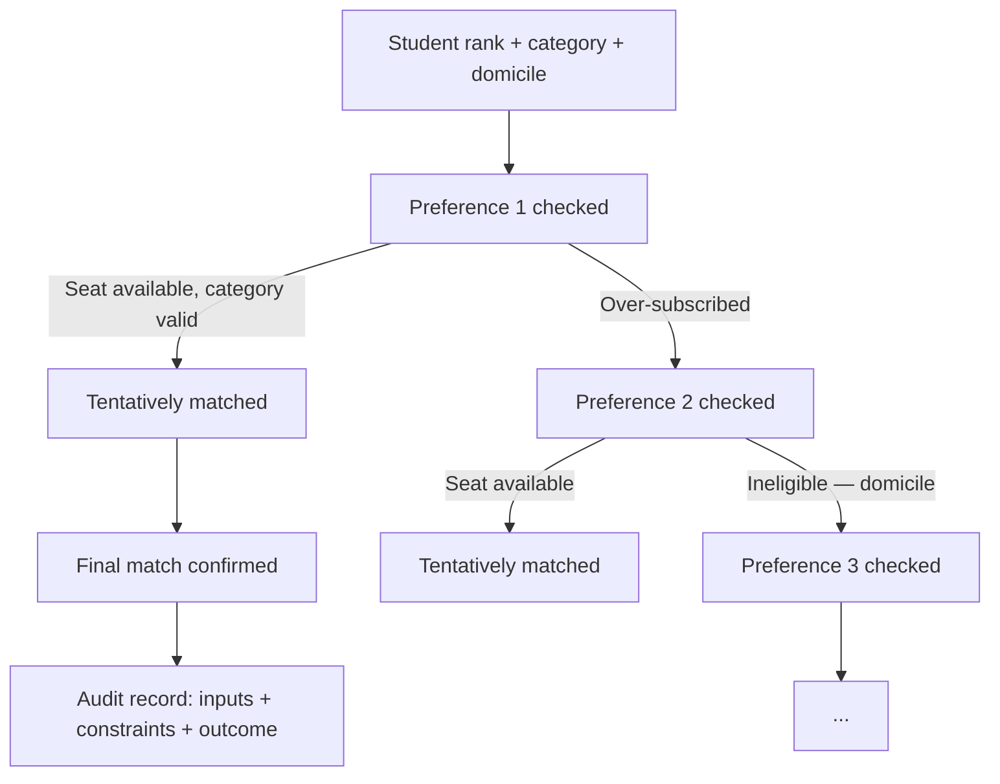
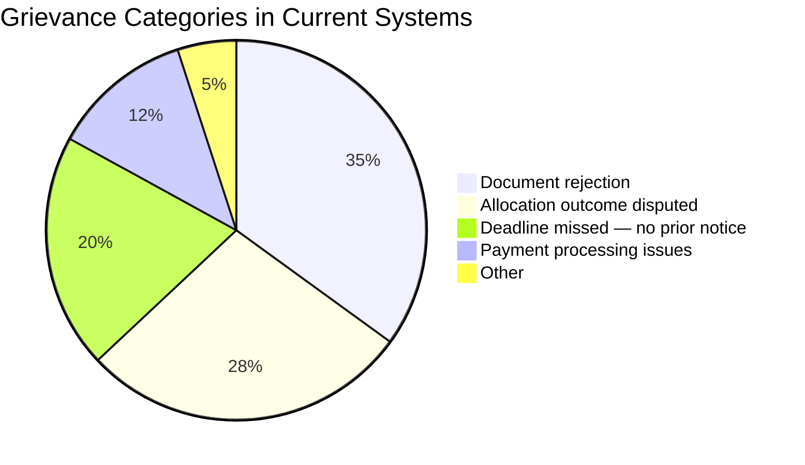

Allocation outcomes must be explainable to maintain trust. Superadmission includes an audit layer that records all system operations.

Each write operation generates an audit record. Records are append-only, with no deletion or overwrite. Every decision is traceable through its audit history.

---

## What gets logged

<CardGroup cols={3}>
  <Card title="Student actions" icon="user">
    Every preference change, document upload, acceptance, and payment — timestamped
  </Card>

  <Card title="Officer actions" icon="user-tie">
    Every document decision ( approve, reject, resubmission request ) with account and reason
  </Card>

  <Card title="Authority actions" icon="building-columns">
    Every round trigger, seat matrix update, deadline change, and allocation sign-off
  </Card>

  <Card title="System events" icon="gear">
    Every state transition, event trigger, and automated action is stored.
  </Card>

  <Card title="Pravesh AI outputs" icon="brain">
    Every  eligibility determination, and guidance output  with inputs recorded
  </Card>

  <Card title="Allocation decisions" icon="gavel">
    Every match produced preference tried, constraint applied, outcome reached
  </Card>
</CardGroup>

---

## Allocation audit trail

This is the most detailed log in the system. For every student, every allocation run produces:

**Every node in this chain is stored.**

<Frame caption="Recent activity feed — every document verification, seat allotment, fee payment, and counselling event logged with source and timestamp">
  
</Frame>

---

## Who can query what

| Actor | What they can see |
| --- | --- |
| Student | Their own complete audit trail preferences, documents, allocation decisions |
| Counselling authority | All audit records within their counselling process |
| Verification officer | Their own decision log |
| Regulator | Full system audit log is governed access |

## Retention

<CardGroup cols={2}>
  <Card title="Minimum 7 years" icon="clock">
    All audit records retained for a minimum of 7 years post-cycle
  </Card>

  <Card title="Append-only" icon="lock">
    No record is ever updated or deleted. New records are created for corrections.
  </Card>

  <Card title="Partitioned by year" icon="database">
    Audit log partitioned for query performance at scale
  </Card>

  <Card title="Export available" icon="file-export">
    Authorities can export their process audit log in structured format post-cycle
  </Card>
</CardGroup>

---

## Why this matters for disputes

_Illustrative breakdown based on reported grievance patterns across counselling systems._

> The two largest categories document rejections and disputed allocation outcomes are addressed through the audit layer. Each document decision is recorded with a reason, and each allocation outcome is fully traceable. This enables direct resolution of most disputes and reduces the need for escalation.\\

---

<Info>
  How authority-facing operational workflows are designed seat matrix, intake, verification queue, allocation is in Authority Workflows.
</Info>