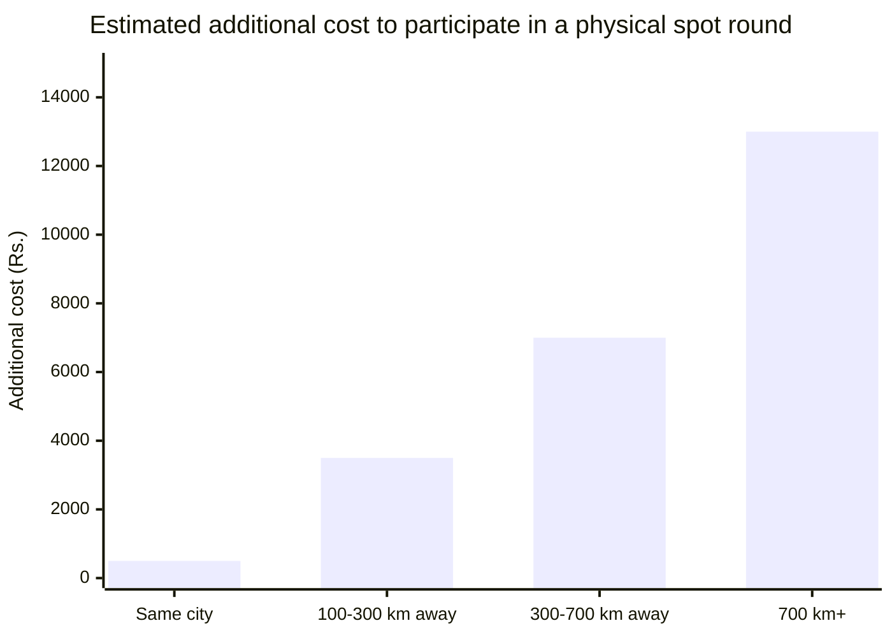
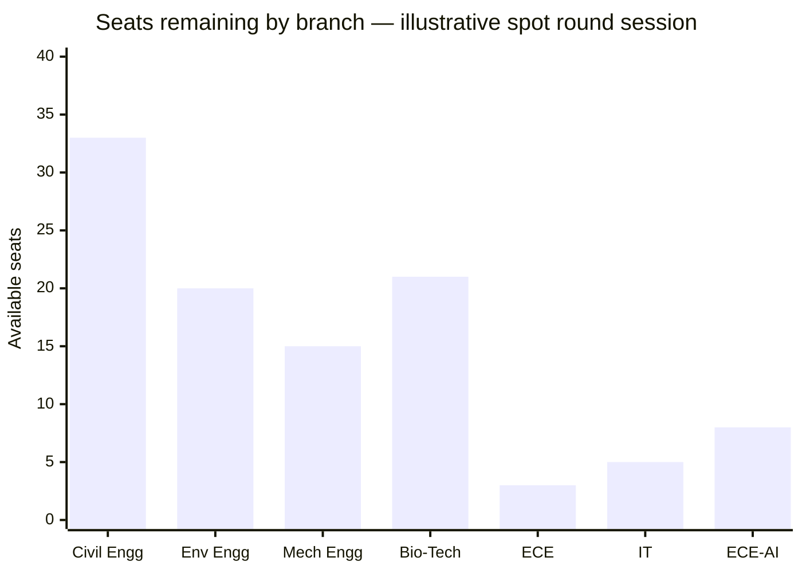

Spot rounds are used to allocate seats that remain vacant after regular counselling rounds. These rounds are typically conducted within a compressed timeline and represent the final allocation opportunity in the admission cycle.

The proposed virtual spot round preserves existing allocation rules while standardising participation, verification, and seat acceptance workflows.

---

## What physical spot rounds involve today

<CardGroup cols={2}>
  <Card title="Physical presence required" icon="location-dot">
    Students must report to the designated campus in person, on a specific date, regardless of where they live
  </Card>

  <Card title="Demand drafts only" icon="file-invoice">
    Payment must be made via a pre-prepared demand draft from a specific bank branch. No other mode accepted.
  </Card>

  <Card title="No preparation time" icon="hourglass-end">
    When your number is called, you decide at a counter immediately. The queue behind you is not waiting.
  </Card>
</CardGroup>

---

## Who this hits hardest

_Travel and accommodation estimates for participating in a physical spot round held at a metro-city campus._

Students from smaller cities and towns pay significantly more for the same seat access as students already in the city. The spot round has always been geographically biased. That is the problem the virtual format solves first.

---

## How the virtual spot round works

---

## Before the session

Before the session opens, every student knows:

- Their position in the allocation queue.
- The scheduled start time and remaining time until the session begins.
- PraveshAI based allocation projections derived from seat availability, queue position, and historical allocation patterns.

---

## While waiting - the live seat board

While waiting for their turn, students watch the live seat board update in real time.

Each selection updates the allocation board in real time. Students can track remaining availability and make informed decisions before their turn.

---

## The 8-minute selection window

When a student's turn begins, the seat selection window opens. The student has 8 minutes to make a selection.

The duration is intended to provide sufficient time to review available options while maintaining a manageable session length.

### Confirmation

The selection screen displays the highest-ranked available options from the student's preference list, followed by a complete list of all remaining available seats.

The allotment letter is available immediately. Reporting date, document requirements, and fee deadline all shown on the same screen. The seat matrix updates for the next student before the current student closes the tab.

---

## Physical vs virtual

| Dimension | Physical spot round | Virtual spot round |
| --- | --- | --- |
| Participation | In-person attendance required | Online participation |
| Location | Designated venue | Any location with internet access |
| Payment | Offline payment methods | Online payment confirmation |
| Selection window | At the allocation counter | 8-minute selection window |
| Queue visibility | Limited visibility | Queue position visible throughout the session |
| Preparation | Based on available information at venue | Available seats and allocation projections visible before selection |
| Travel requirement | Travel may be required | No travel required |

<Tip>
  **The seat access is identical. The operational barrier is not.**
</Tip>

---

<Info>
  For the complete end-to-end journey across all phases, see The Admission Journey.
</Info>
