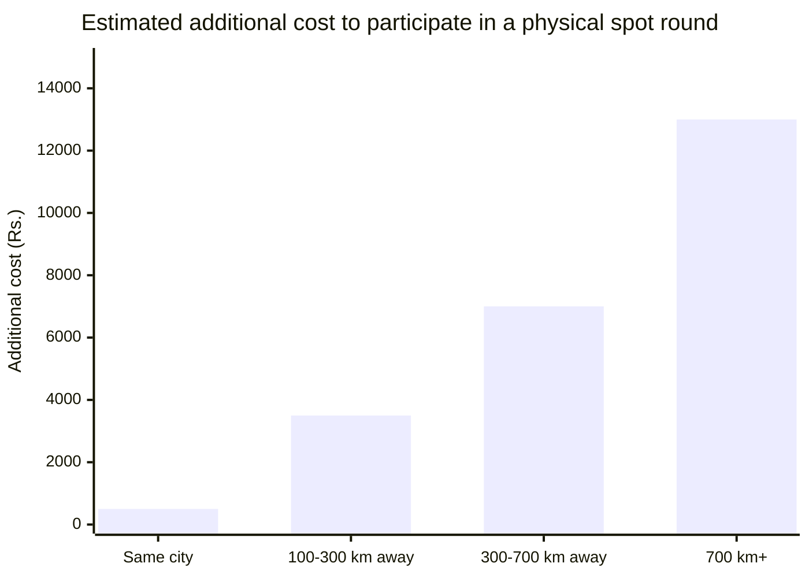
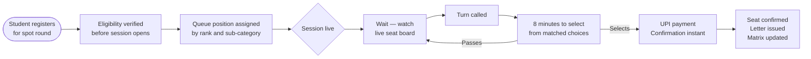

Spot rounds are used to allocate seats that remain vacant after regular counselling rounds. These rounds are typically conducted within a compressed timeline and represent the final allocation opportunity in the admission cycle.

The proposed virtual spot round preserves existing allocation rules while standardising participation, verification, and seat acceptance workflows.

---

## What physical spot rounds involve today

<CardGroup cols={2}>
  <Card title="Physical presence required" icon="location-dot">
    Students must report to the designated campus in person, on a specific date, regardless of where they live
  </Card>

  <Card title="Demand drafts only" icon="file-invoice">
    Payment must be made via a pre-prepared demand draft from a specific bank branch. No other mode accepted.
  </Card>

  <Card title="No preparation time" icon="hourglass-end">
    When your number is called, you decide at a counter immediately. The queue behind you is not waiting.
  </Card>
</CardGroup>

---

## Who this hits hardest

_Travel and accommodation estimates for participating in a physical spot round held at a metro-city campus._

Students from smaller cities and towns pay significantly more for the same seat access as students already in the city. The spot round has always been geographically biased. That is the problem the virtual format solves first.

---

## How the virtual spot round works

---

<Steps>
  <Step title="Pre-session — eligibility and queue position">
    The student sees their estimated position in the OBC-NCL queue, eligibility check status, round trend insight from PraveshAI™, and can add the session to Google Calendar before it begins.

    <Frame>
      
      
    </Frame>
  </Step>
  <Step title="Session live — seat board and queue">
    Once the session goes live, the student sees their queue position, live seat availability by branch and institute with PraveshAI™ chance scores, and the live queue updating in real time.

    <Frame>
      
      
    </Frame>
  </Step>
  <Step title="Your turn — select a seat">
    When the student's turn arrives, a countdown timer starts. Available seats are shown with institute, category, annual fee, and previous year closing rank. The student can pass up to 2 times.

    <Frame>
      
      
    </Frame>
  </Step>
  <Step title="Seat confirmed">
    On selection, the seat is confirmed immediately. The allotment letter is generated with the student's Access ID and next steps — reporting date, document requirements, and fee payment deadline.

    <Frame>
      
      
    </Frame>
  </Step>
</Steps>

---

## Physical vs virtual

| Dimension | Physical spot round | Digital spot round |
| --- | --- | --- |
| Participation | In-person attendance required | Online participation |
| Location | Designated venue | Any location with internet access |
| Payment | Offline payment methods | Online payment confirmation |
| Selection window | At the allocation counter | 8-minute selection window |
| Queue visibility | Limited visibility | Queue position visible throughout the session |
| Preparation | Based on available information at venue | Available seats and allocation projections visible before selection |
| Travel requirement | Travel may be required | No travel required |

<Tip>
  **The seat access is identical. The operational barrier is not.**
</Tip>

---

<Info>
  For the complete end-to-end journey across all phases, see The Admission Journey.
</Info>