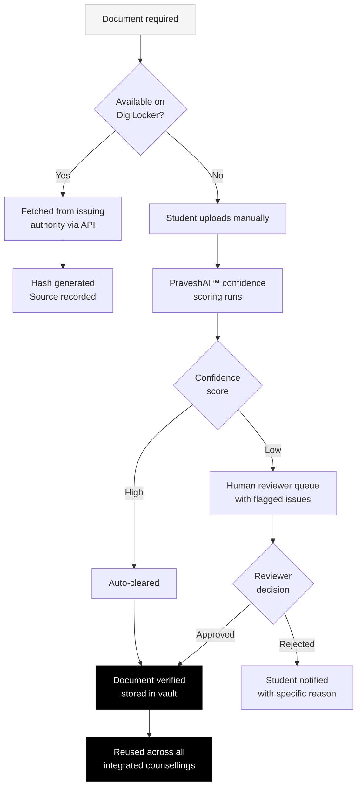
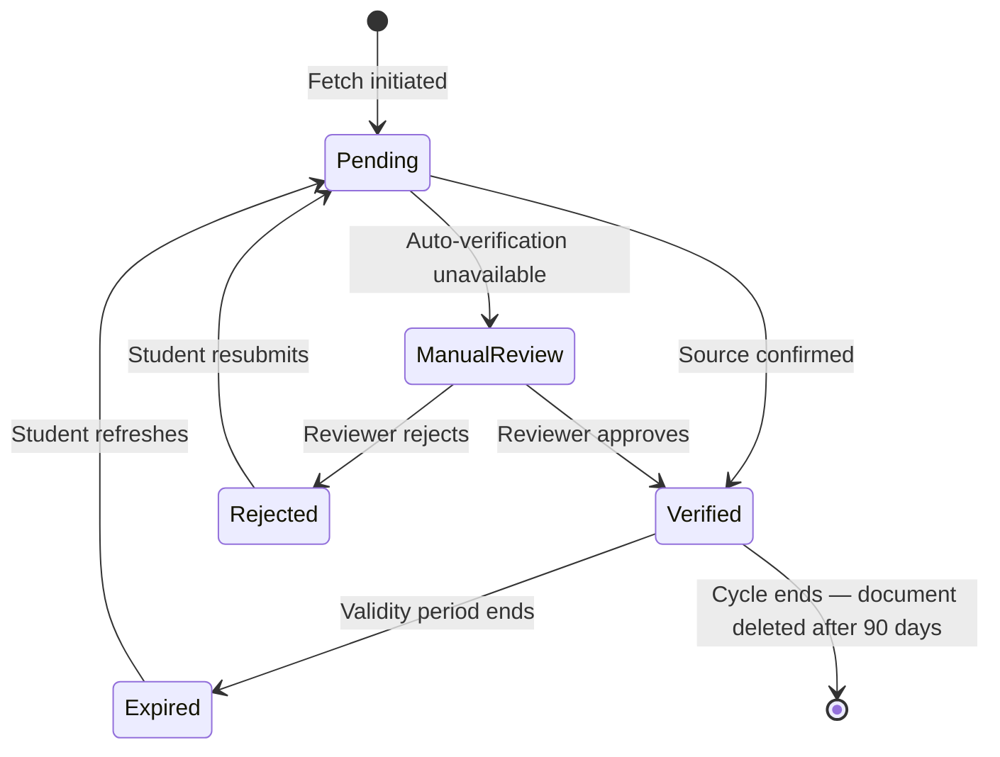
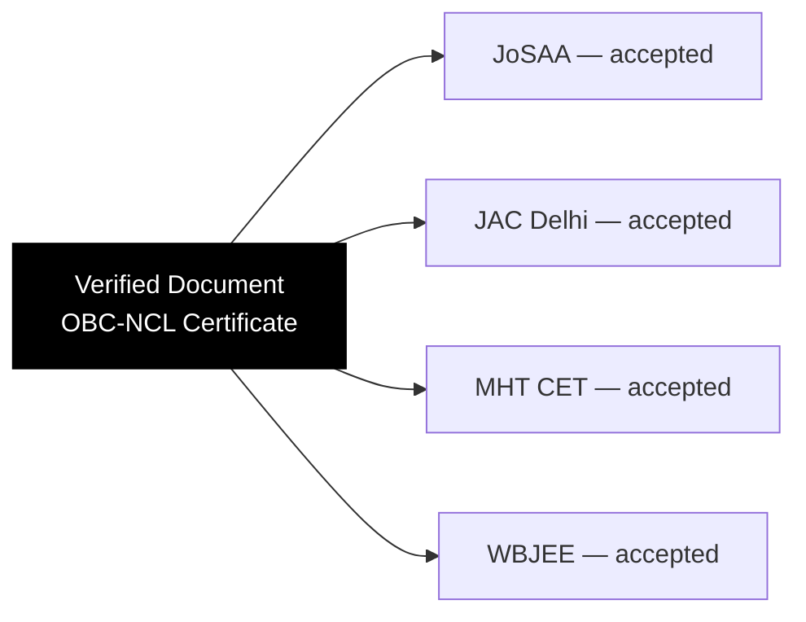

India's current admissions process requires students to submit the same documents an average of **4.2 times** across their counsellings. Same caste certificate. Same marksheet. Same income certificate. Uploaded fresh to each portal, entering a separate verification queue each time.

The document workflow in Superadmission is designed around one principle: verify at source, reuse everywhere.

---

## The core flow

---

## Document types in scope

<CardGroup cols={2}>
  <Card title="Identity" icon="id-card">
    Aadhaar card — fetched from UIDAI
  </Card>

  <Card title="Academic" icon="graduation-cap">
    Class 10 marksheet, Class 12 marksheet — fetched from CBSE or state boards via DigiLocker
  </Card>

  <Card title="Examination" icon="file-pen">
    JEE Main score, NEET score, state CET results — fetched from NTA or state examination boards
  </Card>

  <Card title="Category" icon="people-group">
    Caste certificate, OBC-NCL certificate, EWS certificate — fetched from state government via DigiLocker where available
  </Card>

  <Card title="Domicile and income" icon="house">
    State domicile certificate, family income certificate — DigiLocker fetch or manual upload
  </Card>

  <Card title="Counselling-specific" icon="clipboard-list">
    Medical fitness certificate, migration certificate — manual upload with PraveshAI™ review
  </Card>
</CardGroup>

---

## PraveshAI™ confidence scoring

When a document cannot be fetched automatically and the student uploads manually, PraveshAI™ runs a pre-review assessment before any human reviewer sees the file.

| What it checks | How it works |
| --- | --- |
| Document format | Expected structure for this document type |
| Field consistency | Name, DOB, category matches profile data |
| Authenticity signals | Issuing authority markers, seal placement |
| Legibility | Resolution, scan quality, completeness |

The output is a confidence score. High-confidence documents clear faster. Low-confidence documents reach a reviewer with specific flags already identified — reducing the time the reviewer spends diagnosing what is wrong.

<Tip>
  Manual review is triggered when DigiLocker cannot reach the issuing authority. This happens most often with state-level income and domicile certificates from smaller district offices. The system is designed to handle this gracefully — not to reject automatically.
</Tip>

---

## Verification states across the vault

---

## Reuse across counsellings

Once a document reaches `Verified` status, it is available to every integrated counselling the student registers for.

The counselling authority receives a verification record — not a document copy. The record shows: document type, issuing authority, verification date, verification method. The authority does not need to re-verify. The verification has already been done against the primary source.

---

## Document lifecycle

| Stage | What happens to the document |
| --- | --- |
| Verification | Fetched or uploaded, hashed, verified |
| Active cycle | Stored encrypted in vault, accessible to authorised counsellings |
| Post-cycle | Deleted from storage 90 days after the admission cycle ends |
| Structured data | Extracted fields (marks, category, dates) retained as part of the student's academic record |

<Warning>
  Documents are deleted. Structured data derived from them (scores, category, dates) is retained. The student can export their full data at any time. They can also delete the DigiLocker sync and revoke all document access.
</Warning>

---

## Authority access controls

| Actor | Can see | Cannot see |
| --- | --- | --- |
| Student | Full document list, verification status, access log | Nothing hidden |
| Integrated counselling authority | Verification record for their registered students | Documents of students registered in other counsellings |
| Other counselling authorities | Nothing | All student data from other counsellings |
| Superadmission team | Aggregate verification metrics | Individual student documents |

---

<Info>
  Guidance and Support covers what PraveshAI™ does with the verified profile — how it checks eligibility, surfaces deadlines, and assists students through choice filling.
</Info>