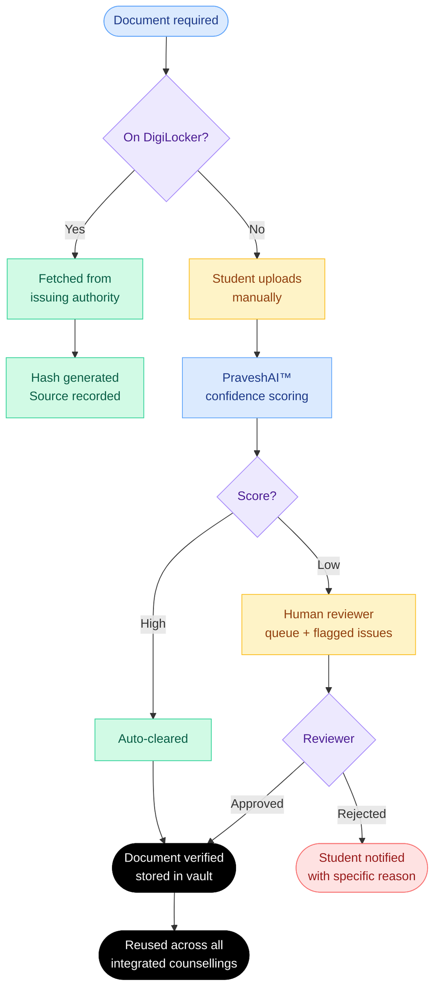
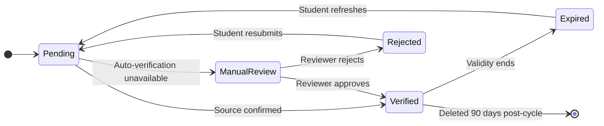

Students currently submit the same documents on an average of **4 times** across their counsellings. Each requiring a fresh upload entering a separate verification queue.

## Core flow

<Frame caption="Document vault — Core Identity, Academic Records, Category Documents, and Counselling Specific documents. Verified via DigiLocker, manual review flagged where auto-fetch is unavailable, missing documents alerted before deadline">
  
  
</Frame>

---

## Document types

<CardGroup cols={2}>
  <Card title="Identity" icon="id-card">
    Aadhaar card : fetched from UIDAI
  </Card>

  <Card title="Academic" icon="graduation-cap">
    Marksheets : fetched from issuing boards via DigiLocker
  </Card>

  <Card title="Examination" icon="file-pen">
    Entrance exam scores : fetched from examination authority APIs
  </Card>

  <Card title="Category" icon="people-group">
    Caste, OBC-NCL, EWS certificates : fetched from state government via DigiLocker where available
  </Card>

  <Card title="Domicile and income" icon="house">
    State domicile and family income certificates : DigiLocker fetch or manual upload
  </Card>

  <Card title="Counselling-specific" icon="clipboard-list">
    Medical fitness, migration certificate : manual upload with PraveshAI™ review
  </Card>
</CardGroup>

---

## PraveshAI™ Verification Signal

When a document cannot be auto-fetched and the student uploads manually, PraveshAI™ runs automated extraction and OCR based pre-assessment before any human reviewer sees it.

| Check | What it looks at |
| --- | --- |
| Format | Expected structure for this document type |
| Field consistency | Name, DOB, category match with profile |
| Authenticity signals | Issuing authority markers, seal placement |
| Legibility | Resolution, scan quality, completeness |

Documents with clear verification signals are processed faster. Cases requiring review are routed with specific issues identified.

---

## Verification states

---

## Verified Once, Reused Across counsellings

Once a document reaches`Verified`, it is available to every integrated counselling the student registers for.

---

## Authority access controls

| Actor | Can see | Cannot see |
| --- | --- | --- |
| Student | Complete document list, verification status, and access history | No restrictions |
| Registered counselling | Verification records for students registered with them | Data unrelated to their registered students |
| Other authorities | No access | All student data |

---