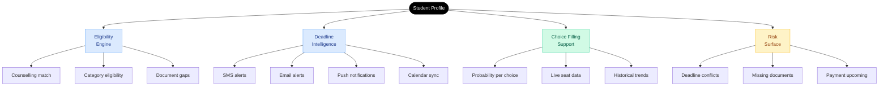
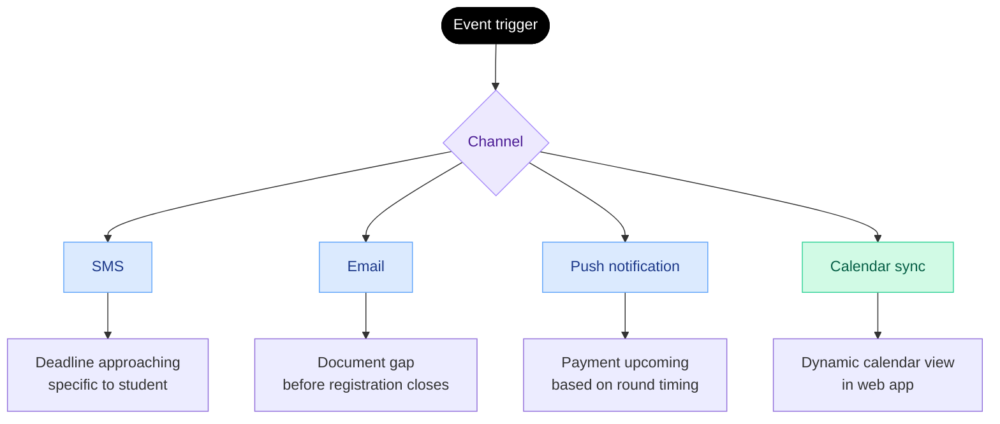

The admissions process generates over 2.5 lakh grievances annually due to missed deadlines, document issues, and uninformed choices. PraveshAI is a coordinated LLM that provides continuous tracking, automated alerts, and structured guidance.

## What the guidance engine covers

---

## Eligibility Check

<Steps>
  <Step title="Score ingestion">
    Entrance exam results are fetched directly from the examination authority.
  </Step>
  <Step title="Counselling matching">
    The engine checks the student's rank, category, and domicile against the eligibility criteria of every participating counselling. Every applicable counselling appears automatically.
  </Step>
  <Step title="Document readiness">
    For each eligible counselling, the engine checks whether the student's verified documents meet that counselling's requirements. Missing documents are flagged before registration closes.
  </Step>
  <Step title="Eligibility confirmation">
    The student sees every counselling they qualify for, with deadlines, document status, and the specific action needed and by when.
  </Step>
</Steps>

---

## Smart Alerts

Smart alerts focuses on delivering relevant information to the student through appropriate channels before a critical time, ensuring it is seen and acted upon.

Reminders are sent ahead of deadlines, based on the steps a student still needs to complete for that action.

Payment anticipation alerts inform students in advance about upcoming fees linked to expected events such as allocation results.

Calendar integration allows deadlines to be added to Google Calendar in one step, with a unified calendar view showing all upcoming events across registered counsellings.

---

## Choice filling support

PraveshAI™ incorporates three layers in choice filling guidance:

<CardGroup cols={3}>
  <Card title="Probability signal" icon="chart-bar">
    Safe, Good, or a percentage computed from the student's rank, category, and the current live seat matrix. Not static. Updated in real time.
  </Card>

  <Card title="Live seat data" icon="chair">
    Current availability in this category at this institute, updated continuously as students confirm and withdraw.
  </Card>

  <Card title="Round trend insight" icon="clock-rotate-left">
    What happened in last year's equivalent round at this rank and category. Which options filled fast. Which had seats remaining.
  </Card>
</CardGroup>

<Frame caption="PraveshAI™ — knows the student's rank, documents, active counsellings, and saved choices. Recommendations include safety probability and one-tap add to choice list.">
  
  
</Frame>

---

## Risk surface

PraveshAI™ flags risks before they become problems.

| Risk type | What triggers it | What the student sees |
| --- | --- | --- |
| Deadline conflict | Two counsellings with overlapping critical windows | Alert with the sequence that resolves the conflict |
| Missing document | A counselling requires something not in the vault | Flagged immediately at eligibility check |
| Payment upcoming | Allocation results releasing for a counselling | Advance notice of expected fee and timeline |
| Eligibility gap | Profile detail that may affect eligibility | Surfaced before registration closes |

---