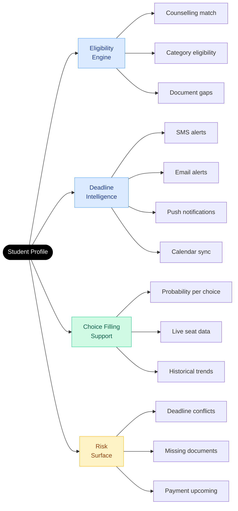
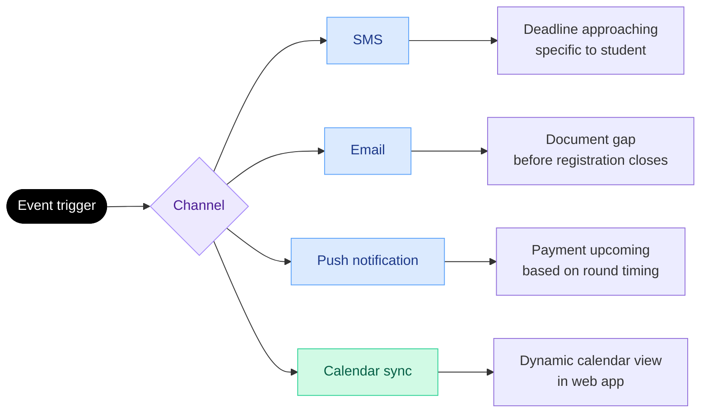

The admissions process generates more than 2.5 lakh grievances annually. Most of them trace back to the same causes: students who missed a window they did not know was closing, submitted a document that was quietly rejected, or filled choices without understanding what the numbers meant for their rank.

PraveshAI™ guidance is designed to make all three structurally unlikely.

---

## What the guidance engine covers

---

## Eligibility engine

<Steps>
  <Step title="Score ingestion">
    Entrance exam results are fetched directly from the examination authority. The student does not enter scores manually.
  </Step>
  <Step title="Counselling matching">
    The engine checks the student's rank, category, and domicile against the eligibility criteria of every participating counselling. Every applicable counselling appears automatically.
  </Step>
  <Step title="Document readiness">
    For each eligible counselling, the engine checks whether the student's verified documents meet that counselling's requirements. Missing documents are flagged before registration closes — not after.
  </Step>
  <Step title="Eligibility confirmation">
    The student sees every counselling they qualify for, with deadlines, document status, and the specific action needed and by when.
  </Step>
</Steps>

<Tip>
Only 23% of students currently have the information they need at the point of choice filling. The eligibility engine is designed to make that number approach 100%.
</Tip>

---

## Deadline intelligence

Deadline intelligence is not about rewriting alert copy. It is about getting the right information to the student through the right channel before the window closes — and making sure it does not get lost.

**Smart reminders** are sent before deadlines — not on the deadline. The system factors in what the student still has to do before they can complete the action being reminded about.

**Payment anticipation** — if allocation results for a counselling are releasing soon, the student is alerted to the likely upcoming registration or seat acceptance fee. ₹45,000 does not arrive as a surprise.

**Calendar sync** — every deadline can be added to Google Calendar in one tap. The web app also carries a dynamic calendar view showing all upcoming events across all registered counsellings.

---

## Choice filling support

When a student builds their preference list, most are working with one source: last year's closing rank data.

PraveshAI™ adds three layers on top:

<CardGroup cols={3}>
  <Card title="Probability signal" icon="chart-bar">
    Safe, Good, or a percentage — computed from the student's rank, category, and the current live seat matrix. Not static. Updated in real time.
  </Card>
  <Card title="Live seat data" icon="chair">
    Current availability in this category at this institute, updated continuously as students confirm and withdraw.
  </Card>
  <Card title="Round trend insight" icon="clock-rotate-left">
    What happened in last year's equivalent round at this rank and category. Which options filled fast. Which had seats remaining.
  </Card>
</CardGroup>

**Autosave every 30 seconds.** Nothing is lost to a browser close or a network drop.

**Lock deadline visible at all times** — live countdown in the workspace while the student is filling choices.

---

## Risk surface

PraveshAI™ flags risks before they become problems.

| Risk type | What triggers it | What the student sees |
|---|---|---|
| Deadline conflict | Two counsellings with overlapping critical windows | Alert with the sequence that resolves the conflict |
| Missing document | A counselling requires something not in the vault | Flagged immediately at eligibility check, not at submission |
| Payment upcoming | Allocation results releasing for a counselling | Advance notice of expected fee and timeline |
| Eligibility gap | Profile detail that may affect eligibility | Surfaced before registration closes |

---

<Info>
Seat Allocation covers how PraveshAI™ runs the matching engine — merit-cum-preference matching, round logic, per-authority configuration, and the full decision audit trail.
</Info>